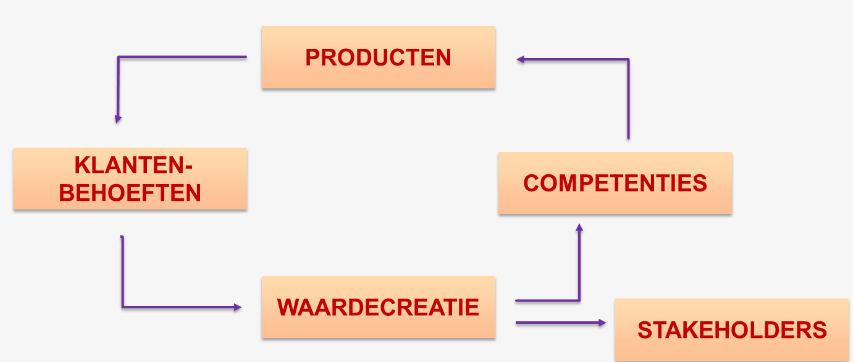

<h1> Continuïteit en waardecreatie </h1>

- [Business](#business)
  - [De continuïteitskring](#de-continuïteitskring)
  - [Waardecreatie](#waardecreatie)
- [Management](#management)

# Business

## De continuïteitskring

- Producten: Organisatie gebruikt deze om aan klantenbehoeften te voldoen
- Klantenbehoeften: Klanten kopen producten omdat ze een tekort ervaren
- Waardecreatie: Door verkoop ontstaat er waarde voor de organisatie.
- Competenties: Een deel van de waardecreatie kan in kennis en middelen geïnvesteerd worden, om betere producten aan te bieden.
- Stakeholders: Het andere deel van de waardecreatie gaat naar de belanghebbenden

## Waardecreatie

Drie voorwaarden voor waardecreatie (= basis voor goede bedrijfsvoering):

1. Ontdekken van klantenbehoeften - Product heeft pas waarde voor de klant als die behoeftebevrediging ervaart.
2. Klantwaarde creëren
   - Door klanten te begrijpen
   - Baten voor klanten overtreffen de kosten
   - Beter presteren dan concurrentie
3. Belofte nakomen

Als een bedrijf de belofte niet nakomt heeft dit gevolgen voor het imago van het merk en de waardecreatie + kan ook wettelijke gevolgen hebben (misleiding - vb. Valvert die behandeld water verhandelde als bronwater).

# Management

> Definitie  
> Management is een geheel van verschillende activiteiten:
>
> - Plannen voor de toekomst
> - Organiseren van activiteiten om doelen te realiseren
> - Leiden, begeleiden en motiveren van ondergeschikten
> - Beheersen en controleren of de plannen en doelen gehaald worden

Het managementproces bestaat uit 7 stappen:

1. [Macro-omgevingsanalyse](./Deel%202%20-%20Macro-omgevingsanalyse.md)
2. [Sectoranalyse](./Deel%203%20-%20Sectoranalyse.md)
3. [Analyse van de organisatie](./Deel%204%20-%20Analyse%20van%20de%20organisatie.md)
4. [SWOT-analyse](./Deel%205%20-%20SWOT-analyse.md)
5. [Strategiekeuze](./Deel%206%20-%20Strategiekeuze.md)
6. [Waardeaanbod](./Deel%207%20-%20Waardeaanbod.md)
7. [Opvolging](./Deel%208%20-%20Opvolging.md)

De PDCA-cyclus (zelfde als binnen het onderwijs) kan helpen bij management:

- Plan: Probleem beschrijven
- Do: Plan uitvoeren
- Check: Nagaan of alles goed verlopen is
- Act: Bijsturen waar nodig
