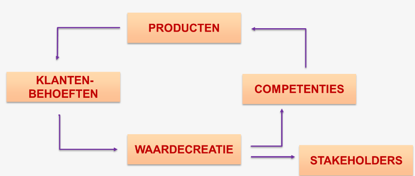

# Continuïteit en waardecreatie

## De continuïteitskring

- Producten: Organisatie gebruikt deze om aan klantenbehoeften te voldoen
- Klantenbehoeften: Klanten kopen producten omdat ze een tekort ervaren
- Waardecreatie: Door verkoop ontstaat er waarde voor de organisatie.
- Competenties: Een deel van de waardecreatie kan in kennis en middelen geïnvesteerd worden, om betere producten aan te bieden.
- Stakeholders: Het andere deel van de waardecreatie gaat naar de belanghebbenden

## Waardecreatie

Drie voorwaarden voor waardecreatie (= basis voor goede bedrijfsvoering):
1. Ontdekken van klantenbehoeften - Product heeft pas waarde voor de klant als die behoeftebevrediging ervaart.
2. Klantwaarde creëren
    - Door klanten te begrijpen
    - Baten voor klanten overtreffen de kosten
    - Beter presteren dan concurrentie
3. Belofte nakomen