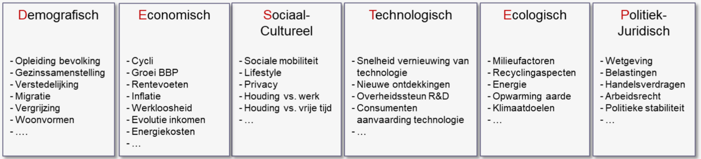

<h1> Macro-omgevingsanalyse </h1>

- [Omschrijving](#omschrijving)
- [DESTEP-model](#destep-model)
- [Maatschappelijk Verantwoord Ondernemen (MVO)](#maatschappelijk-verantwoord-ondernemen-mvo)
  - [Maturiteitsniveaus](#maturiteitsniveaus)
  - [10 R-Strategieën voor circulaire economie](#10-r-strategieën-voor-circulaire-economie)
- [Duurzame ontwikkelingsdoelen VN](#duurzame-ontwikkelingsdoelen-vn)

## Omschrijving

Maatchappelijke tendensen in kaart proberen te brengen. Beschrijft krachten (kansen of bedreigingen) die de werking van het bedrijf beïnvloeden.

Kansen en bedreigingen zijn externe ontwikkelingen met een gunstige / remmende invloed op de realisatie van doelstellingen.

Kansen en bedreigingen moet je altijd binnen de doelen van de organisatie zien. Een verandering in de maatschappij kan een kans zijn voor het ene bedrijf en een bedreiging voor het andere. Kansen moeten genomen worden en bedreigingen moeten vermeden / verzacht worden.

## DESTEP-model

Model om op zoek te gaan naar de maatschappelijke ontwikkelingen die invloed hebben op de verschillende bedrijfstakken.

DESTEP is de afkorting voor de verschillende domeinen in het model:

- **Demografisch**: Beschrijving van de bevolking (grootte, dichtheid, plaats, leeftijd, ras, bezigheid, etc.)
- **Economisch**: Veranderingen in koopkracht en uitgavenpatroon van consumenten
- **Sociaal-cultureel**: Wat zijn de heersende waarden en normen (= regels) binnen een maatschappij? (Bestudeert ook voorkeuren, preceptie en andere zaken die het gedrag beïnvloeden)
- **Technologisch**: Nieuwe technologieën die kansen creëren om nieuwe producten op de markt te brengen of oude producten bedreigen.
- **Ecologisch**: Krachten die te maken hebben met tekort aan grondstoffen, natuurlijke bronnen, milieuvervuiling en klimaatverandering
- **Politiek-juridisch**: Welke wetten en overheden hebben een invloed op onze organisatie?

Koopkracht = hoeveel goederen een huishouden kan kopen met het besteedbare inkomen  
Uitgavenpatroon = waaraan het huishoudbudget wordt besteed

## Maatschappelijk Verantwoord Ondernemen (MVO)

= verantwoordelijkheid van een organisatie voor de effecten van haar besluiten en activiteiten op de maatschappij en het milieu.

In het Engels: Corporate Social Responsibility

Rekening houden met:

- Mensenrechten
- Consumentenbelangen (vb. geen bedrog)
- Sociale, ethische en milieukwesties

### Maturiteitsniveaus

1. Defensive CSR / Age of Greed: Enkel focus op winst (+ creëren van werkgelegenheid en een inkomen bieden aan gezinnen)
2. Charitable CSR / Age of Philantropy: Deeltje winst gaat naar goede doelen (vb. donaties)
3. Promotional CSR / Age of Marketing: Reclame met duurzame acties -> klanten worden kritischer en het imago wordt belangrijker (daarom lange-termijnsponsoring i.p.v. eenmalige donaties)
4. Strategic CSR / Age of Management: Duurzaamheid in elk proces (kan stapsgewijs groeien - vb. herbruikbare zakjes in supermarkten - of radicaal omslaan)
5. Systemic CSR / Age of Responsibility (= Sociaal ondernemerschap): Maatschappelijk probleem ligt aan de oorsprong van opstart (doel = creëren van economische waarde en tegelijkertijd een positieve impact hebben)

Misbruik MVO: **Greenwashing** => Zich groener / maatschappelijk meer verantwoord voordoen dan het bedrijf eigenlijk is. 
vb. Finish geeft aan op de vaatwastabletten dat het geen fosfaat bevat. Die stof is wettelijk verboden.

Lineaire economie: Waarde wordt voor het gebruik toegevoegd, na gebruik belandt het product op de afvalberg.  
Recycling economie: Na gebruik worden materialen gerecycleerd. De kwaliteit van de materialen neemt af (= downcycling), waardoor het product na enkele malen toch op de afvalberg belandt.  
Circulaire economie: Producten worden zo lang mogelijk hergebruikt. Er is een focus op het regenereren van natuurlijke systemen.

Niveaus 1-4 staan bekend als CSR 1.0. -> Lineaire of recycling economie.  
Niveau 5 staat bekend als CSR 2.0 -> Circulaire economie

### 10 R-Strategieën voor circulaire economie

## Duurzame ontwikkelingsdoelen VN

VN heeft duurzame ontwikkelingsdoelen vastgelegd in 17 Sustainable Development Goals (SDGs). De SDGs vormen vaker en vaker de leidraad voor dagelijks beleid in organisaties.

Doel 12 => Verantwoorde consumptie en productie: Heel belangrijk voor economische bedrijven, want als er verantwoorde consumptie nodig is, moet er ook verantwoord geproduceerd worden.
