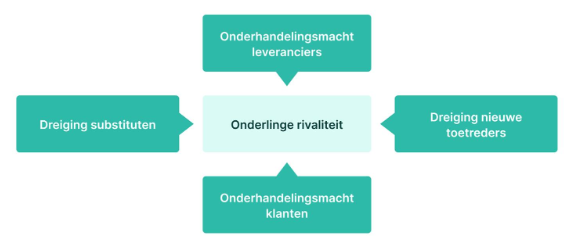

<h1> Sectoranalyse </h1>

- [De meso-omgeving](#de-meso-omgeving)
- [Stakeholders](#stakeholders)
- [Klanten](#klanten)
- [Leveranciers](#leveranciers)
- [Concurrenten](#concurrenten)
  - [Vijfkrachtenmodel Porter](#vijfkrachtenmodel-porter)
  - [Interne concurrentie](#interne-concurrentie)
  - [Dreiging substituten](#dreiging-substituten)
  - [Dreiging nieuwe toetreders](#dreiging-nieuwe-toetreders)
  - [Onderhandelingsmacht van de leveranciers en afnemers](#onderhandelingsmacht-van-de-leveranciers-en-afnemers)

## De meso-omgeving

De onmiddellijke omgeving van het bedrijf.

In de meso-omgeving zijn de andere "spelers" belangrijk, we noemen ze **belanghebbenden / stakeholders**.  
-> Niet beheersbaar, maar wel vaak beïnvloedbaar  
-> Kunnen zowel kansen als bedreigingen zijn

## Stakeholders

> Definitie  
> Stakeholders zijn alle belanghebbenden in de omgeving van de onderneming die de gevolgen ondervinden van de beslissingen en acties van de organisatie.

Er is een wisselwerking tussen bedrijven en stakeholders. Stakeholders oefenen namelijk ook invloed uit op de bedrijven.

Enkele categorieën van stakeholders zijn:

- Financiële groepen: investeerders, banken, crowdfunding
- Overheid - kan veel invloed uitoefenen op de bedrijven (via wetten en verordeningen)
- Media: Klassieke media, maar ook sociale media - kunnen veel aandacht (ook negatieve) op het bedrijf vestigen
- Maatschappij: Werknemers- en werkgeversorganisaties (vb. vakbond), consumentenorganisaties, actiepgroepen, etc.

Er zijn nog veel meer groepen die stakeholder kunnen zijn.  
De drie belangrijkste categorieën van stakeholders (klanten, leveranciers en concurrenten) worden hieronder besproken.

## Klanten

Behoeften van klanten invullen is de bestaansreden van een organisatie.

## Leveranciers

Relaties onderhouden met leveranciers is belangrijk voor de:

- prijs
- kwaliteit
- beschikbaarheid (leveringstermijnen)
- MVO -> vb. om materialen te kunnen aankopen die herbruikbaar zijn

## Concurrenten

> Definitie  
> Aanbieder van producten die op dezelfde markt worden aangeboden en een waardeaanbod zijn voor dezelfde klanten.

Belangrijke vraag: Op welke markt ben je actief?

Bedrijven bakenen hun markt af. Ze vragen zich af waar ze precies actief zijn. Op basis van die vraag kunnen we enkele soorten concurrenten onderscheiden op verschillende niveaus:

- Product- of merkconcurrentie: Andere bedrijven die een soortgelijk product of service aanbieden (voor ongeveer dezelfde prijzen) - vb. aanbieders van oploskoffie
- Concurrentie binnen de productcategorie: Alle organisaties die dezelfde soort producten maakt - vb. koffie in het algemeen (oploskoffie, bonen, pads, etc.)
- Generieke concurrentie: Organisaties die dezelfde functie vervullen. vb. dranken in het algemeen (koffie, water, frisdranken, sportdranken, fruitsappen, etc.)
- Behoeftenconcurrentie: Elke andere organisatie (geld kan maar een keer uitgegeven worden) - Je concurreert met alle andere organisaties om het budget van dezelfde klant

Bij behoeftenconcurrentie is het belangrijk de afweging te maken welke behoefte voor de klant op dit moment primeert (vb. als energiefacturen hoog zijn, worden minder reizen gemaakt).

De laatste twee concurrentiecategorieën zijn belangrijk om substitutie in de gaten te houden.

**Substitutie**: Product uit een andere markt bevredigt dezelfde behoefte (vb. GPS wordt ineens vervangen door Smartphone).

### Vijfkrachtenmodel Porter

Volgens het model van Porter zijn er 5 krachten die ervoor zorgen dat een markt al dan niet aantrekkelijk is:

Conclusie van het onderstaande = Een ideale markt voor een organisatie heeft:

- Weinig concurrenten
- Weinig substitutiedreiging
- Veel toetredingsdrempels
- Veel leveranciers
- Veel klanten

### Interne concurrentie

Bij interne concurrentie zijn er enkele belangrijke vragen:

- Hoeveel concurrenten zijn er binnen de markt?
- Hoe groot zijn ze? Groeit de markt?
- Zijn er overstapkosten binnen de markt? -> Dit drukt de concurrentiedreiging omdat de waargenomen kost hoger is. vb. Om over te stappen naar elektrische auto's heb je een laadpaal nodig, moet je je rijstijl aanpassen, etc.

### Dreiging substituten

Porter legt hier de nadruk op. Hij wil in het model duidelijk maken dat substituten ook belangrijke concurrenten zijn.

De mate van concurrentie is afhankelijk van de kwaliteit van het substituut en de overstapkosten.

### Dreiging nieuwe toetreders

Hoe toegankelijk is de markt? Dit hangt af van de toetredingsdrempels.

Enkele voorbeelden:

- toegang tot kanalen -> Raak ik met mijn product vlot in de winkels?
- benodigd startkapitaal
- overheidsbeleid
- verwachte reacties van bestaande concurrenten
- overstapkosten (Hoe trouw zijn de klanten aan bepaald merk / product?)

### Onderhandelingsmacht van de leveranciers en afnemers

Als er veel leveranciers zijn, kan je makkelijk leveranciers vinden die een lagere prijs vragen. Ook hier zijn overstapkosten weer belangrijk. (Hoe makkelijk is het om over te stappen naar een andere leverancier?) Hoe meer leveranciers er zijn, hoe sterker de onderhandelingsmacht van de organisatie.

Als afnemers veel klanten hebben, hebben zij sterke onderhandelingsmacht. Dit valt vooral op bij supermarkten, waar klanten heel vaak heel trouw aan zijn. Supermarkten hebben dus vaak een sterke onderhandelingsmacht.
