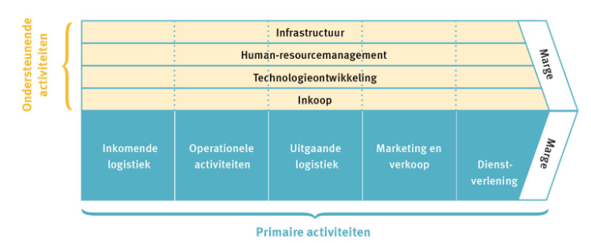
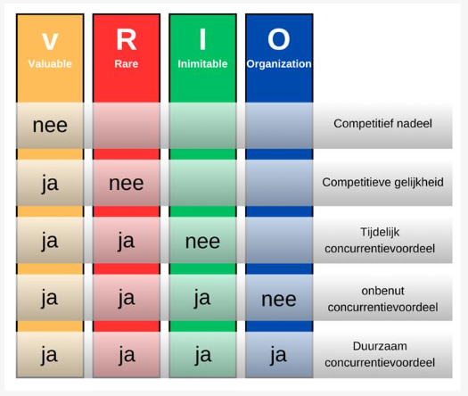
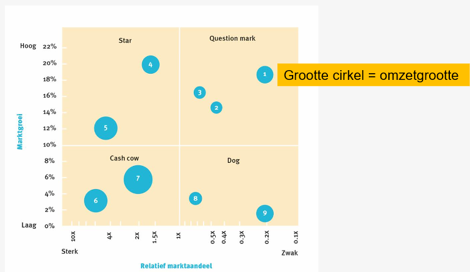

<h1> Analyse van de organisatie </h1>

## Interne omgeving

De interne omgeving bestaat uit de **middelen** en **capaciteiten** (kennis en ervaring) van de onderneming.

Soorten middelen:

- Materiële -> vb. gebouwen
- Immateriële -> intellectueel eigendom, patenten (20 jaar geldig), merknamen
- Financiële -> geld

Analyse van de organisatie probeert de sterkten en zwakten te identificeren in de interne omgeving.

Sterkten en zwakten zijn de interne componenten met een (on)gunstige invloed op de realisatie van doelstellingen. (vb. versnellen / vertragen van realisatie). Of een interne component een sterkte of zwakte is, is volledig afhankelijk van de externe omgeving.

### Benchmarking

-> Capaciteiten vergelijken met andere bedrijven (concurrenten, andere sectoren).

Doel: Verbeterpunten voor eigen competenties opsporen

## Waardeketen van Porter

Nut van de waardeketen: identificeren welke activiteiten geoptimaliseerd kunnen worden (kosten verlagen, efficiëntie verbeteren of differentiëren)   -> _Het gaat hier om een benchmark van alle activiteiten als aanvulling op het product_

Onderscheid tussen

- Primaire activiteiten
- Ondersteunende activiteiten

De activiteiten stellen de kosten voor de organisatie voor. De marge aan de rechterkant van het model staat voor de opbrengsten die nodig zijn om het voortbestaan van een bedrijf te garanderen.

### Primaire activiteiten

= activiteiten die rechtstreeks waarde toevoegen aan het product van de organisatie

- **Inkomende logistiek**: Ontvangst en opslag van goederen
- **Operationele activiteiten**: Productieproces (twee soorten)
  - Fabrikage: Grondstoffen die bewerkt worden tot (eind)producten
  - Dienstverlenende productie (vb. verpakken) -> Het eigenlijke product verandert niet meer
- **Uitgaande logistiek**: Fysieke distributie
- **Marketing en verkoop** (denken na over 4 P's - Product, Prijs, Plaats, Promotie)
- **Dienstverlening** (vb. herstellen van gekochte producten, aanbieden van opleidingen, etc.)

> Uitgaande logistiek laten verzorgen door een gespecialiseerd transportbedrijf, kan vaak tegen een lagere prijs dan wanneer je het zelf doet.

### Ondersteunende activiteiten

= activiteiten die ervoor zorgen dat de primaire activiteiten mogelijk zijn

- **Inkoopmanagement**: Kopen materialen aan en onderhandelen met de leveranciers.
- **Technologie en Ontwikkeling (R&D)**
- **Human-Resourcemanagement (HRM)**
- **Infrastructuur** -> vb. financieel beheer, management, planning

## VRIO-model

-> _Benchmark voor het product zelf, in tegenstelling tot waardeketen van Porter die op de activiteiten errond focust_

Doel: competenties identificeren die een concurrentievoordeel opleveren of zwak scoren.

V -> Valuable (Waardevol)  
R -> Rare (Zeldzaam) 
I -> Inimitable (Niet imiteerbaar) 
O -> Organized (Georganiseerd)

Als de competenties alle kenmerken bevatten, zijn ze duurzaam (ze werken op de lange termijn).

## BCG-matrix

BCG = Boston Consulting Group

-> Portfolio dat een overzicht geeft van alle producten die een bedrijf op dit ogenblik aanbiedt. Hiermee kan je nagaan welke acties de onderneming moet nemen.

Streefdoel volgens BCG was marktleiderschap -> best op snel groeiende markten

> Kritische noot
>
> Dit model stamt uit de jaren 60 af. Het advies dat toen gegeven werd is niet altijd accuraat.

### Relatief marktaandeel (x-as)

> De x-as is een logaritmische schaal.

relatief marktaandeel = `eigen marktaandeel / marktaandeel van de grootste concurrent`

-> linkerhelft van de matrix betekent dus dat je zelf de grootste bent binnen de markt (= marktleiderschap)

### Marktgroei (y-as)

-> Groeitempo van de markt (hoe aantrekkelijk is de markt?)

Groei hoger dan 10% per jaar = aantrekkelijke markt

> Let op! Dit percentage is in de jaren 60 vastgelegd. Momenteel ligt de scheidingslijn voor een aantrekkelijke markt op 6% groei per jaar (en in sommige sectoren zelfs 4%).

### Kwadranten

#### Question Mark (snelgroeiende markt, geen marktleider)

Advies: Overtuig meer klanten om je product te gaan kopen. Investeren is aangeraden (in de hoop een Star te krijgen).

#### Star (snelgroeiende markt, marktleider)

Advies: Als de afstand met de grootste concurrent niet groot is, moet je blijven investeren in het product om marktleider te blijven.

Doel = Star-positie vasthouden

#### Cash Cow (stagnerende markt, marktleider)

Marktleider zijn in een onaantrekkelijke markt is voordelig,omdat je weinig moet investeren maar veel inkomsten genereert.

#### Dog (stagnerende markt, geen marktleider)

Advies in jaren 60: Productie stopzetten (= liquideren / afstoten van product). De middelen die hierdoor vrijkomen, moet je investeren in een Question mark die hopelijk een Star kan worden.

**Belangrijk**: Dit advies is gedateerd, je moet kijken naar de winstgevendheid van het product.

### Interpretatie

Het is vandaag de dag vooral belangrijk deze matrix te interpreteren zodat je een evenwichtige portefeuille van producten kan maken.

Als de meeste producten onderaan liggen, moet je cashflow gebruiken om in R&D te investeren.

Die cashflow haal je uit de cash cows en dogs, want daar is weinig investering nodig (de markt stagneert).
