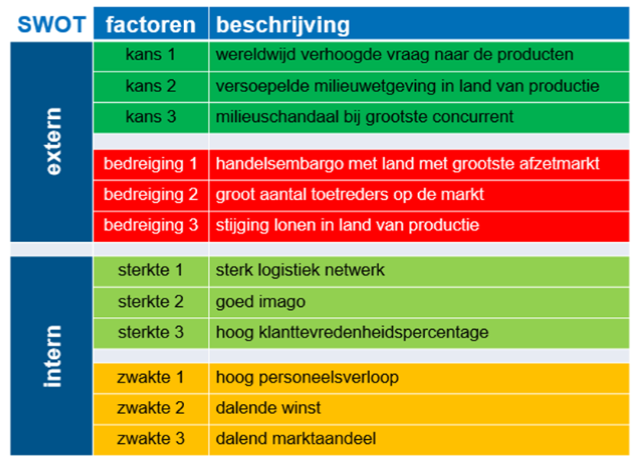
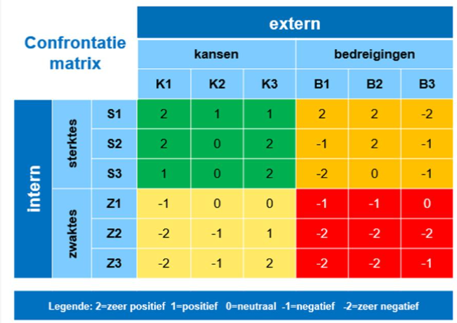

<h1> SWOT-analyse </h1>

## SWOT-analyse

In de externe analyse (macro-omgeving en sector) werden kansen en bedreigingen vastgesteld. In de interne analyse werden sterktes en zwaktes vastgesteld. In de SWOT-analyse worden deze conclusies verder geanalyseerd:

- **S**trengths
- **W**eaknesses
- **O**pportunities
- **T**hreats

Doel:

- Onderbouwing voor de strategiekeuze (Hoe gaan we de continuïteit realiseren?)
- Inspelen op dynamische externe omgeving.

## Confrontatiematrix

Belangrijk onderdeel van SWOT-analyse. Hier worden sterktes en zwaktes (intern) afgetoetst tegen kansen en bedreigingen (extern).

### Werkwijze

1. Kies 3 belangrijkste sterktes, zwaktes, kansen en bedreigingen (handboeken bevelen vaak maximaal 5 aan)
2. Koppel in de matrix de sterktes en zwaktes aan de kansen en bedreigingen.
3. Elke cel in de matrix moet een waarde krijgen van zeer gunstig tot zeer ongunstig (vaak van -2 tot 2, maar bedrijven beslissen de schaal zelf)
   - +2 = duidelijk, erg gunstig verband
   - +1 = gunstig verband, maar niet zo duidelijk
   - 0 = geen verband

Op basis hiervan kan een strategie gekozen worden.
