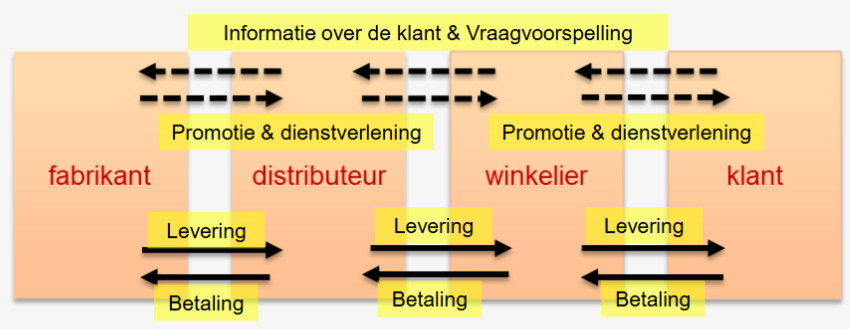
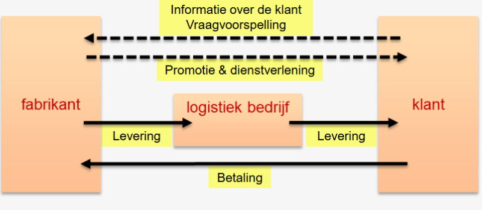

<h1> Waardeaanbod </h1>

## Klantenwaarde

In deze fase proberen we behoeftebevrediging aan te bieden en de concurrentie te overtreffen door de gekozen strategie concreet te maken. De beste manier om dit te doen is **unieke klantenwaarde** creëren.  Dit betekent dat we bestaande of nieuwe producten ontwikkelen om in de behoeften van de klant te blijven voorzien (= business) en plannen, coördineren en controleren we die activiteiten (= management).

## Strategische bedrijfsprocessen

Strategische bedrijfsprocessen houden zich bezig met:

- Afstemming tussen verschillende bedrijfsprocessen
- Samenwerking met stakeholders opvolgen
- Activiteiten bijsturen

Hieronder volgen enkele voorbeelden van strategische bedrijfsprocessen bij de primaire activiteiten in de waardeketen van Porter.

### Inkomende Logistiek - Just-In-Time (JIT)

Bij JIT worden de levering en productie zo op elkaar afgestemd dat er (bijna) geen voorraden nodig zijn. (vb. LOC / Adient bij Volvo)

Leveranciers moeten real time toegang hebben tot informatie over het productieproces (en dus toegang tot de software), zodat ze tijdig kunnen leveren. -> vraagt veel onderling vertrouwen.

Voordelen: Nauwelijks plaats voor opslag nodig (= minder kosten), minder kapitaal dat in de voorraad vastzit, minder kans op schade/diefstal/verlies  
Nadelen: Geen foutmarge in de levering, geen mogelijkheid om onverwachts bestellingen te plaatsen, geen tijd om leveringsvoorwaarden te onderhandelen

### Operationele Activiteiten - Productieplanning

Zoeken naar een evenwicht tussen een **hoge leveringsgraad** (= voldoende producten in voorraad hebben om te kunnen leveren) en de **voorraadkosten**.

Productie kan op 2 manieren georganiseerd worden:

- Produceren op voorraad (= make to stock): Aan de hand van vraagvoorspelling wordt de productie op- of neergeschaald. (vb. barbecueproducten als er goed weer aankomt) -> Zo kan op het moment dat er gevraagd wordt om te leveren direct uit de voorraad geleverd worden.
- Produceren op bestelling (= make to order): Product bestaat nog niet wanneer de klant het product wil kopen. Door communicatie tussen productieafdeling en winkelpunt, weet men exact wat er geproduceerd moet worden.

### Uitgaande logistiek - Distributiemodellen

#### Klassiek distributiemodel

Voordeel voor de fabrikant: De anders nog-niet-verkochte voorraad wordt wel al gestribueerd en gekocht door de tussenpersonen.

#### Nieuw distributiemodel

Vooral door de opkomst van e-commerce. De fabrikant kan veel gemakkelijker rechtstreeks met de klant communiceren.

De fabrikant moet er nu wel voor zorgen dat het zelf de levering aan de klant kan doen (meestal door logistieke bedrijven zoals bpost, PostNL)
