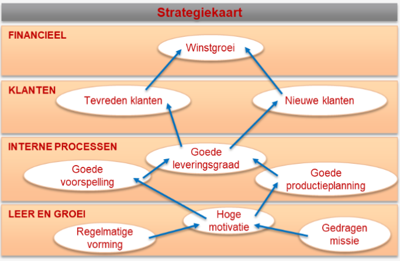
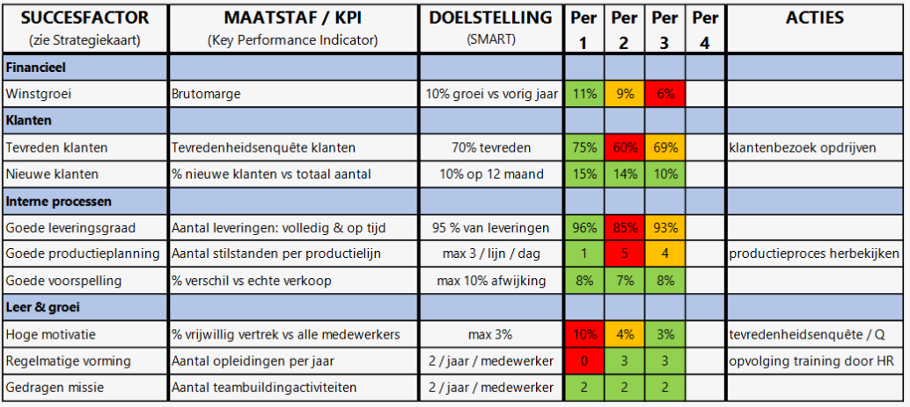

<h1> Opvolging </h1>

- [De gekozen strategie realiseren](#de-gekozen-strategie-realiseren)
- [Strategiekaart](#strategiekaart)
- [Balanced scorecard](#balanced-scorecard)

## De gekozen strategie realiseren

In deze fase is de check-fase uit de PDCA-cyclus heel belangrijk. (-> Zijn we met de vooropgestelde strategie goed bezig om onze doelstellingen te realiseren?)

Er zijn drie situaties:

- Alles is volgens plan verlopen => Geen verdere analyse nodig
- Alles is beter verlopen dan verwacht => Bekijken waarom en kijken of we deze kennis in de toekomst kunnen gebruiken.
- Ons plan is niet zo goed verlopen als verwacht => Nadenken over correcties om terug op schema te geraken.

## Strategiekaart

-> Helpt de strategie te vertalen naar activiteiten. Kan handig zijn bij analyseren van belangrijke informatie.

Strategie wordt hierin visueel weergegeven in vier niveaus (van onder naar boven)

De indicatoren die we uit de strategiekaart halen wordt in 2 categorieën opgesplitst:

- Lagging indicatoren (met informatie over het verleden)
- Leading indicatoren (met informatie over de toekomst)

Wordt vaak vergeleken met een dashboard van een auto   kilometerstand = lagging, benzineniveau = leading

Het financiële niveau (de winstgroei) is een lagging indicator. De andere drie niveaus (klanten, interne processen, leer en groei) zijn leading indicatoren.

Leer en groei zorgt voor betere interne processen, wat leidt tot tevreden klanten. Er is dus een sterke onderlinge afhankelijkheid tussen de drie niveaus.

## Balanced scorecard

Vertrekt vanuit de strategiekaart.

In de linkerkolommen staan de verschillende onderdelen van de strategiekaart.

In de tweede kolom worden Key Performance Indicators gedefinieerd (= Waar gaan we naar kijken om te beoordelen of de succesfactor moet bijgestuurd worden of niet?)

In de derde kolom staan doelstellingen (SMART geformuleerd).

Tijdens de CHECK-fase doe je metingen om te kijken of de organisatie de doelstellingen haalt of niet (= de opvolging).

Tijdens de ACT-fase wordt een laatste kolom toegevoegd waarin acties worden neergeschreven om de doelen bij te sturen.

