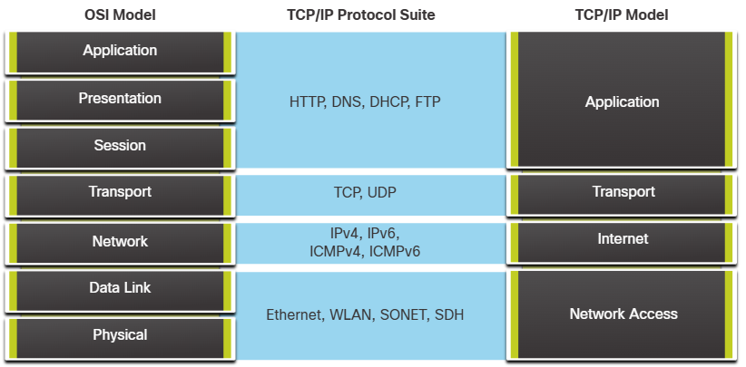

# Protocollen en Modellen

## De regels

Vereisten voor netwerkprotocollen:
-	Message encoding: encoderen bij verzenden en decoderen bij ontvangen
-	Message formatting en inkapseling: informatie moet in een bepaalde vorm verzonden worden om geïdentificeerd te kunnen worden (analogie met brief in envelop)
-	Message size: Boodschappen worden in stukjes opgedeeld
-	Message timing: 
    + Flow control: Managen hoeveel data en hoe snel deze data kan verstuurd worden
    + Response timeout: Hoe lang het duurt voor er beslist wordt dat er geen antwoord komt
    + Access method: Bepaalt wanneer iemand een bericht kan verzenden
-	Message delivery options: unicast (naar 1 ontvanger), multicast of broadcast (alle end devices)

## Protocollen

4 types:
-	Network Communication Protocols: Zorgen ervoor dat meerdere devices met elkaar kunnen communiceren. (IP, TCP, HTTP)
-	Network Security Protocols: Houden zich bezig met beveiligen van data. (SSH, SSL, TLS)
-	Routing Protocols: Bepalen het pad dat de informatie moet nemen (OSPF, BGP)
-	Service Discovery Protocols: Automatische detectie van devices of services.

Functies van netwerkprotocollen:
-	Addresseren: Identificeert de zender en ontvanger. (vb. Ethernet, IPv4, IPv6)
-	Reliability: Gegarandeerde aflevering van het bericht (vb. TCP)
-	Flow control: Ervoor zorgen dat de data efficiënt flowt.
-	Sequencing: Data labelen zodat de ontvanger deze juist terug aan elkaar kan plakken.
-	Foutdetectie
-	Applicatie Interface: Informatie bijhouden om de communicatie tussen processen mogelijk te maken (vb. HTTP of HTTPS)

## Protocol suites
Sets van protocollen die samenwerken op verschillende layers.

Belangrijkste is TCP/IP Protocol. Er zijn enkele andere suites, maar deze zijn in de jaren 90 in onbruik geraakt. (OSI-suite soms wel nog)

TCP/IP werkt in 4 layers:
-	Applicatie: HTTP, DNS, DHCP, FTP
-	Transport: TCP, UDP
-	Internet: IPv4, IPv6, ICMPv4, ICMPv6
-	Network Access: Ethernet, ARP, WLAN

Ze hebben de volgende functies
-	Applicatie: Name system, host config, email, file transfer, web and web services
-	Transport: Connection-Oriented, Connectionless
-	Internet: Internet Protocols, Messaging, Routing Protocols
-	Network Access: Address Resolution, Data Link Protocols

## Standaardenorganisaties
Open standaarden betekent dat geen enkele producent een oneerlijk voordeel heeft op de markt. Er zijn een paar belangrijke organisaties die zulke standaarden maken:
-	IETF: Internet Engineering TaskForce voor onder andere TCP/IP-technologieën (is deel van ISOC -> Internet Society)
-	ICANN en IANA: Verantwoordelijk voor toewijzen van IP-addressen, domain name managamen en andere informatie die belangrijk is voor IP.
-	IEEE: onder andere voor 802.3 Ethernet en 802.11 WLAN
-	EIA: Verantwoordelijk voor standaarden voor de elektrische bedrading, connectoren en network rack groottes.
-	TIA: Communicatiestandaarden (onder andere VoIP)
-	ITU-T: IPTV, DSL, videocompressie

Deze organisaties zijn gebruikelijk non-profits en vendor-neutraal.

## Referentiemodellen
Er zijn twee grote referentiemodellen: OSI en TCP/IP

### OSI-layers
-	Applicatie: Protocollen voor proces-naar-procescommunicatie
-	Presentatie: Gemeenschappelijke representatie van data tussen applicatielagen
-	Sessie: Beheert data-uitwisseling en biedt diensten aan de presentatielaag aan
-	Transport: Diensten die data overbrengen, reassembleren, opsplitsen, etc.
-	Netwerk: Diensten die de data van het ene end-device naar het andere brengen
-	Data link: Diensten om data over een medium aan andere devices aan te bieden.
-	Fysiek: Mechanische, elektrische, etc. onderdelen om verbinding te maken met andere devices.

### TCP/IP-layers
Dit model is specifiek opgesteld voor de TCP/IP-suite
-	Applicatie: Data die aan de gebruiker wordt gegeven + encoderen / decoderen
-	Transport: Verzorgt de communicatie tussen devices
-	Internet: Beslist het beste pad door het netwerk.
-	Netwerktoegang: Beheert de hardware en devices in het netwerk.

## Data-inkapseling
Segmenteren is nodig: kleinere packets zorgen ervoor dat de communicatielijnen niet bezet blijven en dat niet heel het bericht opnieuw verzonden moet worden bij een fout. Dit zorgt voor de mogelijkheid om meerdere communicatielinken te ondersteunen met één pad (= multiplexen)

**Segmenteren verhoogt snelheid en efficiëntie.**

TCP is verantwoordelijk voor de sequencing van packets (nummer geven zodat ze in de juiste volgorde gezet kunnen worden door de ontvanger).

PDU (protocol data unit) -> De vorm die de data aanneemt in een bepaalde layer. Elk protocol kapselt het PDU verder in.
De PDU krijgt soms een andere naam afhankelijk van de layer waarnaar we kijken. In Netacad worden de volgende termen gebruikt:
-	Applicatielaag: data
-	Transportlaag: segment (bij TCP), datagram (bij UDP)
-	Netwerklaag: packet
-	Data Link: Frame (hier wordt ook informatie op het einde toegevoegd)
-	Fysiek: Bits

In elke laag wordt het packet van de “hogere layer” gezien als data.

## Data Access
Twee addressen nodig:
-	Netwerklaag: Verantwoordelijk voor de source en destination op hetzelfde of een ander netwerk (logical address)
-	Data Link: Verantwoordelijk voor het afleveren van het datalinkframe van een NIC naar een andere NIC op hetzelfde netwerk. (physical address)

Logical adressen zijn IP-adressen, ze bestaan uit:
-	Netwerkportie (IPv4) of Prefix (IPv6): Linkerdeel toont in welk netwerk het IP-adres zich bevindt.
-	Host portion (IPv4) of Interface ID (IPv6): Het specifieke device in het netwerk.

IPv4 gebruikt het subnet mask en IPv6 de prefix-length om aan te geven hoe lang het netwerkgedeelte is.

Fysieke adressen zijn MAC-adressen. Als devices op hetzelfde netwerk zitten, communiceren ze direct met elkaar.
Als de devices op verschillende netwerken zitten, stuurt het device de boodschap naar de default gateway (= router), deze forwardt het bericht naar het andere netwerk.
