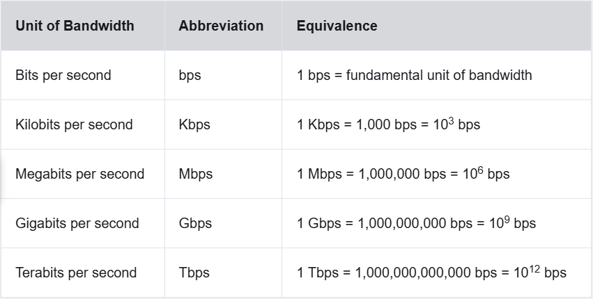
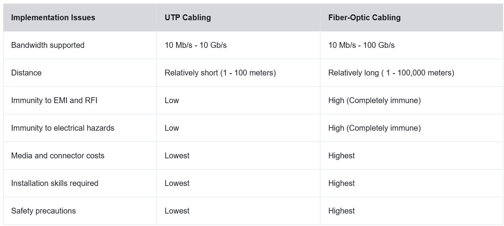

# Physical Layer

## Doel

Devices fysiek verbinden via hun NIC's.

De fysieke laag ontvangt een data link frame en zet dit om naar een reeks signalen (elektrisch, optisch, radiogolven) die over het medium verzonden kunnen worden.

## Eigenschappen

### Standaarden

De fysieke laag is vooral bezig met de fysieke bekabeling / hardware. De standaardorganisaties verschillen dus vaak van de hogere lagen die vaak onder IETF vallen. 

Voor de fysieke laag zijn het meestal elektrische ingenieursorganisaties die de standaarden vastleggen (vb. IEEE, ISO, ITU-T, ...) Er zijn ook veel lokale bekabelingsstandaarden.

De standaarden omvatten:
- **de fysieke componenten**: designs van kabels, connectoren, kabelmateriaal, NIC's
- **encoderen**: bepalen wanneer het signaal een 1 of een 0 is (vb. Manchester encoding)
- **signaleren**: de manier waarop bits voorgesteld worden in hun signaal

### Bandbreedte

= De capaciteit van een medium.

Bandbreedte is niet de snelheid van de signalen, maar de hoeveelheid bits die per seconde kunnen uitgestuurd worden.

Om de kwaliteit van bandbreedte aan te geven, worden deze termen gebruikt:
- Latency: tijd die nodig is om de data van punt A naar B te brengen (= gelimiteerd door traagste link)
- Throughput: Hoeveel bits door het medium gaan over een bepaalde tijdspanne (= altijd lager dan bandbreedte)
- Goodput: De hoeveelheid bruikbare data door het medium stroomt (= alle data - overhead - opnieuw verstuurde bits, dus altijd lager dan throughput)

## Koperkabels

**Meest voorkomende bekabeling**

-> Vooral voor netwerken (= goedkoop, makkelijk te installeren, geleidt goed **MAAR** beperkte afstand, andere signalen kunnen interfereren) 

Signal attenuation = signaalverzwakking

Interference van:
- EMI (Electromagnetic Interference) en RFI (Radio Frequency Interference): kunnen data vervormen (vb. elektrische motors)
- Crosstalk: Vervorming door signaal in een andere kabel / ander magnetisch veld (vb. kabels effectenpedalen gitaar)

EMI/RFI wordt tegengegaan met shielding en aarding. Crosstalk door kabels in twisted pairs te leggen (-> "opposing circuit" haalt crosstalk weg)

Drie types:
- UTP (= Unshielded Twisted Pair): LAN-kabels die op RJ-45 passen
- STP (= Shielded Twisted Pair): Betere bescherming tegen EMI / RFI, maar duurder. Past ook op RJ-45. Moet correct geaard worden, zodat het shield niet als antenne werkt.
- Coaxiaal: Vervangen door UTP in Ethernet, maar nog gebruikt om antennes te verbinden met apparaten. ISP's vervangen deze door glasvezel, maar veel mensen hebben nog een coax-aansluiting.

## UTP-kabels

Gebruikt geen shielding, maar enkele andere methodes om EMI/RFI interference te verminderen:
- Cancellation: De kabels komen in een "paar" dat rond elkaar gewikkeld wordt, hun magnetische velden zijn exact het omgekeerde van elkaar. Ze cancellen elkaars magnetische veld en EMI/RFI
- Elke kabelkleur verschilt in het aantal "twists", dit versterkt het cancellation-effect.

De elektrische standaarden voor koperkabels zijn vastgelegd door IEEE. Ze krijgen op basis daarvan een rating.

|Category|Data rate|
|--------|---------|
|3|10Mbps|
|5|100Mbps|
|5e|1000Mbps|
|6|10Gbps|
|7|10Gbps|
|8|40Gbps|

Cat3 kon gebruikt worden voor data, maar was vooral voor telefoonbedrading.

> Tip!
>
> Om de performance van de kabels hoog te houden, moet je ervoor zorgen dat je de kabel maar losdraait tot waar het nodig is en dat je de beschermende buitenlaag tot in de plug laat doorlopen.

### Straight-Through vs. Crossover

||Ethernet Straight-Through|Ethernet Crossover|
|----|----|----|
| Gebruik | Verbindt apparaten op verschillende layers met elkaar | Verbindt apparaten van dezelfde layer met elkaar (vb. switch-switch)|
|Wiring standards|Beide kanten gebruiken dezelfde standaard in RJ-45 connector| Ene uiteinde gebruikt T568A en het andere T568B in de RJ-45|

Crossover kabels worden als legacy gezien -> De NIC detecteert nu zelf het soort kabel (auto-MDIX)

Verkeerde keuze brengt geen schade aan maar kan wel de reden zijn dat er geen verbinding is -> altijd het eerste dat je moet checken op de fysieke laag.

## Glasvezelkabels

Er zijn twee types glasvezelkabel:

|Single-mode fiber|Multimode fiber|
|----|----|
|SMF|MMF|
|Lasers als lichtbron| LED als lichtbron|
|Honderden kilometers| Maximaal 550m|
|Eén pad voor het licht | Licht neemt meerdere paden door de kabel|
|Aangeduid met gele kleur|Aangeduid met oranje of aqua kleur|

Tot voor kort had je vaak twee kabels nodig voor wederzijdse communicatie. Nu zijn er ook kabels die kunnen verzenden en ontvangen over dezelfde glasvezelverbinding.

Use cases:
- Bedrijfsnetwerken: Backbone van het systeem en verbinden van infrastructuur
- Fiber-to-the-Home (FTTH): Bekabeling naar huizen en kleine bedrijven
- Long-Haul netwerken: Landen en steden verbinden met elkaar
- Submarine Cable Networks: Onderzeekabels

### Glasvezel vs. Koper

## Wireless

Meest flexibel op vlak van mobiliteit maar heeft een paar limitaties:
- Coverage: Veel materialen houden het signaal tegen.
- Interference: Kan verstoord worden door andere apparaten
- Security: Omdat je geen fysiek medium nodig hebt, kan iedereen aan de transmissie.
- Shared medium: Er kan maar één device tegelijk verzenden/ontvangen. Als er meer gebruikers zijn, gaat de verbinding dus trager.

IEEE regelt voor wireless de standaarden voor zowel de fysieke als de datalinklaag.

Standaarden:
- Wi-Fi (IEEE 802.11): Soms ook WLAN, maakt gebruik van CSMA/CD (Carrier Sense Multiple Access with Collision Detection).
- Bluetooth (IEEE 802.15): Soms ook WPAN (Wireless Personal Area Network)
- WiMAX (IEEE 802.16): Worldwide Interoperability for Microware Access - draadloze breedband
- Zigbee (IEEE 802.15.4): Gebruikt voor IoT en industriële omgevingen. Lage data-rate, lage range.

*Er zijn nog andere standaarden, maar die komen niet in netacad aan bod*

Om een draadloze verbinding te maken, heb je een WAP (Wireless Access Point) en een Wireless NIC nodig.
