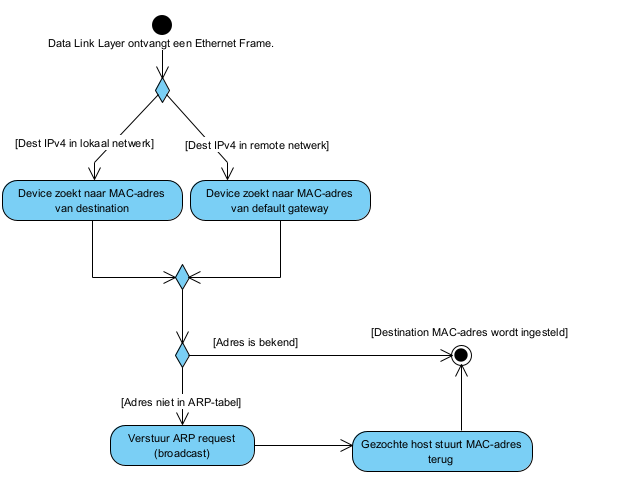

# Address Resolution

- [MAC and IP]()
- [ARP]()
- [IPv6 Neighbor Discovery]()

## MAC and IP

MAC = physical address  
IP = logical address

| Ontvanger op...     | Zelfde netwerk         | Ander netwerk                                             |
| ------------------- | ---------------------- | --------------------------------------------------------- |
| **Destination MAC** | Adres van de ontvanger | Adres van de default gateway OF adres van de volgende hop |
| **Source MAC**      | Adres van de zender    | Adres van de zender OF laatste hop                        |
| **Source IP**       | Adres van de zender    | Adres van de zender                                       |
| **Destination IP**  | Adres van de ontvanger | Adres van de ontvanger                                    |

## ARP

-> Zoekt MAC-adres dat bij een IPv4-adres hoort  
-> Houdt een tabel met IPv4-MAC mappings bij (in RAM)

Een ARP-request is een broadcast. Het packet bestaat uit een Ethernet Header en een ARP Request.

- De hosts ontvangen de PDU.
- De hosts zien dat de PDU een broadcast is en ontkapselen de Ethernet Header.
- De host checkt het Target IPv4 in ARP Request
  - Match -> Host stuurt een ARP-reply terug naar het MAC-adres van de zender.
  - Geen match -> Drop packet

Een ARP-reply bevat het IPv4-adres en MAC-adres van de zender (= host die reply stuurt)

ARP-requests en -replies hebben het type 0x806

Elke ARP cache heeft een timer. Als een entry in de ARP cache niet gebruikt is binnen die tijd, wordt de entry verwijderd  
_(-> op moderne Windows systemen is de timer tussen de 15 en 45 seconden)_

Risico: ARP-spoofing = device stuurt een ARP-reply voor een ander device (vb. host van een hacker repliet op een ARP-request voor de default gateway)

Op windows: `arp -a` om de mappings te tonen, `arp -d` om de cache te clearen.

## IPv6 Neighbor Discovery

Vijf soorten messages:

- Neighbor Solicitation (NS)
- Neighbor Advertisement (NA)
- Router Solicitation (RS)
- Router Advertisement (RA)
- Redirect Message

NS en NA worden gebruikt voor address resolution.  
RS en RA worden gebruikt voor router discovery en SLAAC.

Zender van een message stuurt een NS met een speciaal multicast-address. Ontvangers kunnen checken of de NS voor hen is zonder die naar het OS door te sturen. De ontvanger stuurt een NA via ICMPv6 terug.

