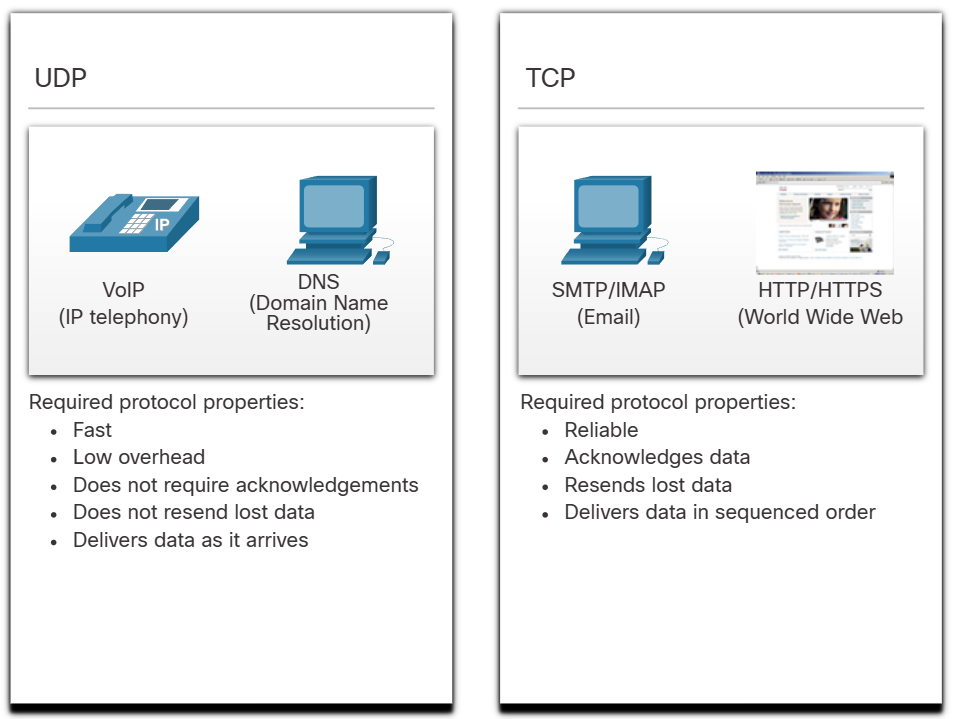

# Transport Layer

## Transportation of Data

In de transport layer heet de PDU een segment (TCP) of datagram (UDP).

De Transport Layer heeft enkele verantwoordelijkheden

- "Conversations" (stroom data tussen applicatie op een host en een andere host) bijhouden
- Data opdelen in stukjes en terug aan elkaar maken
- Een header toevoegen met extra informatie (vb. voor welke applicatie de data bedoeld is, volgorde van data, etc.)
- De applicaties die data nodig hebben identificeren (via ports)
- Conversaties multiplexen (verschillende conversations door elkaar bijhouden)

In de transport layer spelen twee grote protocollen:

- Transmission Control Protocol (= TCP): Deelt de data op in segmenten, verstuurt ze en verwacht een acknowledgement. Zeer betrouwbaar.
- User Datagram Protocol (= UDP): Sneller, zonder acknowledgments.

Een connection-oriented protocol moet eerst een connectie maken met de ontvanger. TCP is connection-oriented, UDP is connectionless.

De keuze tussen TCP en UDP is afhankelijk van de applicatie. TCP zorgt ervoor dat de data volledig is. UDP richt zich op snelheid (vb. voor video streaming).

UDP wordt ook vaak gebruikt voor request-and-reply applicaties, zoals DNS. Als ze binnen een bepaalde tijd geen antwoord hebben ontvangen, sturen ze het request gewoon opnieuw. Ze hebben geen ACK nodig.

Sommige firewalls blokkeren UDP, waardoor applicaties die normaal gezien UDP zouden kunnen gebruiken er toch voor kiezen om met TCP te werken.

## TCP Overview

TCP voorziet naast segmentatie en reassembly van data voor de volgende services:

- Maakt sessies aan: een connectie tussen twee hosts
- Zorgt voor reliable delivery (door gebruik van acknowledgements)
- Zorgt ervoor dat de data in de juiste volgorde terecht komt.
- Flow Control

TCP wordt onder andere gebruikt door de volgende applicaties:

- FTP (File Transfer Protocol)
- HTTP (HyperText Transfer Protocol)
- SMTP (Simple Mail Transfer Protocol)
- SSH (Secure Shell)

De TCP header bestaat uit 20 bytes. De 10 fields zijn:

- Source Port
- Destination Port
- Sequence Number -> cijfer waarmee de data in de juiste volgorde gezet kan worden
- Acknowledgement Number -> de ontvangende host stuurt hiermee terug welk segment het nu verwacht (en geeft daarmee aan dat het vorige aangekomen is) : vb. ack number is 15, dat betekent dat segment 0-14 aangekomen zijn en dat de andere host nu segment 15 verwacht.
- Header Length
- Reserved -> bevat geen data, gereserveerd voor de toekomst
- Control Bits -> codes en flags om doel en functie van het segment aan te geven (vb. SYN, ACK, FIN).
- Window Size -> geeft aan hoeveel bytes in één keer geaccepteerd worden voordat een ACK teruggekregen moet worden
- Checksum
- Urgent -> Geeft aan of het segment voorrang moet krijgen

## UDP Overview

Best-effort delivery: UDP verzendt de data, maar checkt niet of dit goed gedaan is.

UDP is stateless, dat betekent dat noch de client noch de server de staat van communicatie bijhoudt.

De UDP header is 8 bytes lang. De 4 fields zijn:

- Source Port
- Destination Port
- Length
- Checksum

Wordt vooral gebruikt door:

- Live video en multimedia applicaties: VoIP (Voice over IP)
- Request en reply applicaties: DNS, DHCP
- Applicaties die zelf reliability implementeren: SNMP (Simple Network Management Protocol), TFTP (Trivial File Transport Protocol)

## Port Numbers

De source port wordt dynamisch gegenereerd wanneer een request verzonden wordt. De destination port identificeert de service die je request op de server (vb. poort 80 voor web)

De source port dient als return adres voor de applicatie die de info aanvraagt.

Socket = combinatie van Destination/Source IP en Destination/Source Port (vb. 192.168.1.7:80)

### Port Number Groups

| Naam                    | Range         | Nut                                                                                             |
| ----------------------- | ------------- | ----------------------------------------------------------------------------------------------- |
| Well-known ports        | 0 - 1023      | Worden gebruikt voor bekende services (vb. 20 voor FTP)                                         |
| Registered ports        | 1024 - 49151  | Poorten die toegewezen zijn aan specifieke processen / applicaties van bedrijven / organisaties |
| Private / Dynamic Ports | 49152 - 65535 | Vrij te gebruiken, meestal als source port.                                                     |

Je kan met het commando `netstat` zien welke active connections er open zijn via TCP. Dit is belangrijk voor security. Optie -n zorgt ervoor dat de domeinnamen niet vertaald worden, maar gewoon als IPs blijven staan.

## TCP Communication Process

TCP maakt een verbinding via de **three-way handshake**. Hiervoor moeten de Synchronize (SYN) en Acknowledgement (ACK) flags gebruikt worden.

1. SYN: Client vraagt een client-server-sessie aan.
2. ACK and SYN: De server stuurt een acknowledgement naar de client en vraagt een server-client-sessie aan.
3. ACK: De client stuurt een acknowledgement naar de server.

De three-way handshake bereikt drie zaken:

- Bevestigt dat het destination device op het netwerk zit.
- Bevestigt dat het destination device een actieve service aanbiedt op de destination port.
- Informeert het destination device dat de source client communicaties wil opstarten met de destination port.

Sessies worden beëindigd door de Finish (FIN) control flag. Dit kan zowel door de client als server gebeuren:

1. FIN: Host A, die de sessie wil beëindigen, stuurt een FIN-segment naar host B.
2. ACK: Host B stuurt een ACK naar host A. Dit zet de A-B-sessie stop.
3. FIN: Host B stuurt een FIN naar host A.
4. ACK: Host A stuurt een ACK naar host B. Dit zet de B-A-sessie stop.

Er bestaan nog drie andere control flags:

| Flag | Betekenis                                                                                                           |
| ---- | ------------------------------------------------------------------------------------------------------------------- |
| URG  | Geeft aan dat de data in dit segment dringend is                                                                    |
| PSH  | Geeft aan dat de date nog dringender is en onmiddellijk naar de applicatielaag moet zonder op extra data te wachten |
| RST  | Reset de verbinding bij een error of timeout                                                                        |

## Reliability and Flow Control

Wanneer de sessie aangemaakt wordt, krijgt het sequence number een random waarde (Initial Sequence Number = ISN) => Reden: bepaalde cyber attacks voorkomen

Segmenten kunnen in de verkeerde volgorde arriveren bij de destination. De segmenten komen bij het ontvangende apparaat in een receiving buffer. TCP zet ze daar terug in de juiste volgorde. Als ze in de juiste volgorde staan, worden ze doorgegeven naar de applicatielaag.

Data loss wordt opgevangen door een timer. Host A zet die timer en als er geen ACK komt voor het verloop van de timer, stuurt A het segment opnieuw.

Als het segment onvolledig bij host B aangekomen is, wordt de data vanaf de laatste ACK opnieuw opgestuurd. Dit stuurt onnodig veel duplicate data door. Sommige devices ondersteunen daarom SACK (Selective ACK) waardoor ze kunnen aangeven welke seq numbers verloren gingen.

In een ACK van Host B, kan de window size aangepast worden (vb. omdat de buffer bijna vol zit). Host A moet de verzonden bytes beperken tot de window size die het van host B krijgt (dynamische window size = sliding windows). Host B zal vaak al een ACK sturen voordat de window size bereikt is. Als de window size bereikt is, moet host A wachten met data zenden.

**Maximum Segment Size** (= MSS) - Maximum grootte van data in één segment (TCP header niet meegerekend). Dit wordt vastgezet tijdens de three-way handshake. Dit is meestal 1460 bytes bij IPv4. MSS wordt vastgesteld door de MTU (maximum transmission unit) van de ethernet interface te nemen en de grootte van de IPv4 header (20 bytes) en TCP header (20 bytes) ervan af te trekken.

Om opstopping te voorkomen, zendt TCP kleinere segments als het geen ACKs ontvangt.

## UDP Communication

Datagrammen worden niet geordend, ze hebben geen sequence number. Ze worden aan de applicatielaag doorgegeven in de volgorde waarin ze ontvangen worden. Er zijn geen ACK messages. UDP werkt zoals TCP maar zonder de reliability en flow control.
