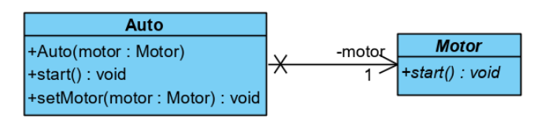
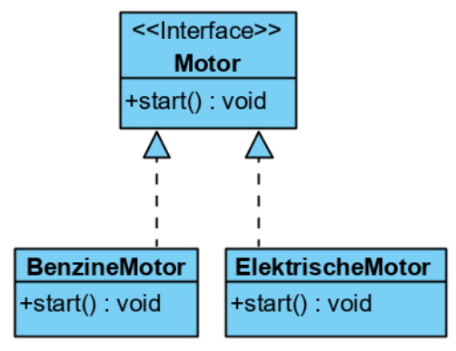

# Polymorfisme & Interfaces

De doelen van dit hoofdstuk zijn om volgende zaken te herkennen, toe te lichten, te definiëren, toe te passen en te implementeren:

- [Overerving en polymorfisme](#polymorfisme)
- [Static en dynamic binding](#static-en-dynamic-binding)
- [Dependency injection](#dependency-injection)
- [Interfaces](#interfaces)

## Polymorfisme

Komt voort uit overerving.

**Upcasting**  
<code>Rechthoek ref_rechthoek =  new Vierkant("Vierkant")</code>  
*Superklassereferentie refereert naar een subklasse*

**Downcasting**  
<code>Vierkant ref_vierkant = (Vierkant) ref_rechthoek</code>  
*Superklassereferentie wordt toegekend aan een subklassereferentie*

> **TIP**   Je moet altijd nagaan of de referentie wel refereert naar een object van het juiste type voor je een downcast uitvoert. Gebruik daarvoor <code>instanceof</code>

Je kan ook direct downcasten met instanceof.

> <code>if (ref_rechthoek instanceof Vierkant ref_vierkant) {
    // ref_vierkant kan je hier gebruiken
    } </code>

### Toekenning

** De rechteroperand moet... **
- van dezelfde klasse als de linkeroperand zijn;
- een subklasse van de linkeroperand zijn;
- <code>null</code> zijn.

De methodes die je kan aanroepen, zijn de methodes in de klasse van de **referentie** (vb. Als de referentie van type Figuur is en verwijst naar een instantie van Vierkant, kan je enkel de methodes van Figuur aanroepen.)

De gekende methodes van een klasse zijn:
- de zichtbare methodes van de klasse zelf;
- de zichtbare methodes in een supperklasse van de klasse;
- de zichtbare methodes in een interface die de klasse implementeert.

De gekende methodes in [interfaces](#interfaces) zijn:
- de methodes van de interface elf;
- de zichtbare methodes van een superinterface van de interface.

### Abstracte klasse

Abstracte klassen kunnen geen instanties maken, maar heeft subklassen die dit wel kunnen. Je kan de abstracte klasse wel als referentie gebruiken om een hogere graag van generalisatie te bereiken.

In de abstracte klasse, schrijf je abstracte methoden uit:   <code>**abstract** void *teken()* {}</code>

## Static en Dynamic Binding

Binding = linken van een methodedeclaratie aan de implementatie

- **Static Binding**: gebeurt tijdens compileren
- **Dynamic Binding**: gebeurt tijdens uitvoering

Static binding is enkel mogelijk als het type van het object als gekend is tijdens het compileren. Dit is het geval bij private, final en static methodes en attributen.   *Bij static binding kan de aanroep direct naar het codeblok van de methode verwijzen*

Bij dynamic binding bepaalt het type van het object de implementatie die uitgevoerd wordt, dat type wordt pas bij runtime bepaald.

> **Dynamic Binding** -> pas bij runtime weet het programma welke klasse `obj` heeft. Het programma weet dan pas welke implementatie van `teken()` het moet uitvoeren.

## Dependency Injection

Een abstracte methode dwingt gedrag af dat van een type verwacht kan worden, maar nog niet geïmplementeerd is. De methode kan later geïnjecteerd worden (= **dependency injection**)

vb. Je maakt een abstracte klasse `Motor` en definieert daarin de abstracte methode `start()`. Je kan nu de Auto (die Motor nodig heeft) gaan implementeren en later de motor implementeren. Hoe de startmethode van de motor eruitziet, wordt later bepaald (elektrische motor / benzinemotor?).

De methode `start()` van Auto: 
<code>public void start(){ 
    motor.start() 
    }</code>

## Interfaces

Is een referentietype (vergelijkbaar met klasse). Ze schrijven methoden en attributen voor die de klassen die de interface implementeren, moeten hebben. Interfaces kunnen niet-gerelateerde klassen samenbrengen in een bepaalde context.

Een klasse kan meerdere interfaces implementeren en een interface kan meerdere andere interfaces uitbreiden.

Implementeren met:   <code>public class Class **implements** Interface</code>

> **TIP**   Namen van interfaces eindigen vaak op -able / -baar (Nederlands)

Een interface kan het volgende bevatten:
- constanten
- `abstract` methodes
- `default` en `static` methodes met implementatie

Interfaces hebben geen constructor en kunnen niet geïnstantieerd worden.

Een **functionele interface** is een interface met één abstracte methode.

Methodes zonder de keywords `private`, `default` of `static` zijn impliciet `public` en `abstract`.

Attributen zijn impliciet `public`, `static` en `final`.

Als een variabele een interface als type heeft, moet de rechteroperand bij toekenning van een van de volgende types zijn:
- de interface zelf
- een sub-interface van de interface
- een klasse die de interface implementeert
- een klasse die een subinterface van de interface implementeert
- `null`

   UML-notatie van een interface

> **Principle**   <strong> "Program to an interface, not an implementation" </strong>   Dit design principle zorgt ervoor dat je later makkelijk de implementatie kan vervangen.

> **Principle**   <strong> "Code should be open for extension, but closed for modification" </strong>   Als we onze code niet moeten aanpassen, maar wel kunnen uitbreiden, zorgen we ervoor dat onze oude code niet breekt.

### Default methodes

-> Impliciet `public`

De defaultmethode wordt gebruikt door klassen die de interface implementeren, maar zelf geen uitwerking van de methode voorzien.

Laat toe om makkelijk nieuwe methodes aan een interface toe te voegen.

### Objecten sorteren

Als je bij de methode `sort()` de parameter `null` gebruikt, maak je gebruik van de natuurlijke vergelijking (Comparable). Je kan ook een alternatieve sortering meegeven, dan moet je een nieuwe instantie van een klasse die Comparator implementeert meegeven.

#### Comparable interface

Is een functionele interface (heeft één abstracte methode):  
<code> public interface Comparable<T> {  
    public int compareTo(T o);  
} </code>

De int bij return bepaalt of het andere object groter / kleiner is:
- negatief: het meegegeven argument is kleiner
- 0: het object en het argument zijn even groot
- positief: het meegegeven argument is groter

Deze interface kan op de klasse zelf, we spreken van *natuurlijke vergelijking*.

### Comparator interface

Is ook een functionele interface. De methode in Comparator volgt dezelfde regels als in Comparable. Je gebruikt Comparator als je van de natuurlijke vergelijking wil afwijken.

Comparator implementeer je op een aparte klasse. Meestal geef je die een naam die eindigt op Comparator.

### Interface of abstracte klasse?

Abstracte klasse: specifiëren wat een bepaald object is  
"A is een B"

Interface: beloven dat een object iets kan doen  
"A kan hetgene uit B doen"

Volgens Oracle gebruik je abstracte klasses:
- Als je code wil delen in sterk gerelateerde klasses
- Als je verwacht dat de klassen die zullen erven van de abstracte klassen veel gedeelde methodes / attributen zullen hebben.
- Attributen definiëren die niet static of final zijn.

En interfaces als je:
- Verwacht dat niet-gerelateerde klassen hetzelfde gedrag nodig hebben.
- Een bepaald gedrag wil specifiëren maar niet weet wie / wat dit zal implementeren.
- Meervoudige overerving wil kunnen gebruiken.