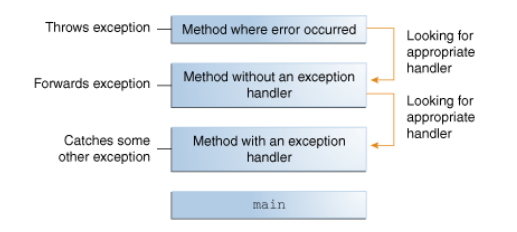
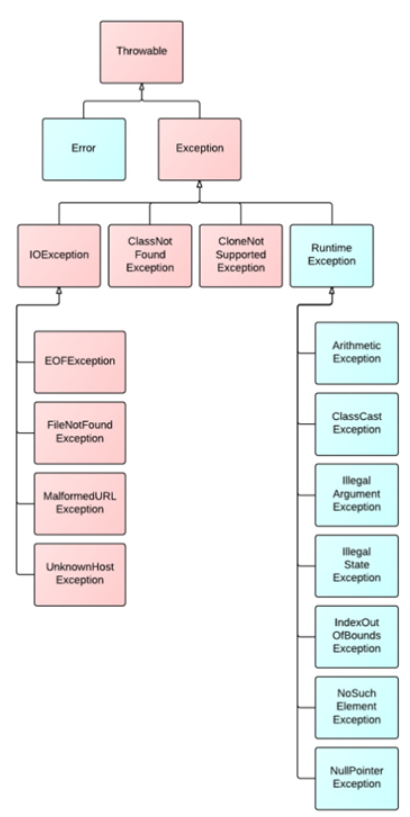

# Exception Handling

- [Excepties gooien](#excepties-gooien)
- [Exception handling](#exception-handling-1)
- [Propagatie van een exceptie](#propagatie-van-een-exceptie)
- [Excepties opvangen](#excepties-opvangen)
- [Try-with-resources statement](#try-with-resources-statement)
- [Soorten exceptions](#soorten-exceptions)
- [Exceptions declareren](#exceptions-declareren)

## Excepties gooien

Bij een exceptie (= gebeurtenis die tot bijvoorbeeld een crash leidt), maakt de methode een nieuw exception object aan.

```java
throw new IllegalArgumentException();
```

Als een exceptie gegooid wordt, zoekt het runtime system naar een handler in de call stack. <br> 

De exception handler kan de exception afhandelen als het type van de exception parameter hetzelfde is als die van de exception. Dit heet catching an exception.

Geen handler = runtime system stopt.

Als je wil (verplicht bij checked exceptions) aangeven dat een methode een exception kan throwen maar deze niet zelf handlet:

```java
public void methodName() throws ExceptionType, ExceptionType 2{
    //code
};
```

## Exception Handling

Kan met een try/catch blok:
- try: Blok code waarin een exception kan optreden
- catch: Block code die een specifieke exception kan handlen
- finally (optioneel): Blok code dat altijd uitgevoerd zal worden (ook als er een error optreedt), hier kan je best de cleanup van het try-blok doen.

```java
try {
    code
} catch (ExceptionType parameterNaam) {
    //code voor exception handling
} catch (ExceptionType2 parameterNaam) {
    //code voor nog een andere exception
} catch (ExceptionType3|ExceptionType4 parameterNaam) {
   // handlet zowel 3 als 4
}
finally {
    // Dit wordt altijd uitgevoerd, belangrijk voor resource leaks
}

```

De eerste exception handler die de exception kan accepteren, is degene die uitgevoerd wordt (let op voor polymorfisme bij exceptions)

Propagatie = exceptie op een hoger niveau afhandelen

## Try-with-resources statement

= Try-statement dat meerdere resources declareert. <br>
Resource = object dat moet gesloten worden nadat het niet meer nodig is

```java
try (Scanner s = new Scanner(System.in)) {
    //code
}
// s wordt vanzelf gesloten
```
Als je meerdere resources wil declareren, moet je ze scheiden met een ;

Catch en finally blokken worden uitgevoerd NA het sluiten van de resources.

## Soorten exceptions

 <br> *Blauw: unchecked - Rood: checked*

Onder de unchecked exceptions vallen:
- Errors: Events waarop niet geanticipeerd kan worden en de applicatie zich niet van kan herstellen.
- Runtime Exceptions: Exceptions die de applicatie niet kan anticiperen (vb. bugs, onjuist gebruik van API, etc.)

Unchecked exceptions kunnen afgehandeld worden. Dit is niet verplicht.

Checked exceptions **moeten** afgehandeld worden. Het zijn exceptions waarop je kan anticiperen. Het is verplicht ze te omringen met try-clausules.

## Exceptions declareren
Je kan zelf een exception klasse declareren door deze te laten erven van Exception(checked exceptions) of RuntimeException(unchecked exceptions)