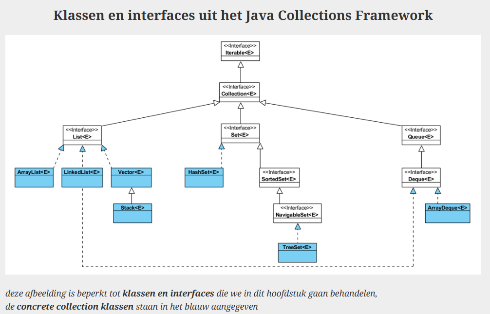
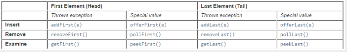

# Collections

## Interface Collection<E>

Kan gebruikt worden om collections aan methodes door te geven als parameter of als returntype. Op die manier is de implementatie flexibel.

Methodes:
- size()
- isEmpty()
- contains(Object o)
- add(E element)
- remove(Object element)
- iterator()

Bulk methodes:
- containsAll(Collection<?> c)
- addAll(Collection<? extends E> c)
- removeAll(Collection<?> c)
- retainAll(Collection<?> c)
- clear()

< ? extends E> = het type moet een subtype zijn van E.

Je kan een collection doorgeven aan de constructor om een nieuwe collection aan te maken met alle elementen uit de eerste collection. Alle types uit Collections kunnen dus naar alle andere types omgevormd worden.

## Interface Iterable<E>

Voorziet forEach() en enhanced for-loop (dus ook toe te passen op alle Collections)   *collection mag niet gewijzigd worden*

Als je een collection wil wijzigen tijdens het itereren, moet je een iterator gebruiken (verkrijgen door .iterator() -> deel van Collections<E>)

### Iterator
Methodes:
- hasNext()
- next()
- remove()

## Interface List<E>
Geordende collection (= sequence)

Dubbels (2 of meer keer hetzelfde element) toegelaten

Methodes:
- get(int index)
- indexOf(Object o)
- lastIndexOf(Object o)
- remove(int index)
- set(int index, E element)
- subList(int fromIndex, int toIndex)
- sort (Comparator <? super E> c)
- toArray(T[] a)
- listIterator()
- add(E e)
- hasNext() & hasPrevious()
- next() & previous()
- nextIndex() & previousIndex()
- remove()
- set(E e)

### ArrayList<E>
Je kan een int meegeven aan de constructor om de grootte van de array te bepalen.

Andere methodes:
- trimToSize()
- ensureCapacity(int minCapacity)

### LinkedList<E>
Implementeert zowel List<E> als Deque<E>
Elementen in de lijst houden hun voorganger en opvolger bij.

Voordeel: Elementen moeten nooit verschoven worden als je iets toevoegt (bij ArrayList wel)  
Nadeel: Bij een get-operatie moet de lijst vanaf het begin zoeken en telkens de referentie naar het volgende object aanroepen.

|ArrayList|LinkedList|
|----|----|
| resizeable array | doubly linked list |
| random access (elk element is even snel terug te vinden) | start met zoeken vanaf eerste element |
|veel verschuiving bij invoegen of verwijderen van elementen| efficiënt toevoegen of verwijderen van elementen |
|goed bij veel opzoekingen|goed bij veel invoegen/verwijderen|

### Vector <E>
*Verouderd, gebruik ArrayList*

-> Wel thread-safe.

Stack<E> is ook verouderd, kan beter geïmplementeerd worden met ArrayDeque<E>

## Interface Queue<E>
FIFO

Belangrijke methodes:
- offer(E e)
- peek()
- poll()

add, remove en element zijn ook aanwezig, maar gooien exceptions bij lege queues terwijl offer, peek en poll speciale waarden retourneren

### Interface Deque<E>
= Double ended queue  
Je kan elementen toevoegen / wegnemen bij de head en de tail

Werkt dus als een stack en als een queue.

De stack methoden kunnen toegepast worden:
- push (E e)
- peek()
- pop()

#### ArrayDeque
Meest performante klasse voor een stack of queue.

## Interface Set<E>
Elementen in een set hebben geen index. Ze moven geen dubbels bevatten (gebaseerd op equals-methode).

### HashSet<E>
De index van de elementen is de hashcode. -> Enorm snel te vinden en toevoegen / verwijderen is heel performant

Nadeel: itereren is minder performant + HashSet is niet geordend dus volgorde is onzeker

### Interface SortedSet<E>
Set waarin de elementen wel een vaste volgorde hebben, gebaseerd op de natuurlijke ordening of een comparator

Methodes:
- first()
- last()
- subset(E fromElement, E toElement)
- headset(E toElement)
- tailset(E fromElement)

### Interface NavigableSet<E>

Methodes:
- floor (E e) // grootste element <= e
- lower (E e) // grootste element < e
- ceiling (E e) // kleinste element >= e
- higher (E e) // kleinste element > e

#### TreeSet<E>
Gebaseerd op boomstructuur. Maakt opzoeken, toevoegen en verwijderen van elementen heel performant.

## Een brugs tussen arrays en collections
Arrays is geen deel van Collections framework.

### Array naar List
`Arrays.asList(T... a)`  
T... betekent dat je hier zo veel elementen van type T kan toevoegen als je wil.

Dit creëert een fixed-size list, gebruik conversion constructors om andere lijsttypes te maken.  
vb. `new ArrayList<>(Arrays.asList(e1, e2, e3))`

### Collection naar Array
collection.toArray() -> maakt een array met alle elementen uit de collection.

## Klasse Collections
