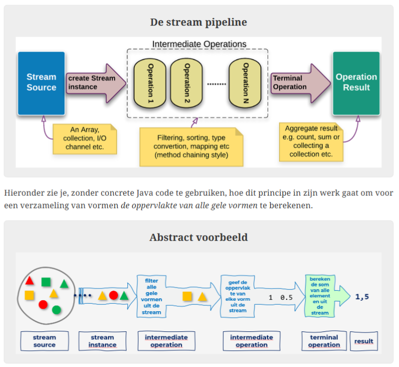

# Functioneel programmeren

- [Functionele interfaces en lambda expressies](#functionele-interfaces-en-lambda-expressies)
- [Streams](#streams)
- [Van een databron naar een stream](#van-een-databron-naar-een-stream)
- [Enkele veelgebruikte intermediate operations](#enkele-veelgebruikte-intermediate-operations)
- [Enkele terminal operations](#enkele-terminal-operations)

> **Functioneel programmeren**
>
> Software maken met behulp van **zuivere functies** (geen side-effects, mutable data, shared state)

Functioneel programmeren is **declaratief** (focus op WAT? i.p.v. op HOE?)

## Functionele interfaces en lambda expressies

## Streams

= Sequentie van objecten waarop geaggregeerde en parallelle operaties kunnen toegepast worden.

Intermediate operations = Bewerking die op elementen van de stream wordt uitgevoerd. Het resultaat is een nieuwe stream met de bewerkte elementen erin.  
Volgen het principe van _lazy evaluation_ -> ze worden pas uitgevoerd als de terminal operation aangeroepen wordt (en dus niet waar ze gedefinieerd worden)

> **LET OP!**  
> Dit betekent dat wijzigingen van de databron na de definitie van de intermediate operation en voor de terminal operation, verwerkt worden door de intermediate operation.

Terminal operation: Bewerking die op elementen van de stream wordt uitgevoerd. Het resultaat is geen stream.  
Volgen het principe van _eager evaluation_ -> als de terminal operation aangeroepen wordt, wordt de databron omgevormd tot een stream en worden alle intermediate operations (en daarna de terminal operation) uitgevoerd.

Pipeline-principe:

1. Creëer een stream vertrekkend van een databron (= verzameling elementen of een generator van elementen)
2. Voer 1 of meerdere intermediate operations uit.
3. Beëindig de stream met een terminal operation

## Van een databron naar een stream

### IntStream, LongStream, DoubleStream
- IntStream.of(intArray);
- IntStream.of(-2,3,4);
- IntStream.range(4, 8); // 4, 5, 6, 7
- Intstream.rangeClosed(4, 8); // 4, 5, 6, 7, 8

> In DoubleStream bestaan de range methodes niet.

### Statische methode Arrays.stream()
Arrays.stream(array), maakt een Stream van de elementen (of een deel van de elementen) in de opgegeven array.

### Collections<T>.stream()
Zelfde als Arrays.stream() maar voor Collection.

## Enkele veelgebruikte intermediate operations

- filter(): filtert de elementen volgens een bepaalde voorwaarde
- map(): elementen transformeren
- distinct(): enkel unieke elementen
- sorted(): sorteert de stream zonder de oorspronkelijke verzameling te wijzigen
- boxed(): maak een Stream<T> van een IntStream/DoubleStream/LongStream

## Enkele terminal operations
- count(): telt de elementen
- forEach(): loopt over de elementen
- sum(): geeft de som van alle elementen (enkel IntStream, DoubleStream en LongStream)
- min()
- max()
- average()
- allMatch(predicate): check of alle elementen aan het predicaat voldoen
- anyMatch(predicate): check of minstens 1 element aan het predicaat voldoet
- reduce(): reduceer alle elementen tot 1 samenvattend element
- toArray(): returnt een array met alle elementen van de stream (voor Stream<T> moet je T[]::new meegeven als argument)
- toList(): returnt een list met alle elementen van de stream, de list is niet te wijzigen
- collect(collector): verzamelt de elementen van de stream in een container (collectors zijn gedefinieerd als statische methodes in de klasse Collectors)

### Optional types
OptionalInt, OptionalDouble, OptionalLong en Optional<T> zijn containerklassen die een waarde kunnen bevatten of null kunnen zijn.