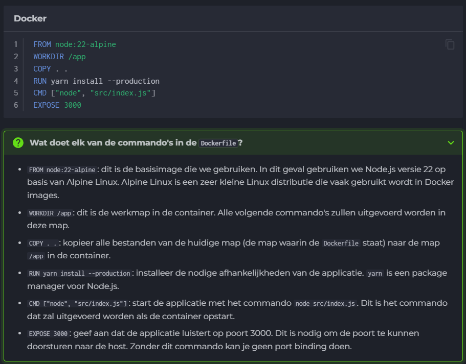

# Docker advanced

Een DockerFile is een file met de naam "Dockerfile" zonder file extension.

Om de image te builden: `docker build -t naam .`

Optie -d bij run commando zorgt ervoor dat container in de achtergrond draait.

|Volume|Bind Mount|
|----|----|
|Goed voor databases|Goed voor wanneer je bestanden aan wil passen|
|`docker volume create <volumenaam>` en dan `docker run -p <hostport>:<containerport> -v <volumenaam>:<containerdir> <imagename>`|`docker run -p <hostport>:<containerport> -v <hostdir>:<containerdir> <imagename>`|

-> Mountpoint vinden van volume kan met: `docker volume inspect <volumenaam>`

## Docker netwerken

Nieuw netwerk maken: `docker network create <netwerknaam>`

-> logs opvragen: `docker logs -f <container-id>`