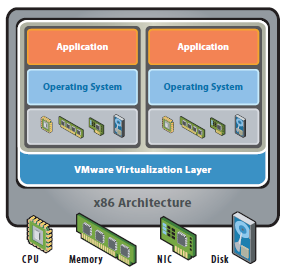

# Virtualisatie en Cloud

- [Wat is virtualisatie?](#wat-is-virtualisatie)
- [Concepten van virtualisatie](#concepten)
- [Multi-tenancy](#multi-tenancy)
- [Cloud computing](#cloud-computing)

## Wat is virtualisatie?

-> Virtuele versies (in tegenstelling tot fysieke versies) maken van computeronderdelen.

In traditionele computerarchitectuur heeft elk apparaat één OS waarin applicaties draaien.

In een virtuele architectuur heeft een apparaat een virtualisatielaag waarop meerdere OS'en kunnen draaien, elk met hun eigen applicaties. 

  </img>
  De <strong>virtualisatielaag</strong> "vertaalt" tussen de fysieke en virtuele hardware. 
  

Voordelen:
- We gebruiken de hardware optimaal (i.p.v. bijvoorbeeld maar 15% van de CPU-kracht)
- Het is goedkoper omdat je maar één apparaat moet kopen om verschillende apparaten emuleren.
- Beter voor het milieu (vb. één zwaardere server vs. 4 lichtere servers)

Nadelen:
- Compatibiliteit: Niet alle software kan werken met virtualisatie
- Prestaties: Verminderde prestatie door overhead
- Complexiteit: Vereist technische kennis
- Beschikbaarheid: Als de fysieke machine uitvalt, ben je de toegang tot alle servers erop kwijt i.p.v. één.

> **TIP**   Er wordt aangeraden niet meer dan de helft van je fysieke resources toe te wijzen aan VM's. Verwacht performantieverlies als je dit wel doet.

Virtualisatiesoftware werkt niet goed samen, beperk je daarom tot één software.

## Concepten van virtualisatie

### Virtuele Machine
Afgekort als VM -> virtuele volledige computer

Er bestaan drie soorten VM's:
- Programmeertaalspecifiek: De VM is enkel en alleen gemaakt om een bepaalde programmeertaal uit te voeren (vb. JVM - Java Virtual Machine)
- Emulator: Je emuleert een volledige OS met applicaties
- Applicatiespecifiek: Je virtualiseert één applicatie / Werkt met containers (vb. Docker)

### Hypervisor

De software die het mogelijk maakt om VM's te maken, te beheren en op te starten.

-> Wordt soms Virtual Machine Monitor (VMM) genoemd.

#### Type 1 Hypervisor
_____
Rechtstreeks op de hardware geïnstalleerd (bare metal).

**Voordeel**: Je hebt geen overhead van het bestaande OS (= efficiënter) 
**Nadeel**: Je kan op de machine enkel met VM's werken. Omdat je meer VM's kan draaien, is het vaak ook complexer.

Voorbeelden: Hyper-V, VMWare ESXi

#### Type 2 Hypervisor
_____
Is een programma bovenop OS (hosted). Wordt meestal gebruikt op persoonlijke systemen. De hardware wordt aangesproken via het bovenliggende OS.

**Voordeel**: Eenvoudiger te installeren. Je kan ook nog andere dingen met je apparaat doen.  
**Nadeel**: Niet zo krachtig en efficiënt als type 1

Voorbeelden: VirtualBox, VMWare Player, Parallels Desktop

## Multi-tenancy

- Single-tenancy: Eén huurder van het systeem
- Multi-tenancy: Systeem wordt gebruikt door meerdere huurders (= **tenants**)

Multi-tenancy is goedkoper en zorgt ervoor dat er een hoger gebruik is van beschikbare resources, maar er is minder afscherming (= beveiligingsrisico).

Multi-tenancy kan zowel op hardware- als softwareniveau (vb. VirtualBox installeren in VirtualBox).

Bij multi-tenancy heb je **altijd** nood aan virtualisatie.

## Cloud computing

> Hardware / Software op aanvraag ter beschikking stellen via een netwerk.

Kenmerken:
- Bronnen op aanvraag
- Pay-as-you-go pricing model: de kostprijs is afhankelijk van verbruik
- Elasticiteit: het aanbod stemt zich af op een stijgende of dalende vraag
- De eindgebruiker weet meestal niet waar de instanties draaien
- De eindgebruiker is geen eigenaar van de hardware / software, de provider is dus verantwoordelijk voor onderhoud
- Schaalbaar

Grootste cloudproviders:
- AWS: Grootste cloudprovider, goedkoopste optie (gebruikt in Operating Systems)
- Microsoft Azure: Integratie met Microsoftproducten, maar veel duurder dan AWS (gebruikt in System Engineering Lab)

### Deploymentmodellen
- Publieke Cloud: Beschikbaar voor iedereen via internet
- Private Cloud: Toegang beperkt tot één of enkele organisaties
- Hybride Cloud: Combinatie van meerdere modellen

Een private cloud die in een publiek datacenter draait wordt ook een **colocated** cloud genoemd.

### Servicemodellen
- IaaS: Virtueel beschikbare infrastructuur, gebruiker heeft volledige controle over OS, software en (virtuele) hardware.
- PaaS: Gebruiker heeft controle over software, maar niet over onderliggende hardware.
- SaaS: Enkel software.