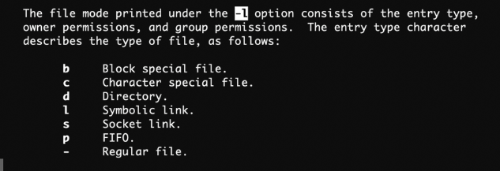
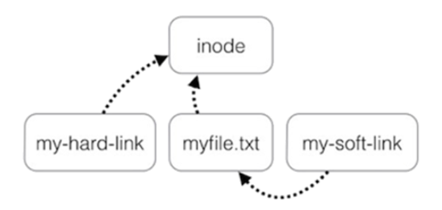

# File Systems

## Persistente opslag

Doel = data bewaren na afsluiten van proces, grote hoeveelheden data opslaan en data delen tussen processen

Behandelde media:
- HDD (nadeel = seek time)
- SSD
- USB
- CD

## Files
Fysieke media zijn onderverdeeld in blokken. Een **file** is een groepering van de data uit verschillende blokken.

Bytes in een file kunnen dus verspreid zijn over het opslagmedium.

Systemen gebaseerd op UNIX zien alles als een file, er zijn een paar soorten:
- directories
- links
- speciale bestanden (zijn gekoppeld aan hardware)
- sockets (zorgen voor netwerkcommunicatie)
- pipes (verbinden output van een proces met input van een ander proces)

Er bestaan twee manieren om bytes uit te lezen:
- Sequentieel (in volgorde)
- Random access

## Directories

Directories zijn files die andere files groeperen, hierdoor krijg je een hiërarchische structuur

Absolute paden in Windows starten met een letter (vb. C:\\). In Linux is dat niet zo  omdat alle filesystems onder één virtueel filesystem ondergebracht worden.

## Mappenstructuur

### Windows

Opslagmedia krijgen een aparte **schijfletter**

Belangrijke directories:
- Program Files: Uitvoerbare bestanden en applicaties
- Windows\System32: Systeembestanden
- Users\<gebruikernaam>: home directory
- Users\AppData: config bestanden

Beheer van apparaten via Device Manager.

-> Opstartbestanden op een aparte bootpartitie

### Linux

Alles zit onder de root / :
- /home/<gebruiker> -> hieronder worden ook de uitvoerbare applicaties geplaatst
- /etc -> configuratiebestanden
- /(s)bin, /usr/(s)bin, /opt -> uitvoerbare bestanden
- /var -> voor onder andere logs

Opstartbestanden staan niet op een aparte partitie, maar onder /boot

I/O-apparaten staan onder /mnt of /media en andere apparaten onder /dev

### macOS:
Op Mac heet de C-schijf *Main Disk*.

Belangrijke mappen:
- Applications: Geïnstalleerde applicaties
- Library: Fonts en andere resources die de apps nodig hebben
- System: systeembestanden
- Users: home directories per gebruiker + shared map

Dit zijn de zichtbare mappen, achter de schermen gebruikt macOS een gelijkaardige mappenstructuur als Linux

## File Systems
-> Onderdeel van de OS. Beheert fysieke opslagruimte en implementeert files en directories.

### Implementatie

#### Implementatie van files

||Contiguous storage|Linked Lists|File Allocation Table (FAT)|Index nodes|
|----|----|----|----|----|
| Omschrijving | Elk bestand wordt in aansluitende blokken opgeslagen | Elk blok bevat een verwijzing naar het volgende blok | Linked List waar alle verwijzingen in één tabel samengebracht worden | Datastructuur die zowel metadata als verwijzing naar datablokken bevat |
| Voordelen | Eenvoudig, goede leessnelheid, random access | Geen fragmentatie | Betere leessnelheid dan linked list, random access | Goede leessnelheid, random access, beperkt RAM-verbruik|
| Nadelen | Als bestanden groeien, moeten ze worden verplaatst, veel fragmentatie | Slechte leessnelheid, geen random access | Neemt veel RAM-geheugen in beslag | / |

#### Implementatie van directories

Een directory wordt geïmplementeerd via een bestand dat een entry per file of subdirectory bijhoudt. Entries worden in verschillende file systems anders vormgegeven, maar moeten zeker een verwijzing naar het eerste datablok of de inode bevatten.

#### Implementatie van links

- Hard links: datablokken of inodes worden gedeeld
- Soft links: heeft een eigen datablok of inode (*dangling pointers* -> soft links die verwijzen naar bestanden die niet meer bestaan)

### Journaling
Als het systeem crasht tijdens schrijfbewerkingen, kan je corrupte data krijgen. File system moet een journal bijhouden om zichzelf te herstellen na de crash.
- Elke uit te voeren bewerking wordt neergeschreven
- File system voert de bewerking uit
- File system markeert bewerking als voltooid
 Na een crash kan file system zien dat er een onvoltooide bewerking in het journal staat en deze alsnog afwerken.

### Virtual file system
-> in Linux en macOS
 *Windows heeft dit niet, elk filesystem krijgt een aparte schijfletter*

Processen gebruiken de functies in het virtuele filesystem. Het virtuele filesystem vertaalt de calls naar de drivers op elk filesystem. Zo zie je als eindgebruiker maar één filesystem.

Verbergt de verschillen tussen file systems.

File systems worden gemount in de VFS-hiërarchie. Bij een mount moet je aangeven in welke directory van de VFS je de de root directory van het nieuwe file system wil inladen.

## Partities
= Onderverdeling van fysiek medium met een eigen bestandssysteem.

Opslagmedium voorziet een partitietabel:
- Master Boot Record (MBR) - maximum schijfgrootte = 2TB, maximaal 4 partities
- GUID Partition Table (GPT) - opvolger van MBR, theoretisch onbeperkt aantal partities (128 in Windows)

## Booten
Je hebt een bootloader in een bootable partitie nodig.

Als je meerdere bootable partities hebt, stel je de volgorde in via de BIOS of EFI.

Bootloaders zijn specifiek voor de OS. Er zijn vier stappen die elke bootloader neemt:
1. Gecomprimeerde bestanden op bootpartitie uitpakken
2. Kernel in het geheugen inladen
3. Root van file system in het geheugen inladen
4. Controle doorgeven aan de kernel

Als je OS updatet, dan update je eigenlijk de files op de bootpartitie (en daarom mag je je computer nooit uitzetten)

Als de bootpartitie corrupt is, kan het OS niet geladen worden.

> **Tip**  
> Als je wil multi-booten is de volgorde van installatie van je OS belangrijk. De voorgaande bootloader wordt telkens overschreven. Windows Boot Manager heeft geen boot menu en zal altijd Windows opstarten. GRUB (Linux) heeft dit wel. Als je dus wil kunnen kiezen welke OS je opstart, moet je eerst Windows installeren en daarna Linux.

## Populaire file systems

### Windows
#### FAT32
Ontwikkeld door Microsoft, eerste versie in 1977. Werkt op verschillende OS.

De FAT gebruikt 32 bits waardoor een bestand maximaal 4GB kan zijn en het volledige filesystem maximaal 2TB.

#### exFAT
Vervangt FAT32 en is gericht op USB-sticks en SD-kaarten. Heeft geen journaling.

Goede ondersteuning op macOS en Linux

#### NTFS (New Technology File System)
Standaard FS voor Windows, is de opvolger van FAT32 (oud FS voor Windows). Gebruikt journaling.

Is bruikbaar op andere OS mits NTFS-3G driver gebruikt wordt.

### macOS
#### HFS+ (Hierarchical File System Plus)
Standaard file system op macOS tot 2017. Gebruikt journaling.

Vervangen door APFS.

#### APFS (Apple File System)
Standaard file system op macOS. Sterke focus op SSDs en encryptie.

GPT-partitionering met containers en volumes.

### Linux
#### ext4 (Fourth extended file system)
Standaard file system op veel distributies. Gebruikt journaling.

Enkel compatibel met Windows 10/11 via WSL. Beperkte ondersteuning op macOS via third-party drivers.

#### ZFS (Zettabyte File System)
Populair op Linux en FreeBSD omdat het gericht is op intensieve servertoepassingen.

Ontwikkeld door Sun Microsystems.

-> Heel krachtig, maar complex en niet zo flexibel.  
-> Goed tegen bitrot en data corruptie

#### Btrfs (B-tree file system)
Ontwikkeld door Oracle als antwoord op ZFS. Vergelijkbaar met ZFS.

Standaard FS op Fedora.

### Andere
#### ISO 9660 / UDF
FS voor optische schijven:
- ISO 9660: CD
- UDF: DVD

Gericht op write-once of read-only media. Ondersteund door Windows, macOS en Linux.

## Opslag in Docker
Een VM heeft een virtuele disk (typisch met extensie .vdi). Elke vdi heeft een eigen partitietabel, elke partitie een eigen FS.

Docker heeft geen virtuele disks.

Containers in Docker maken gebruik van meerdere layers:
- Image layers (read-only)
    - Onderste layer = basis image
    - Rest: Houden info bij over wijzigingen t.o.v. onderliggende layer
- Container layer (bovenste layer, is schrijfbaar = **writable container layer**)

Een **storage driver** beheert deze layers.

-> Als je een nieuwe container aanmaakt, maak je eigenlijk een nieuwe writable container layer. Bestanden worden in de writable container layer opgeslagen.

De lijnen in een Dockerfile (behalve een CMD-instructie) schrijft het resultaat weg naar een nieuwe image layer.
(Goed voorbeeld in speaker notes van slide 78)

Als je een container verwijdert, verwijder je enkel de bovenste laag. De image layers blijven opgeslagen tot je de image zelf verwijdert.

Aangezien de container layer verwijderd wordt, sla je de data best op in volumes of bind mounts.