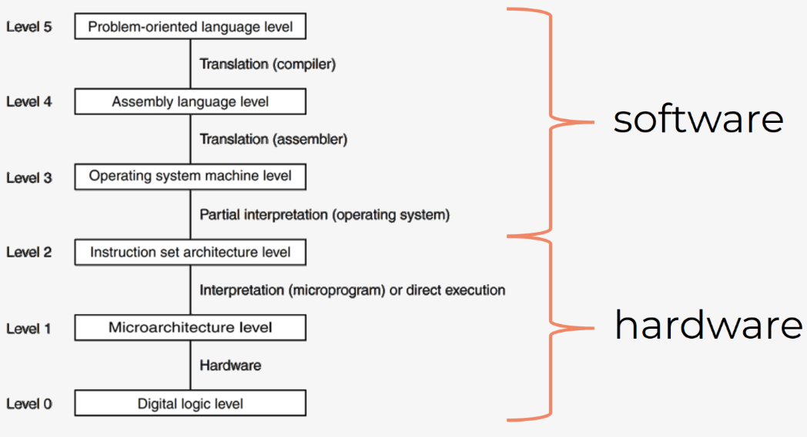
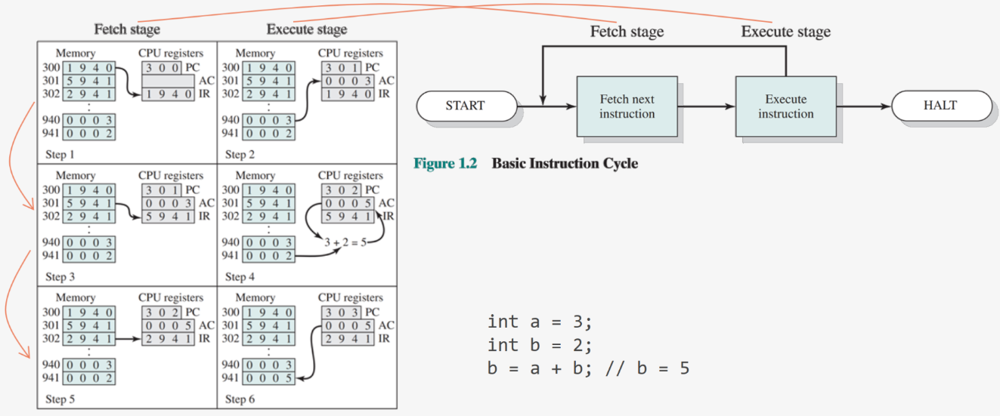
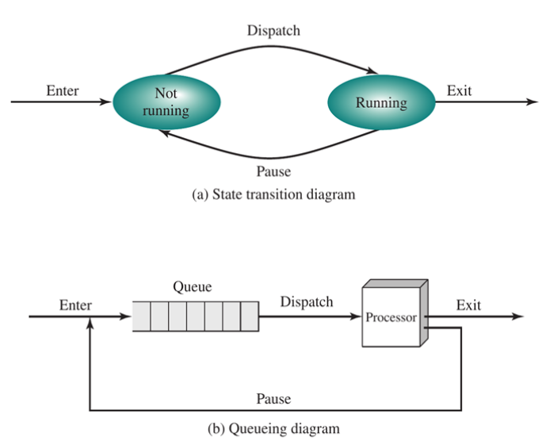
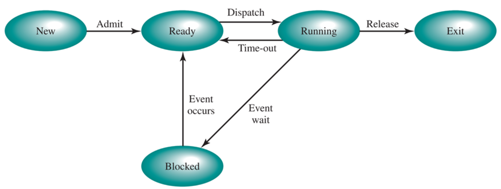
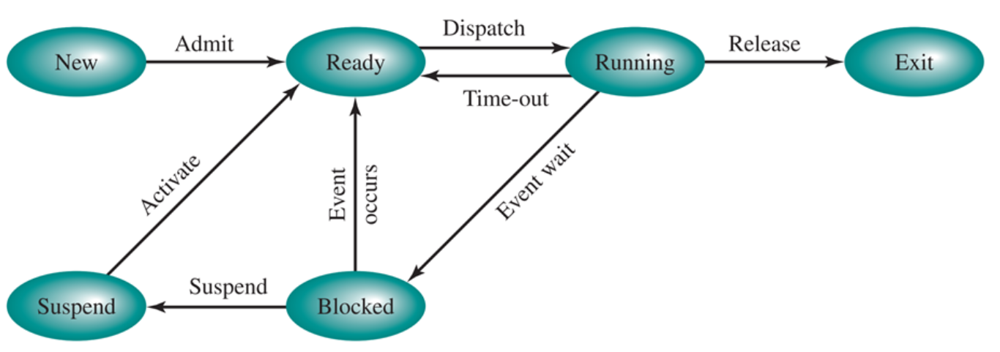
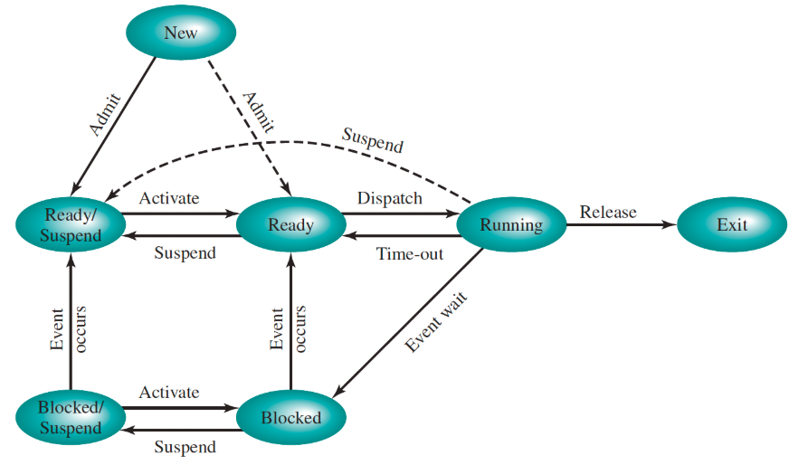

# Processen

- [Van programma tot proces](#van-programma-tot-proces)
- [Opbouw van een proces](#opbouw-van-een-proces)
- [Soorten processen](#soorten-processen)
- [Beheer van processen](#beheer-van-processen)
- [Scheduling](#scheduling)

## Van programma tot proces

Een instructieset is uniek per type CPU -> Je moet een programma daardoor compileren voor elk type CPU.  
-> Daarom vaak verschillende versies voor Windows/Linux/iOS

**Binaries** zijn bestanden waarin de gecompileerde code opgeslagen is. (Is dus anders voor elke OS - vb. PE (= .exe) in Windows, ELF in Linux, Mach-O in iOS)

Programma uitvoeren verloopt volgens de instructiecyclus:

1. Start programma
2. Haal volgende instructie op.
3. Voer volgende instructie uit.
4. Is het programma klaar?
   - Ja: HALT
   - Nee: Ga naar stap 2

De CPU heeft enkele registers waarin data bijgehouden wordt:

- Program Counter (PC) -> adres (in memory) van uit te voeren instructie (wordt bij elke fetch stage met 1 verhoogd)
- Instruction Register (IR) -> uit te voeren instructie
- Accumulator (AC) -> tussenresultaten

Schematisch ziet een instructiecyclus er zo uit:  

> In dit voorbeeld geldt:  
> Instructie 1XXX: Kopieert de waarde van adres XXX naar AC.  
> Instructie 2XXX: Slaat de waarde in AC op in adres XXX.  
> Instructie 5XXX: Telt waarde in adres XXX op bij de waarde in AC en slaat de nieuwe waarde op in AC.

_Let op: De waarden worden door de CPU gekopieerd, niet verplaatst._

### Interrupts

Interrupts zijn zelf ook programma's (= interrupt handler). Als er een event plaats vindt, wordt het programma onderbroken en schakelt de CPU over naar het uitvoeren van de interrupt handler. Het overschakelen naar de handler heet ook wel **context switching**.

Als er meerdere interrupts zijn, kan de OS dit op twee manieren afhandelen:

- OS handelt af volgens FIFO (First in, first out)
- OS handelt af volgens prioriteit

In moderne OS -> eerst prioriteit checken, interrupts met dezelfde prioriteit afhandelen met FIFO

### Van binary tot proces

Als je een programma uitvoert, kopieert de CPU de instructies uit de binaries naar het geheugen (je kan code niet rechtstreeks van de harde schijf uitvoeren).

Het programma krijgt ook stack en heap space in het geheugen toegewezen om bepaalde data op te slaan en te gebruiken.

## Opbouw van een proces

Proces = een instantie van een uitvoerbaar programma op het systeem

Een process image bestaat uit vier onderdelen:

- Stack: opslag voor variabelen, functieparameters, adressen voor return na functies, etc. (vb. lokale variabelen in Java)
- Heap: dynamisch gealloceerd geheugen - kan gebruikt worden als iets te groot is voor de stack of bruikbaar moet zijn over verschillende functies heen. De data in de heap blijft beschikbaar tot het opgekuist wordt. (vb. Java-objecten worden op de heap opgeslagen)
- Data: globale variabelen
- Text: instructies

De process table van het OS bevat voor elk procesbeeld een **process control block** (= PCB). De vorm daarvan is afhankelijk van OS, maar bevat algemeen:

- Een ID voor het proces
- Status van het process (nodig voor context switches)
- Program counter
- Data voor het uitvoeren van het programma

## Soorten processen

### Interactief proces

Klassiek programma dat je controleert vanuit een terminal sessie

- Foreground process: Blokkeert terminal zolang het loopt
- Background process: Blokkeert terminal bij opstart, daarna loopt het in de achtergrond

### Automatisch proces

= Batch proces

Worden in een wachtrij geplaatst. Bij uitvoering worden processen volgens FIFO uitgevoerd.

vb. Automatische back-ups maken

### Daemons

= Services

Proces dat continu in de achtergrond draait. (Meestal opgestart bij opstarten van systeem) 
Wachten in de achtergrond tot ze nodig zijn.

vb. E-mailclient, OneDrive-synchronisatie, server, etc.

## Beheer van processen

### Ontstaan

Bij booten systeem starten veel processen al hiërarchisch op.  
-> Er is één hoofdproces dat andere processen gaat opstarten (vb. systemd (= hoofd van de hiërarchie in Linux) start enkele services op zoals sshd, logind, python, etc.)

Een tweede manier om processen te doen ontstaan is "fork en exec". Voorbeeld bij gebruik LS-commando in Linux:

- Linux forkt Bash (= nieuwe terminal achter de schermen, houdt meestal een PPID = Parent Process ID bij )
- De nieuwe terminal voert LS uit.
- De nieuwe terminal geeft de output van LS terug aan de originele instantie van Bash.

### Afbraak

- Via exit() -> als proces afgewerkt is of een error optreedt
- Afgebroken door een ander proces (vb. kill, of een parent proces breekt child processes af)

> Als het proces correct is afgewerkt, geef je 0 als parameter mee met exit(), anders geef je een error-code mee.

Soms gaat het fout, dan krijg je een zombie proces (= proces waarvan enkel nog het PCB bestaat, maar proces wel al afgewerkt is).  
Orphan process = proces dat geen parent meer heeft.  
_In moderne Linux-distributies komt dit bijna niet meer voor_

In een terminal mogelijk met CRL+C

## State

Hieronder worden states beschreven. Elke categorie bouwt verder op de vorige.

### 2-state scheduling

Proces kan twee states hebben:

- Running: Wordt uitgevoerd door CPU
- Not running

Processen die niet runnen, komen in een queue terecht. De processor behandelt ze dus volgens FIFO.  
Running processes kunnen terug in de queue geplaatst worden als ze gepauzeerd worden.

### 5-state scheduling

De twee states (running en not running) werden vervangen door:

- New: Proces dat nog niet volledig is ingeladen, of dat wacht tot de wachtrij vrije plaatsen heeft (als er een limiet op de wachtrij staat)
- Ready: Proces dat in de wachtrij voor de CPU staat.
- Running: Proces dat uitgevoerd wordt.
- Blocked: Proces wacht op iets (vb. I/O) en maakt ruimte op de CPU voor andere processen die verwerkt moeten worden.
- Exit: Het proces is afgerond

CPU werkt volgens FIFO.  
Pre-emption: Processen mogen maar een bepaalde tijd (= quantum of time slice) op de CPU runnen, daarna gaan ze terug naar de wachtrij (vb. voor time-sharing)  
Processen met een blocked state krijgen terug de state ready (meestal na een event)

### 6-state scheduling

Probleem met 5-state: Alle programma's draaien in RAM, soms zit het vol. Je moet dan swappen.

Nieuwe state:

- Suspend: Een blocked proces komt op de SSD of HDD terecht om ruimte vrij te maken in RAM. Als het systeem terug genoeg RAM-geheugen heeft, wordt het suspended programma terug naar de ready-state gebracht.

### 7-state scheduling

Suspend wordt in twee states opgesplitst:

- Blocked/Suspend: Event van blocked proces moet nog gebeuren, moet naar blocked bij activatie.
- Ready/Suspend: Event van blocked proces is al uitgevoerd, kan naar ready bij activatie.

Nieuw aangemaakte processen en het draaiende proces, kunnen direct in Ready/Suspend geplaatst worden.

### Swapping

Processen worden weggeschreven naar SSD/HDD om RAM vrij te maken.

- Windows: In `pagefile.sys` en `swapfile.sys` op C:\
- Linux: Aparte swap partitie

Swappen = intensief en vertraagt systeem enorm.

## Scheduling
