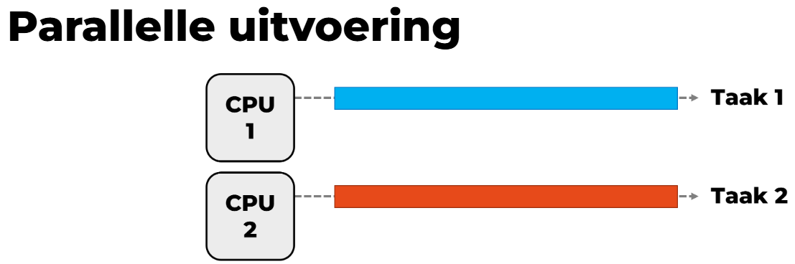
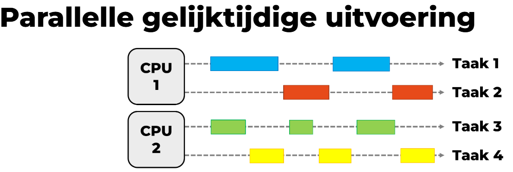
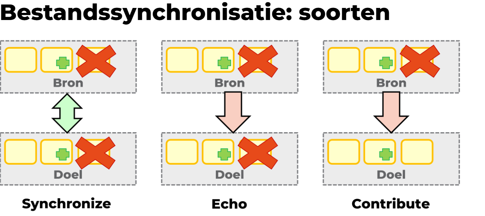

# Concurrency

- [Concurrency](#concurrency)
  - [Wat is concurrency?](#wat-is-concurrency)
  - [In de praktijk](#in-de-praktijk)
  - [Wederzijdse uitsluiting (mutual exclusion)](#wederzijdse-uitsluiting-mutual-exclusion)
    - [Afdwingen](#afdwingen)
  - [Synchronisatie](#synchronisatie)
    - [Bestandssynchronisatie](#bestandssynchronisatie)
  - [Deadlocks](#deadlocks)
    - [Voorwaarden voor deadlocks](#voorwaarden-voor-deadlocks)
    - [Deadlocks voorkomen](#deadlocks-voorkomen)
    - [Deadlocks vermijden](#deadlocks-vermijden)
    - [Deadlocks signaleren](#deadlocks-signaleren)
    - [Deadlocks herstellen](#deadlocks-herstellen)

## Wat is concurrency?

Er zijn drie categorieën waarin we het beheer van meerdere processen kunnen opdelen:

- **Multiprogrammering**: Meerdere processen op een systeem met 1 processor
- **Multiprocessing**: Meerdere processen op een systeem met meerdere processoren
- **Gedistribueerde verwerking**: Meerdere processen op meerdere systemen (die samenwerken)

Multiprocessor = systeem met 2 of meer CPU's <br>
Concurrency = meerdere processen parallel uitvoeren (kan dus enkel op een multiprocessor)

Concurrency zorgt voor hogere productiviteit, maar er zijn enkele uitdagingen:

- Communicatie tussen processen
- Resources delen
- Meerdere procesactiviteiten in sync houden
- Processortijd verdelen

Bij systemen met 1 CPU, kan er ook sprake zijn van gelijktijdige uitvoering, maar dan wisselt de CPU telkens tussen twee taken van hetzelfde proces. Er is geen sprake van echte concurrency.


Bij multiprocessoren kunnen meerdere processen over meerdere processoren gespreid worden. Dit heet parallelle uitvoering.


Gelijktijdige en paralllelle uitvoering worden vaak gecombineerd. Taken worden dan over processoren verdeeld en op de processor gelijktijdig uitgevoerd.



Parallelle uitvoering is niet hetzelfde als parallellisme -> toepassing splitst werk op in meerdere subtaken die op verschillende CPU's / cores / GPU's draaien.

## In de praktijk

Concurrency komt in de praktijk voor bij:

- het verdelen van processortijd over meerdere toepassingen
- toepassingen die geprogrammeerd zijn als een verzameling gelijktijdige processen (= gestructureerde toepassing)
  - vb.: In Task Manager zie je dat Microsoft Teams uit verschillende processen opgebouwd is.
- besturingssystemen zelf worden geïmplementeerd als meerdere processen

## Wederzijdse uitsluiting (mutual exclusion)

Sommige resources (zoals data in het RAM-geheugen) worden door meerdere processen gedeeld. Wanneer een proces zo'n gedeelde bron aanspreekt, spreken we van een **kritieke sectie** code. De kritieke sectie mag niet onderbroken worden. (Moet dus een kleine hoeveelheid samenhorende instructies zijn.)

Er mag op elk moment maximaal 1 proces in een kritieke sectie zitten, anders krijg je conflicten. -> oplossing = wederzijdse uitsluiting.

Voorbeeld (inbeelden dat onderstaande instructies losse cpu-instructies zijn i.p.v. java-code) waarbij we parallel 1 optellen bij gedeelde resource:

```java
// wat we willen
int getal = 1; // gedeelde resource
int a = getal; // 1
getal = a + 1; // 2
int b = getal; // 2
getal = b + 1; // 3
System.out.println(getal); // 3

// wat we krijgen
int getal = 1; // gedeelde resource
int a = getal; // 1
int b = getal; // 1
getal = a + 1; // 2
getal = b + 1; // 2
System.out.println(getal); // 2

```

Wederzijdse uitsluiting is ook belangrijk op systemen met 1 CPU, want ook bij gelijktijdige uitvoering kan je een dergelijk conflict krijgen. Er kunnen ook nog steeds gelijklopende processen zijn, die een gemeenschappelijk geheugen aanspreken, op een systeem met 1 CPU.

Wederzijdse uitsluiting wordt niet enkel gebruikt bij gedeeld geheugen maar ook bij:

- aanpassen van gedeelde bestanden
- toegang tot gedeelde hardwarebronnen

Wederzijdse uitsluiting is de taak van het besturingssysteem.

### Afdwingen

Mogelijke algoritmes (hoe ze werken moet niet gekend zijn voor het examen):

- [algoritme van Dekker (voor 2 processen)](https://youtu.be/MqnpIwN7dz0?si=kDLZW4uN3-oYZ4Wj)
- [wederzijds uitsluitingsalgoritme van Peterson (voor 2 of meer processen)](https://www.youtube.com/watch?v=r3Ma_4_vF2s)

De algoritmes werken met een globale variabele die aangeeft of de kritieke sectie in gebruik is. De (sub)processen die moeten wachten om toegang te krijgen tot de gebruikte kritieke sectie, doen aan **active/busy waiting**. Die processen checken constant of ze toegang kunnen krijgen tot de kritieke sectie.

[Een andere manier om mutual exclusion af te dwingen is **semaforen** gebruiken.](https://www.youtube.com/watch?v=LIzTbA3cAWY)

## Synchronisatie

> **Synchronisatie (in de context van concurrency)** <br>
> = Het opleggen van een dwingende volgorde aan events die door concurrente asynchrone processen worden uitgevoerd.

### Bestandssynchronisatie

Is een voorbeeld van synchronisatie -> De veranderingen in één versie van de file, moeten ook zichtbaar zijn in de andere versies van de file.

Kan continu gebeuren (vb. bij samenwerken) of periodiek (vb. voor back-ups). Wanneer je offline werkt, synchroniseren de bestanden wanneer je terug verbinding maakt.

Er zijn drie types bestandssynchronisatie:

- Synchronize: De inhoud van de bron- en doelmap worden gelijk gemaakt. Als je iets aanpast in de kopie, wordt de aanpassing ook teruggegeven aan de bronmap. (vb. OneDrive)
- Echo: Alle wijzigingen en verwijderingen in de bronmap worden ook toegepast in de doelmap. De wijzigingen gaan echter in één richting. (vb. Kopiëren naar externe HDD)
- Contribute: Zelfde als echo, maar verwijderingen in bronmap gebeuren niet in de doelmap.



## Deadlocks

-> Systeem is in een toestand dat geen voortgang meer mogelijk is.

Komt voor wanneer 2 of meer processen voor onbepaalde tijd wachten op een gebeurtenis die enkel door één van de wachtende processen veroorzaakt kan worden.

Twee manieren om deadlocks te behandelen:

- Protocollen gebruiken die deadlocks voorkomen.
- Deadlocks toelaten, maar detecteren en oplossen.

### Voorwaarden voor deadlocks

Een deadlock kan enkel ontstaan als aan deze vier voorwaarden voldaan wordt:

- **Mutual Exclusion**: Er is een bron met wederzijdse uitsluiting.
- **Hold and Wait**: Een proces houdt de bron bezet en wacht op één of meerdere andere bronnen.
- **No preemption**: Bronnen worden enkel vrijgegeven als het proces klaar is, niet voortijdig.
- **Circular Waiting**: Er is een verzameling van processen die op elkaar wachten (als het ware in een kring)

### Deadlocks voorkomen

Deadlocks kunnen voorkomen worden door één van de voorwaarden onmogelijk te maken. Mutual exclusion kan nooit weggenomen worden omdat de processen anders in conflict kunnen komen. Het circulaire wachten is onvermijdelijk (dat is namelijk waarom er een deadlock is).

- Hold and Wait: Kan opgelost worden door processen te forceren al hun bronnen vrij te geven als ze moeten wachten op een andere bron.
- No Preemption: Bronnen kunnen nu wel ontnomen worden.

Dit moet eerlijk verlopen, daarvoor kan een schema gebruikt worden.

Het OS kan het gebruik van gemeenschappelijke bronnen beperken om deadlocks te voorkomen of onmogelijk te maken.

### Deadlocks vermijden

Het OS kan deadlocks vermijden door aanvragen te weigeren die tot een deadlock zouden kunnen leiden, dit is echter moeilijk (onmogelijk) om te implementeren.

### Deadlocks signaleren

Als een process lang / permanent in de BLOCKED state is, kan dit betekenen dat er een deadlock is.

Het OS spoort deadlocks ook op in de Resource Allocation Graph (RAG). Als hier een cyclus te zien is, dan is er een deadlock gaande. Hiervoor bestaan algoritmes die in het tweede jaar aan bod komen.

### Deadlocks herstellen

- Process stoppen via KILL -> proces gaat volledig verloren, maar bronnen komen vrij.
- Rollback op proces -> deel van het werk wordt ongedaan gemaakt, bronnen worden vrijgegeven. Je kan ook terugkeren naar een checkpoint of starttoestand.
