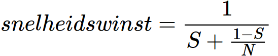

# Threads

- [Threads](#threads)
  - [Wat zijn threads?](#wat-zijn-threads)
    - [Opbouw van een thread](#opbouw-van-een-thread)
  - [Soorten threads](#soorten-threads)
  - [Voordelen en uitdagingen](#voordelen-en-uitdagingen)
    - [Voordelen](#voordelen)
    - [Uitdagingen](#uitdagingen)
  - [Parallellisme](#parallellisme)
    - [Wet van Amdahl](#wet-van-amdahl)

## Wat zijn threads?

Een proces bestaat eigenlijk uit twee concepten die door de OS onafhankelijk van elkaar behandeld worden:

1. **De eigendom van bronnen:**

   - Een proces beschikt ook over bronnen wanneer het momenteel niet uitgevoerd wordt.
   - **Locking** = Een proces krijgt eigenaarschap over bronnen. De bron wordt dan afgeschermd van andere processen door het OS.

2. **Het uitvoeren van de instructies:**

   - via fetch-execute cyclus
   - registers en stack bijhouden
   - scheduling: de staat wordt bijgehouden

Het uitvoeren van de instructies wordt ook een **thread** genoemd.

Een proces kan single-threaded of multi-threaded zijn. Bij multi-threading worden parallelle taken binnen een proces mogelijk.

Threads beschikken net zoals processen over een state. Context switching van threads is analoog aan die van processen, maar goedkoper.

### Opbouw van een thread

Een thread heeft:

- een thread ID
- registers (zoals Program Counter)
- een stack
- een state

Grote verschil met processen: Er is geen afscherming tussen threads. Alle threads delen instructies, data en toegang tot bronnen.

> **Opgelet**  
> Instructies zelf behoren tot het proces, niet de threads. Ze zijn een "bron" van dat proces. Het uitvoeren wordt door de threads gedaan.

## Soorten threads

|           | User-Level Threads                                                                                                                             | Kernel-Level Threads                                                                                                         |
| --------- | ---------------------------------------------------------------------------------------------------------------------------------------------- | ---------------------------------------------------------------------------------------------------------------------------- |
| Aanmaken  | Via libraries voor threading                                                                                                                   | Via OS                                                                                                                       |
| Proces    | Door OS als single-threaded gezien                                                                                                             | Multi-threaded                                                                                                               |
| Voordelen | - Sneller, want geen systemcalls nodig   - Proces heeft zelf de controle over scheduling van de threads   - Onafhankelijk van OS         | - Scheduling op threadniveau   - Blokkeren van één thread heeft geen invloed op de andere threads.   - Multiprocessing |
| Nadelen   | - Als één van de threads wacht op I/O wordt het hele proces geblokkeerd door de OS.   - Geen multiprocessing (= geen parallelle uitvoering) | - Trager (je moet wisselen tussen programma en OS bij aanmaken van threads)                                                  |

De OS zelf gebruikt ook kernel-level threads.

Er kan steeds een combinatie zijn van ULT's en KLT's

## Voordelen en uitdagingen

### Voordelen

- Bij multi-threading kan één thread niet het hele proces blokkeren (vb. lange berekening blokkeert de UI - die in een andere thread berekend wordt - niet)
- Eenvoudig delen van bronnen tussen threads
- Aanmaken en context switching is sneller dan bij processen
- Gebruiken multi-core CPU's efficiënt

### Uitdagingen

- Je moet telkens afwegen of het de moeite is om een thread op te richten voor een bepaalde taak. (vb. Aanmaken van thread is meer rekenwerk dan de taak berekenen)
- Hoe splits je de data over de threads op?
- Als de data niet gesplitst kan worden, moet er gesynchroniseerd worden.
- Testen en debuggen is veel moeilijker (want er zijn meer volgordes waarin instructies uitgevoerd kunnen worden)

## Parallellisme

Twee soorten:

- **Dataparallellisme**: Je splitst de data op en laat verschillende threads verschillende delen van de data verwerken (vb. totaal van alle integers in een array berekenen -> splits de array over verschillende threads -> reken de deelarrays uit in de aparte threads -> som de uitkomsten van de threads bij elkaar op)
- **Taakparallellisme**: Verschillende threads voeren verschillende taken uit (Vb. GUI, physics, input ontvangen)

In de praktijk: combinatie van de twee

### Wet van Amdahl

Formule voor de theoretische snelheidswinst voor een programma bij het toevoegen van CPU cores.

S - Percentage van het programma dat niet versneld wordt met extra cores, uitgedrukt als kommagetal  
N - aantal cores

S is de beperkende factor voor de snelheidwinst, dit deel van het programma kan je niet versnellen met extra cores.
