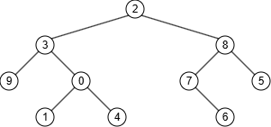

<h1>4.4.4</h1>

# Teken de binaire boom

Boom heeft labels 0 t.e.m. 9

- Inorde: 9, 3, 1, 0, 4, 2, 7, 6, 8, 5
- Postorde: 9, 1, 4, 0, 3, 6, 7, 5, 8, 2



# Teken de binaire boom of leg uit waarom hij niet bestaat.

- Inorde: **9, 3, 1, 0, 4**, 2, 7, 6, 8, 5
- Postorde: **9, 1, 4, 0, 3**, 6, 5, 7, 8, 2

Linkerboom = zelfde als hierboven.

```
Top = 2
Rechterboom = {7, 6, 8, 5}

Top = 8
Linkerboom = {7,6}
Rechterboom = {5}
```

Dit kan niet => In de postorde staat 5 tussen 6 en 7, dit zou betekenen dat 6 en 7 volgens postorde geen broers van elkaar zijn, maar dat zijn ze volgens inorde wel.
