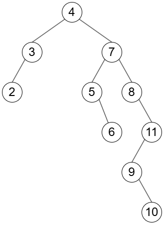
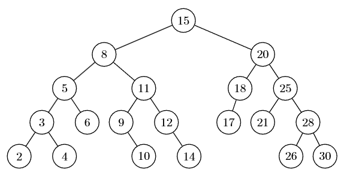
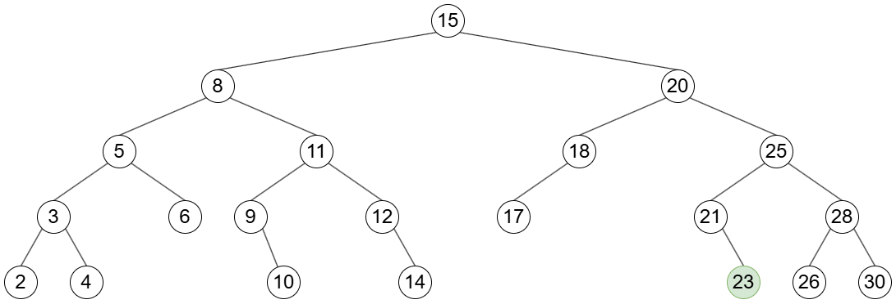
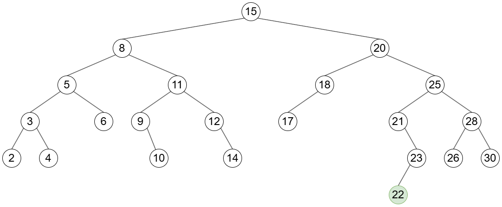
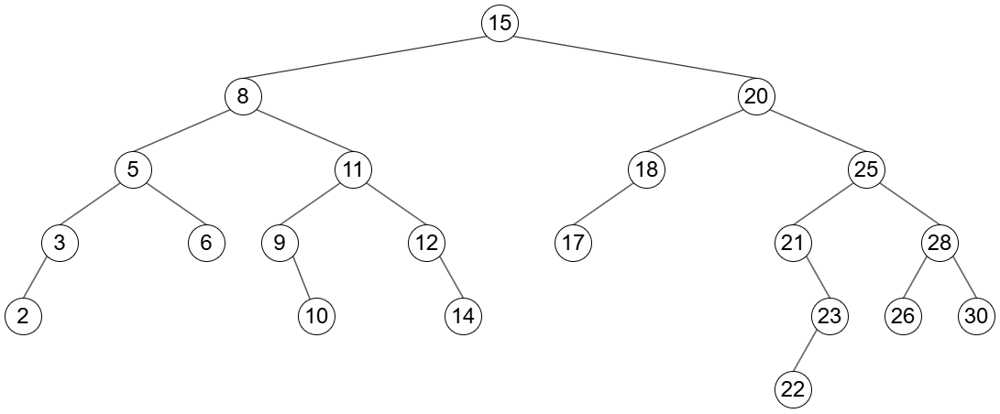
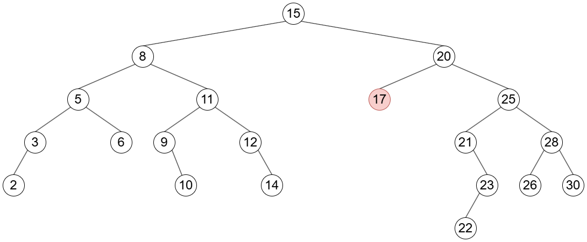
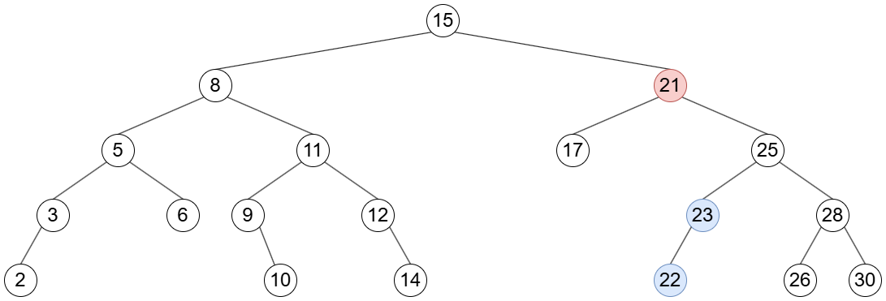

<h1>4.5.5</h1>

# Geef de binaire zoekboom.

Voor de sleutels in volgorde:

- 4, 7, 5, 8, 11, 3, 2, 9, 10, 6

# Veronderstel dat men een binaire zoekboom opbouwt door sleutels één voor één toe te voegen aan een initieel lege boom.

- **Geef een rij van lengte 7 die een binaire zoekboom van minimale diepte oplevert**

{4, 2, 6, 1, 3, 5, 7}

- **Geef een rij van lengte 15 die een binaire zoekboom van minimale diepte oplevert**

{8, 4, 12, 2, 6, 10, 14, 1, 3, 5, 7, 9, 11, 13, 15}

- **Geef een rij van lengte 5 die een binaire zoekboom van maximale diepte oplevert. Wanneer krijg je over het algemeen een slecht gebalanceerde binaire zoekboom?**

{1, 2, 3, 4, 5}

Als de elementen gesorteerd toegevoegd worden, krijg je een slecht gebalanceerde binaire zoekboom. Je moet proberen eerst de ouder van een element toe te voegen.

# Beschouw de binaire zoekboom. Voer de volgende opdrachten één na één uit.

**a. Welke toppen worden er bezocht bij het zoeken naar de top 12?**

15, 8, 11, 12

**b. Welke toppen worden er bezocht bij het zoeken naar de top 27?**

15, 20, 25, 28, 26

**c. Voeg een top met sleutelwaarde 23 toe aan de zoekboom. Teken de resulterende zoekboom.**

**d. Voeg vervolgens een top met sleutelwaarde 22 toe aan de zoekboom. Teken de resulterende zoekboom.**

**e. Verwijder de top met waarde 4 uit de zoekboom. Teken de resulterende zoekboom.**

**f. Verwijder vervolgens de top met waarde 18 uit de zoekboom. Teken de resulterende zoekboom.**

**g. Verwijder vervolgens de top met waarde 20 uit de zoekboom. Teken de resulterende zoekboom.**

