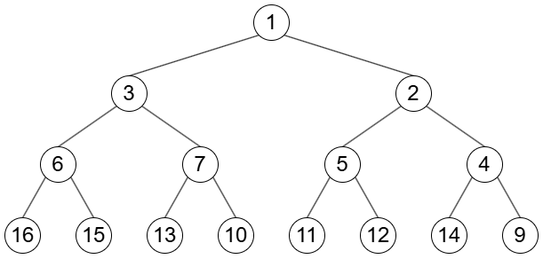
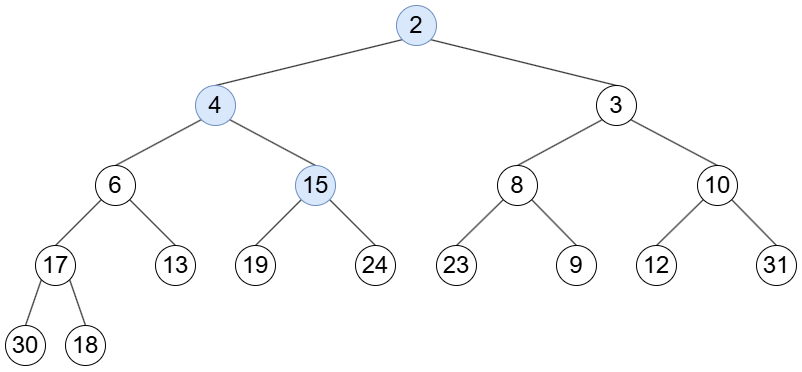
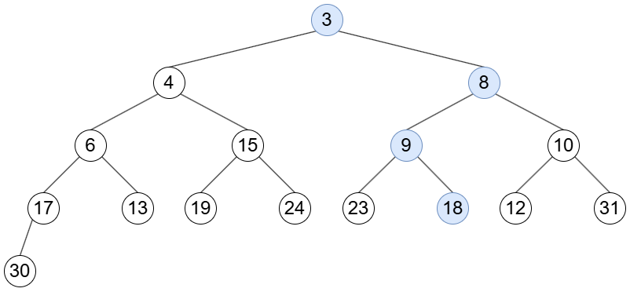
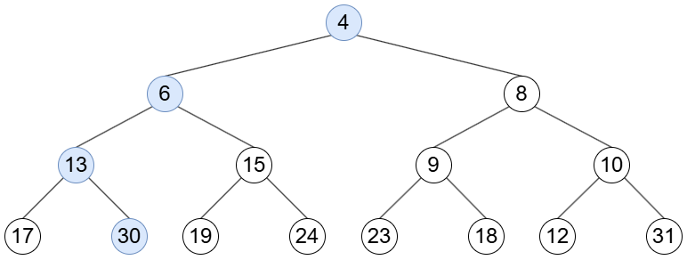
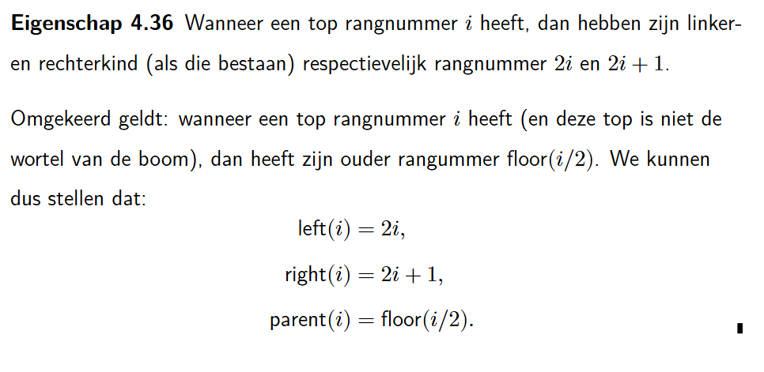

<h1>4.6.8</h1>

# Voeg de elementen toe aan een binaire hoop en teken de hoop.

11, 13, 1, 15, 6, 5, 9, 16, 3, 10, 7, 4, 12, 14, 2

_Enkel eindresultaat hieronder_



# Beschouw de binaire hoop. Verwijder de drie kleinste elementen uit de binaire hoop. Teken de hoop na elke verwijdering.







# Wat worden de relaties in eigenschap 4.36 wanneer een binaire hoop wordt opgeslagen in een array met als eerste index 0?



```
index = i

left -> i * 2 + 1
right -> i * 2 + 2
parent -> floor((i-1)/2)
```

# Waar kan het maximale element zich bevinden in een binaire hoop, aannemende dat de binaire hoop bestaat uit verschillende elementen?

Het maximale element bevindt zich steeds in een blad.
