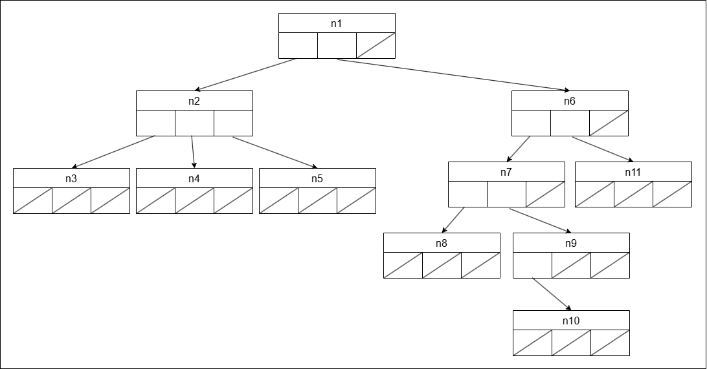
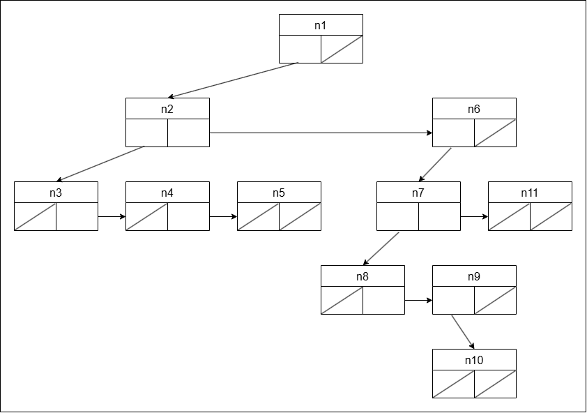

<h1>4.2.3</h1>

**1. Bereken hoeveel null-referenties er zullen zijn bij de array-van-kinderenvoorstelling van de boom in Figuur 4.2. Wat is de verhouding van het aantal effectief gebruikte referenties tot het aantal voorziene referenties?**

```
Graad = 3
Aantal toppen = 11

Gebruikte referenties = aantal toppen - 1 = 10
Gereserveerde referenties = aantal toppen * graad = 33

Null-referenties = 33 - 10 = 23
Verhouding  = 10/33 -> ongeveer 1/3
```

Er zijn 23 null-referenties. De verhouding effectief gebruikte tot de voorziene referenties is 10/33 -> evolueert voor een grote boom naar 1/3

**2. Teken de array-van-kinderen voorstelling van de boom in Figuur 4.2.**



**3. Bereken hoeveel null-referenties er zullen zijn bij eerste-kind-volgende-broer voorstelling van de boom in Figuur 4.2. Wat is de verhouding van het aantal effectief gebruikte referenties tot het aantal voorziene referenties.**

```
Graad = 3
Aantal toppen = 11

Gebruikte referenties = 10
Gereserveerde referenties = aantal toppen * 2 = 22

Verhouding = 10/22
```

Er zijn 12 null-referenties. De verhouding effectief gebruikte tot de voorziene referenties is 10/22 -> evolueert voor een grote boom naar 1/2

**4. Wat is de verhouding van het aantal effectief gebruikte referenties tot het aantal voorziene referenties voor een willekeurige gewortelde boom van graad 𝑘 met 𝑛 toppen.**

Voor de array-van-kinderen voorstelling is dat: (n-1)/(n\*k) => ~ 1/k

Voor de eerste-kind-volgende-broer voorstelling is dat: (n-1)/(2n) => ~ 1/2

**5. Teken de eerste-kind-volgende-broer voorstelling van de boom in Figuur 4.2.**


