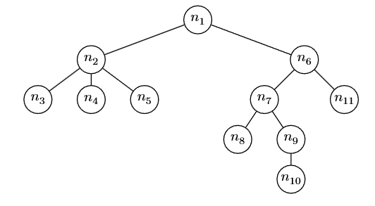

<h1>4.3.3</h1>

**1.Geef de volgorde waarin de toppen worden bezocht wanneer de boom in Figuur 4.2 respectievelijk in preorde en postorde wordt doorlopen.**



Preorde: n1, n2, n3, n4, n5, n6, n7, n8, n9, n10, n11

Postorde: n3, n4, n5, n2, n8, n10, n9, n7, n11, n6, n1

**2. Geef code analoog aan Algoritme 4.1 om een gewortelde boom in postorde te doorlopen.**

```
Invoer: Een gewortelde boom T en een visit functie.
Uitvoer: De visit functie is aangeroepen voor elke top van de boom.

function PostOrde(T, visit)
    PostOrdeRecursief(T.wortel, visit)
end function

function PostOrdeRecursief(v, visit)
    for all w ∈ kinderen(v) do                  # loop over de kinderen van v
        PostOrdeRecursief(w, visit)
    end for
    visit(v)
end function
```

**3. Geef code analoog aan Algoritme refalg:aantal-toppen om de hoogte van een gewortelde boom te berekenen. Baseer je op formule (4.2).**

```
Invoer: Een gewortelde boom T
Uitvoer: De hoogte van de boom.

function Hoogte(T)
    return HoogteRecursief(T.wortel)
end function

function HoogteRecursief(v)
    max <- -1                                   # blad moet 0 teruggeven als hoogte (-1 + 1)
    for all w ∈ kinderen(v) do
        deelboomhoogte <- HoogteRecursief(w)
        if deelboomhoogte > max
            max <- deelboomhoogte
        end if
    end for
    return max + 1
end function
```
