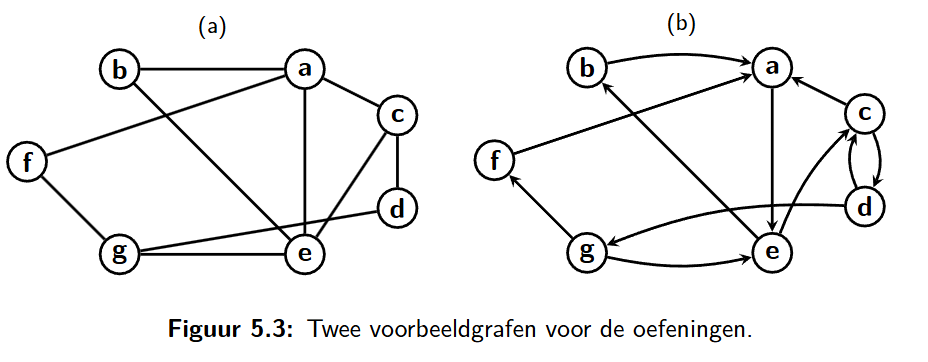

<h1>5.1.1</h1>

## Geef de bogenverzameling van deze twee grafen.

### Graaf A

E = {(a,b), (a, c), (a,e), (a, f), (b, e), (c, d), (c, e), (d, g), (e, g), (f, g)}

### Graaf B

E = {(a, e), (b, a), (c, a), (c, d), (d, c), (d, g), (e, b), (e, c), (f, a), (g, e), (g, f)}

## Geef voor beide grafen de verzameling buren(e). Wat is de graad van de knop e in beide gevallen?

### Graaf A

buren(e) = {a, b, c, g}

Graad van e => 4

### Graaf B

buren(e) = {b, c}

Graad van e => 2

## Vind het kortste pad van b naar d in beide grafen.

### Graaf A

Kortste pad => {b, a, c, d}

### Graaf B

Kortste pad => {b, a, e, c, d}

## Vind in beide grafen de langste enkelvoudige cykel die d bevat

### Graaf A

Langste enkelvoudige cykel => {d, c, e, b, a, f, g, d}

### Graaf B

Langste enkelvoudige cykel => {d, g, f, a, e, c, d}
