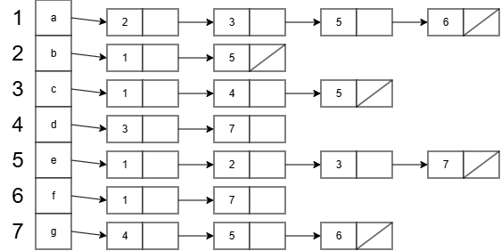
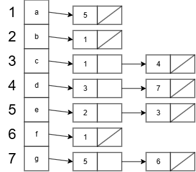

<h1>5.2.3</h1>

# Beschouw de gerichte en ongerichte graaf


## Geef voor beide grafen de adjacentiematrix

_Veronderstelling: a = rangnummer 1, b = rangnummer 2, etc._

### Graaf A

```
    a   b   c   d   e   f   g
a   0   1   1   0   1   1   0
b   1   0   0   0   1   0   0
c   1   0   0   1   1   0   0
d   0   0   1   0   0   0   1
e   1   1   1   0   0   0   1
f   1   0   0   0   0   0   1
g   0   0   0   1   1   1   0

```

### Graaf B

```
    a   b   c   d   e   f   g
a   0   0   0   0   1   0   0
b   1   0   0   0   0   0   0
c   1   0   0   1   0   0   0
d   0   0   1   0   0   0   1
e   0   1   1   0   0   0   0
f   1   0   0   0   0   0   0
g   0   0   0   0   1   1   0
```

## Geef voor beide grafen de adjacentielijst-voorstelling

### Graaf A



### Graaf B



# Vraagstuk 1

_Gevraagd: Hoe berekent men de graad van een top i van een graaf G wanneer de adjacentiematrix A van de graaf gegeven is? Geef een algoritme. Wat is de tijdscomplexiteit van deze methode?_

```
INVOER: Adjacentiematrix A, top i. De graaf bevat n knopen.
UITVOER: De graad van i.

function bepaalGraad(A, i)
    graad <- 0
    for j <- 1 to n do
        graad <- graad + A[i][j]
        end if
    end for
    return graad
end function
```

Tijdscomplexiteit: O(n) <br>
_Je overloopt alle buren._

# Vraagstuk 2

_Gevraagd: Hoe berekent men de graad van een top i van een graaf G wanneer de adjacentielijst-voorstelling van de graaf gegeven is? Geef een algoritme. Wat is de tijdscomplexiteit van deze methode?_

```
INVOER: Graaf G = (V, E) waarvan de adjacentielijst bekend is in het veld adjacentielijst. Knoop i die een element is van V. De graaf bevat n knopen.
UITVOER: De graad van i.

function bepaalGraad(G, i)
    graad <- 0
    L <- G.adjacentielijst
    buur <- L[i]
    while buur != null do
        graad <- graad + 1
        buur <- buur.next
    end while
    return graaf
end function
```

Tijdscomplexiteit is O(graad(i))
