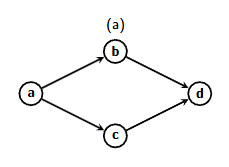
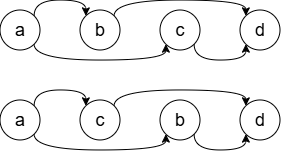

<h1>5.3.5</h1>

# Oefening 1

**Een ongerichte graaf is geconnecteerd als en slecht als er een pad bestaat tussen elke twee knopen v en w.**

## Ga na dat de bovenstaande definitie equivalent is met zeggen dat er een pad bestaat van een bepaalde knoop s naar alle andere knopen.

Inductie: Als er een pad is tussen elke twee knopen v en w, is er een pad tussen s en knoop v. Bijgevolg zal er ook een pad bestaan naar elke knoop w = alle andere knopen.

## Schrijf een methode IsGeconnecteerd die nagaat of een ongerichte graaf geconnecteerd is (return-waarde true) of niet (return-waarde false). Doe dit door de methode BreedteEerst aan te passen.

```
INVOER: Ongerichte graaf G (orde n > 0). De knopen van G zijn genummerd van 1 tot n.
UITVOER: True als G geconnecteerd is, False als G niet geconnecteerd is.

function IsGeconnecteerd(G):
    D <- [false, false, ..., false]     # n keer false
    D[1] <- true                        # start bij knoop 1
    Q.init()
    Q.enqueue(s)

    while Q ≠ ∅ do
        v <- Q.dequeue()                # v = huidige knoop
        for all w ∈ buren(v) do         # w = huidige buur
            if D[w] = false then
                D[w] = true
                Q.enqueue(w)
            end if
        end for
    end while

    for all b ∈ D:                      # b = boolean
        if b = false then
            return false
        end if
    end for
    return true
end function
```

**MODELOPLOSSING - gebruikt een teller (= efficiënter)**

```
INVOER: Ongerichte graaf G (orde n > 0). De knopen van G zijn genummerd van 1 tot n.
UITVOER: True als G geconnecteerd is, False als G niet geconnecteerd is.

function IsGeconnecteerd(G):
    D <- [false, false, ..., false]     # n keer false
    D[1] <- true                        # start bij knoop 1
    a <- 1                              # teller ontdekte knopen
    Q.init()
    Q.enqueue(s)

    while Q ≠ ∅ do
        v <- Q.dequeue()                # v = huidige knoop
        for all w ∈ buren(v) do         # w = huidige buur
            if D[w] = false then
                D[w] = true
                a <- a + 1              # verhoog de teller
                Q.enqueue(w)
            end if
        end for
    end while

    return a = n

end function
```

# Oefening 2



## Vind alle mogelijke topologische sorteringen voor de graaf.

a,b,c,d en a,c,b,d



# Oefening 3


## Vind de compilatievolgorde van de modules in de graaf wanneer de labels in dalende volgorde worden doorlopen.

De compilatievolgorde is: 1, 2, 7, 9, 4, 6, 3, 5, 8, 10

# Oefening 4

Veronderstel dat er in dezelfde graaf als oefening 3 een nieuwe boog (8,6) wordt toegevoegd.

## Pas het algoritme voor topologisch sorteren toe.

De call stack wordt: (1, 2, 4, 6, 3, 5, 8).

Vanuit knoop 8 wordt buur 6 opgemerkt. Deze heeft op dat moment statuscode 1 => detecteert een cykel.
