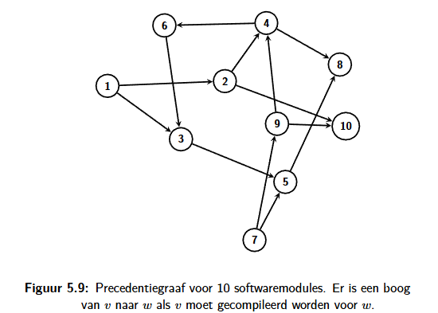
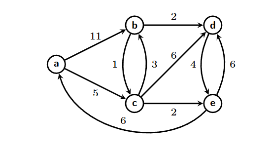

<h1>5.4.3.</h1>

# Oefening 1

In Dijkstra's Algoritme wordt enkel de afstand van elke knoop v tot de start-knoop s bijgehouden. In veel toepassingen heeft men echter ook een pad nodig dat deze minimale afstand realiseert.

## Pas de pseudo-code aan zodanig dat er een tweede array P wordt teruggegeven zodanig dat P[v] de knoop geeft die de voorganger is van v op een kortste pad van s naar v.

```
Invoer: G = graaf, s = startknoop. Knopen zijn genummerd van 1 tot n.
Uitvoer: Array P, P[v] is de vorige knoop op het korste pad naar v

function KortstePadOngewogen(G, s):
  P <- [0, 0, ..., 0]           # 0 = geen knoop want knopen zijn van 1 tot n
  P[s] <- s                     # s is zijn eigen voorganger
  Q.init()
  Q.enqueue(s)
  while Q ≠ ∅ do
    v <- Q.dequeue()
    for all w ∈ buren(v) do
      if P[w] = 0 then
        P[w] <- v
        Q.enqueue(w)
      end if
    end for
  end while
  return P
end function
```

## Pas je aangepaste algoritme toe op de gerichte graaf in Figuur 5.9 startend vanaf knoop 1. Ga ervan uit dat knopen steeds worden bezocht in stijgende volgorde. Hoe ziet de array 𝑃 er na afloop uit?



P = (1,1,1,2,3,4,0,4,0,2)

## Schrijf een algoritme dat als invoer de array 𝑃 neemt en een knoop 𝑣. Het algoritme geeft een lijst terug die het kortste pad van 𝑠 naar 𝑣 bevat (in de juiste volgorde).

```
INVOER: Array P met lengte n > 0, waarvoor P[v] = voorganger in het kortste pad van s naar v. Startknoop s, eindknoop v. De knopen zijn genummerd van 1 tot n.
UITVOER: lijst Pad, bevat alle knopen (in volgorde) van het kortste pad van s naar v.

function GeefKortstePad(P, s, v):
    Pad <- [v]
    huidigeKnoop <- v

    while huidigeKnoop != s do
        huidigeKnoop <- P[huidigeKnoop]
        voeg huidigeKnoop vooraan Pad toe
    end while

    return Pad
end function
```

# Oefening 2

**Opgave**

Beschrijf hoe je volgend probleem kan oplossen als een kortste pad probleem.

Gegeven een lijst van Engelstalige 5-letterwoorden. Woorden worden getransformeerd door juist één letter van het woord te vervangen door een andere letter. Geef een algoritme dat nagaat of een woord 𝑤1 omgezet kan worden in een woord 𝑤2. Indien dit het geval is dan moet je algoritme ook de tussenliggende woorden tonen voor de kortste sequentie van transformaties die 𝑤1 in 𝑤2 omzet.

**Oplossing**

Je verbindt in een graaf de woorden die exact 1 letter verschillen van elkaar. Je kan dan een kortste pad algoritme laten zoeken naar w2. Om dit te versnellen zou je alle buren die een verkeerde letter veranderen al kunnen uitsluiten bij het kiezen van de volgende buur.

# Oefening 3

Vind voor onderstaande graaf in de lengte van het kortste pad van Brugge naar alle andere steden. Voer hiertoe het algoritme van Dijkstra uit.


| Stad      | Afstand naar Brugge |
| --------- | ------------------- |
| Aarlen    | 315                 |
| Antwerpen | 115                 |
| Bergen    | 133                 |
| Brugge    | 0                   |
| Brussel   | 112                 |
| Gent      | 57                  |
| Hasselt   | 194                 |
| Leuven    | 142                 |
| Luik      | 211                 |
| Namen     | 185                 |
| Waver     | 147                 |

# Oefening 4

**Opgave**

Vind voor de graaf in Figuur 5.14 (de lengte van) het kortste pad van deknoop 𝑎 naar alle andere knopen. Voer hiertoe het algoritme van Dijkstra uit (en houd ook bij wat de kortste paden zijn).



**Oplossing**

| Knoop | Afstand naar a | Pad     |
| ----- | -------------- | ------- |
| a     | 0              | a       |
| b     | 8              | a,c,b   |
| c     | 5              | a,c     |
| d     | 10             | a,c,b,d |
| e     | 7              | a,c,e   |

# Minimale Kost Opspannende Bomen

Opspannende boom -> Een graaf waarin enkel de essentiële bogen overblijven (alle knopen moeten nog steeds verbonden zijn met elkaar) en er geen enkelvoudige cykels zijn.

Heeft altijd evenveel knopen als de originele graaf en één boog minder dan dat er knopen zijn.

Ongerichte grafen hebben meestal veel bogen. We willen bij gewogen grafen meestal de opspannende boom met het minimale gewicht (= minimum spanning tree / minimale kost opspannende boom).

## Prims Algoritme

Is een aanpassing van het algoritme voor generiek zoeken -> Generiek zoeken creëert al een opspannende boom. <br>
Dus: Generiek zoeken toepassen, gekozen bogen bijhouden en de bogen _gulzig_ (= steeds het laagste gewicht) kiezen.

Het algoritme werkt met elke startknoop.

```
INVOER: Ongerichte gewogen graaf G = (V, E) met orde n > 0. Knopen zijn genummerd van 1 tot n.
UITVOER: Verzameling T met de bogen van de minimum spanning tree.

function Prim(G)
  D <- [false, false, ..., false]       # n keer
  D[1] <- true                          # we gebruiken 1 als startknoop
  T <- ∅                                # lege lijst - gekozen bogen
  while ∃(u, v) ∶ 𝐷[u] = true ∧ 𝐷[v] = false do
    kies (u, v) met 𝐷[u] = true ∧ 𝐷[v] = false met minimaal gewicht # = boog van bekend naar onbekend gebied
    D[v] <- true
    T <- T ∪ {(𝑢, 𝑣)}                   # = voeg (u,v) toe aan T
  end while
  return T
end function
```

## Kruskals Algoritme

=> Alternatief voor Prims algoritme. Ook een gulzig algoritme, maar de gekozen bogen zijn niet steeds met elkaar verbonden.

Samengevat:

- Sorteer eerst de bogen volgens stijgend gewicht.
- Selecteer telkens de lichtste boog, op voorwaarde dat hierdoor geen cykel ontstaat met de reeds geselecteerde bogen.

```
INVOER: Ongerichte gewogen graaf G = (V, E) met orde n > 0. Knopen zijn genummerd van 1 tot n.
UITVOER: Verzameling T met de bogen van de minimum spanning tree.

function Kruskal(G)
  T <- ∅
  E' <- sorteer E volgens stijgend gewicht
  for all e' ∈ E' do
    if T ∪ e' heeft geen cykel then
      T <- T ∪ e'
    end if
  end for
  return T
end function
```

> **Symbool ∪** <br> Betekent unie -> alle elementen van de verzameling links en rechts samengevoegd.
