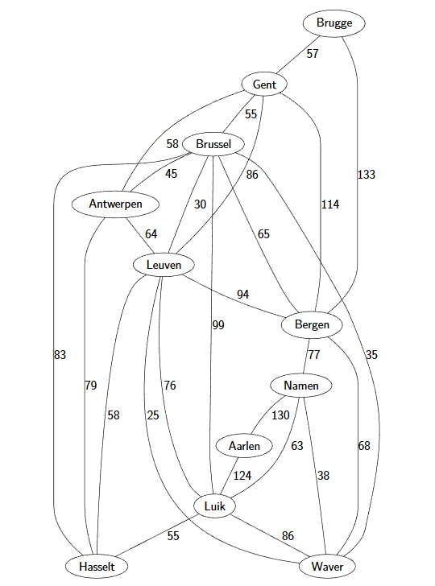
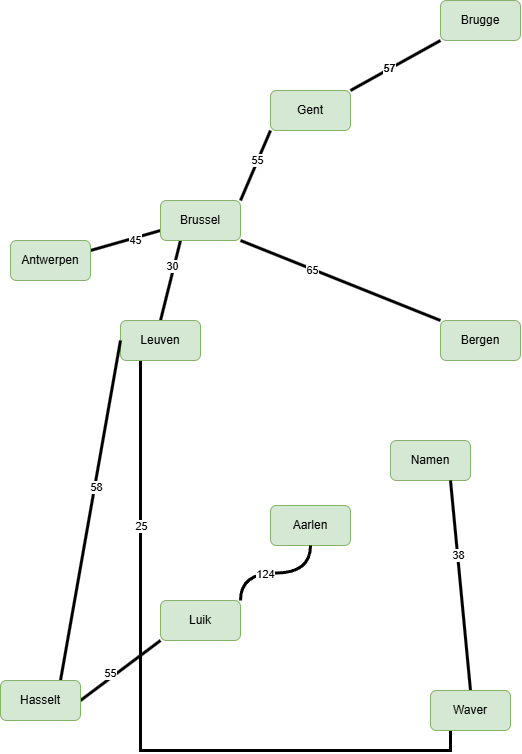
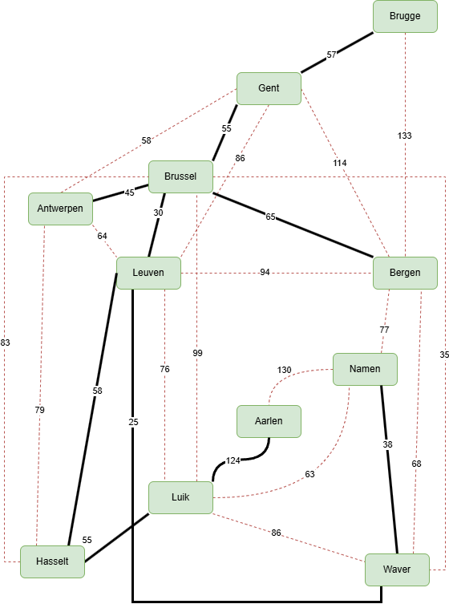

<h1>5.5.4</h1>

# Oefening 1

**Opgave**

Vind een minimale kost opspannende boom m.b.v. het algoritme van Primvoor de graaf in Figuur 5.4. Neem als startknoop “Brugge”.

**Oplossing**

# Oefening 2

**Opgave**

Doe nu hetzelfde, maar gebruik Kruskal.

**Oplossing**

Zelfde oplossing als Prim (de volgorde van ontdekken was wel anders).

