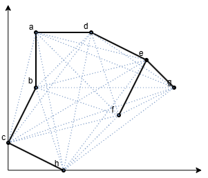

<h1>5.6.1</h1>

# Oefening 1

## Bewijzen dat Manhattan-distance aan de driehoeksongelijkheid voldoet.

**Overgeslagen**

## Oefening 2

Beschouw opnieuw de acht steden in Figuur 5.18, maar veronderstel nu dat het gewicht van een boog gegeven wordt door de zogenaamde Manhattan-distance tussen de twee knopen, dus

𝑑((𝑥1, 𝑦1), (𝑥2, 𝑦2)) = |𝑥2 − 𝑥1| + |𝑦2 − 𝑦1|

Pas het benaderende algoritme voor het oplossen van het handelsreizigersprobleem toe op dit probleem. Gebruik Kruskals algoritme om de minimale opspannende boom te construeren. Wanneer meerdere bogen kunnen gekozen worden, kies dan steeds de lexicografisch kleinste boog. Neem de knoop 𝑎 als wortel van de opspannende boom.

| Knoop | Positie |
| ----- | ------- |
| a     | (1, 5)  |
| b     | (1, 3)  |
| c     | (0, 1)  |
| d     | (3, 5)  |
| e     | (5, 4)  |
| f     | (4, 2)  |
| g     | (6, 3)  |
| h     | (2, 0)  |

| Boog   | Manhattan-distance | Gecheckt |
| ------ | ------------------ | -------- |
| (a, b) | 2                  | x        |
| (a, c) | 5                  |
| (a, d) | 2                  | x        |
| (a, e) | 5                  |
| (a, f) | 6                  |
| (a, g) | 8                  |
| (a, h) | 7                  |
| (b, c) | 3                  | x        |
| (b, d) | 4                  |
| (b, e) | 5                  |
| (b, f) | 4                  |
| (b, g) | 5                  |
| (b, h) | 4                  |
| (c, d) | 7                  |
| (c, e) | 8                  |
| (c, f) | 5                  |
| (c, g) | 8                  |
| (c, h) | 3                  | x        |
| (d, e) | 3                  | x        |
| (d, f) | 4                  |
| (d, g) | 5                  |
| (d, h) | 6                  |
| (e, f) | 3                  |
| (e, g) | 2                  | x        |
| (e, h) | 7                  |
| (f, g) | 3                  |
| (f, h) | 4                  |
| (g, h) | 7                  |

Opgespannen boog:

In preorder: a, b, c, h, d, e, f, g
