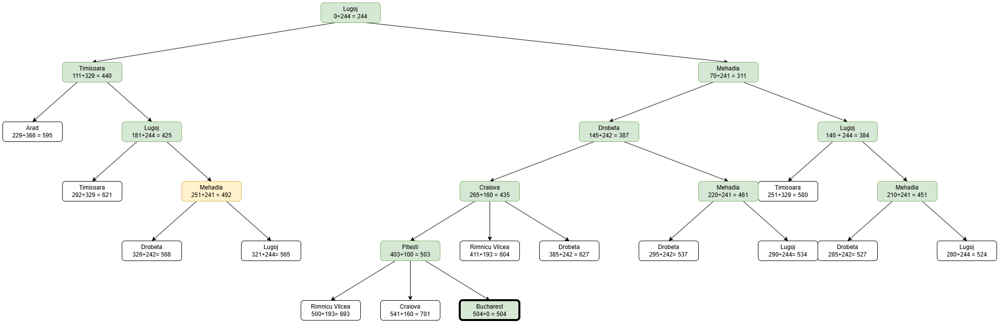
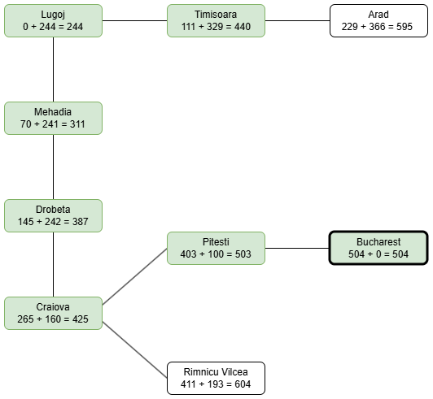

<h1>6.6</h1>

# Oefening 1

(Russell and Norvig, 2014, Oefening 3.4) Beschouw twee vrienden die in verschillende steden wonen, bv. in Roemenië. Bij elke actie kunnen we elke vriend simultaan naar een naburige stad op de kaart verplaatsen. De hoeveelheid tijd nodig om zich van stad 𝑖 naar de aanpalende stad 𝑗 te verplaatsen is gelijk aan de afstand 𝑑(𝑖, 𝑗). Bij elke actie moet de vriend die eerst aankomt wachten tot de andere ook aankomt. De twee vrienden willen zo vlug als mogelijk samenkomen.

## Vraag A

**Opgave**

Geef een gedetailleerde beschrijving van het zoekprobleem.

**Oplossing**

De twee personen in het probleem kunnen als één samenwerkende persoon gezien worden. We kunnen dan een pad gaan zoeken aan de hand van bijvoorbeeld A\* om de twee personen zo snel mogelijk bij elkaar te krijgen. De heuristiek van het pad zou dan de afstand in vogelvlucht zijn tussen de steden waarin beide personen zich bevinden.

De toestandsruimte bestaat uit de steden waarin de personen zich bevinden. Elke toestand is een opsomming van de steden (i, j). Een actie bestaat eruit dat minimaal één persoon zich naar een aanpalende stad verplaatst. _Volgens modeloplossing van vraag c moeten beide personen zich steeds verplaatsen._

De kost van de actie is de verplaatsing die het langste duurt (want de andere vriend moet wachten).

De doeltest slaagt als i en j gelijk zijn aan elkaar -> de personen zijn dan in dezelfde stad.

## Vraag B

**Opgave**

Beschouw 𝐷(𝑖, 𝑗) als de afstand in vogelvlucht tussen de twee steden 𝑖 en 𝑗. Welke van volgende heuristieken zijn toelaatbaar wanneer dee erste vriend zich in stad 𝑖 en de tweede zich in stad 𝑗 bevindt.

- i: D(i,j)
- ii: 2D(i,j)
- iii: D(i,j)/2

**Oplossing**

Heuristiek iii is toelaatbaar. D(i,j) is steeds korten dan de werkelijke kost voor één persoon. Aangezien twee personen zich tegelijk verplaatsen, kan de werkelijke tijd echter dubbel zo snel zijn. Zowel 1 als 2 kunnen dus hoger zijn dan de werkelijke kost.

## Vraag C

**Opgave**
Zijn er toestanden (in de wetenschap dat er een pad is tussen allesteden op de kaart) waarvoor geen oplossing bestaat? Leg uit.

**Oplossing**

_Volgens de modeloplossing moeten twee vrienden zich altijd verplaatsen en kunnen ze daardoor elkaar niet vinden als alle paden tussen de twee steden een oneven aantal stappen bevatten._

# Oefening 2

Een aantal robots (bv. 𝑘) leven in een rooster waarin sommige locaties muren zijn. Twee robots kunnen zich nooit op dezelfde locatie bevinden. Elke robot heeft zijn eigen bestemming. Bij elke tijdseenheid verplaatsen de robots zich simultaan naar een aanpalend (vrij) vierkant of blijven ze staan. Twee robots die zich naast elkaar bevinden kunnen niet van plaats wisselen in één tijdseenheid. Elke tijdseenheid kost één punt. Beantwoord de volgende vragen.

## Vraag A

**Opgave**

Geef een minimale correcte voorstelling van een toestand in de toestandsruimte.

**Oplossing**

De toestand bestaat uit de positie van elke robot. (pos1, pos2, pos3, ..., posk)

## Vraag B

**Opgave**

Schat de grootte van de toestandsruimte in voor een rooster met als afmetingen M x N.

**Oplossing**

(M x N)k

## Vraag C

**Opgave**

Welke van volgende heuristieken zijn toelaatbaar? Beargumenteer je antwoord, meer bepaald: geef een situatie waarvan je aangeeft dat de gegeven heuristiek niet toelaatbaar is wanneer je dit beweert.

**Oplossing**

- i. Som van de Manhattan afstanden voor elke robot tot zijn doel-locatie
  - Niet-toelaatbaar: Stel dat elke robot zich maar één keer moet verplaatsen, dan is de heuristiek k en de werkelijke kost 1.
- ii. Som van de kosten van de optimale paden indien de robots zich alleen in de omgeving voortbewegen, m.a.w. zonder obstructie door andere robots (met de muren wordt wel rekening gehouden)
  - Niet-toelaatbaar: Zelfde reden. Als elk optimaal pad 1 is, dan is de heuristiek k en de werkelijke kost 1.
- iii. Maximum van de Manhattan afstanden vanuit elke robot positie tot zijn doelpositie.
  - Toelaatbaar
- iv. Maximum van de kosten van de optimale paden indien de robots zich alleen in de omgeving voortbewegen, m.a.w. zonder obstructie door andere robots (met de muren wordt wel rekening gehouden).
  - Toelaatbaar
- v. Aantal robots die zich niet op hun doellocatie bevinden.
  - Niet-toelaatbaar: Als k robots zich naast hun doel bevinden, dan heb je maar één stap nodig (werkelijke kost = 1), maar is de heuristiek k.

## Vraag D

**Opgave**

Beschouw de toestandsruimtegraaf in Figuu r6.15. De starttoestand is steeds 𝑆e n de doeltoestand is 𝐺. Voer een aantal zoekalgoritmes uit op deze toestandsruimtegraaf. Indien er ergens “random” een plan uit de open lijst moet gekozen worden, neem je het plan dat eindigt in de lexicografisch kleinste toestand. Hierdoor wordt de oplossing steeds uniek. De heuristiek gebruikt door de geïnformeerde zoekmethoden staat gegeven in onderstaande tabel:

| Toestand | S   | A   | B   | C   | D   | E   | G   |
| -------- | --- | --- | --- | --- | --- | --- | --- |
| h        | 6   | 0   | 6   | 4   | 1   | 10  | 0   |

Geef voor onderstaande blinde en geïnformeerde zoekmethodes het pad naar de doeltoestand. Geef ook aan welke toestanden geëxpandeerd werden en dit in de juiste volgorde van hun expansie. De geïnformeerde zoekmethoden gebruiken de heuristiek ℎ.

**Oplossing**

### Diepte-eerst (boomgebaseerd)

Expansies: S - A - C - G

Pad: S, A, C, G

### Gulzig beste-eerst (boomgebaseerd)

Expansies: S - A - G

Pad: S, G

### Uniforme kost zoeken (boomgebaseerd)

Expansies: S, B, A, D, C, E, D, (G)

Pad: S, B, D, G

### A\* (boomgebaseerd)

Expansies: S, A, D, B, D, (G)

Pad: S B D G

### A\* (graafgebaseerd)

Expansies: S, A, D, B, C, (G)

Pad: S A C G

# Oefening 4

**Opgave**

Pas het gulzig beste eerst algoritme toe om van Arad naar Bucharest tegaan op de kaart van Roemenië in Figuur 6.11. Gebruik de afstand in vogelvlucht uit Tabel 6.2 als heuristiek.

**Oplossing**

Pad: Arad, Sibiu, Fagaras, Bucharest

# Oefening 5

Gebruik A∗ om van Lugoj naar Bucharest te gaan op de kaart van Roemenië in Figuur 6.11 met de afstand in vogelvlucht als heuristiek. Teken de opgebouwde zoekboom en geef aan in welke volgorde de plannen verwijderd worden van de open lijst. Los deze oefening eerst op voor boomgebaseerd zoeken en vervolgens voor graafgebaseerd zoeken.

## Boomgebaseerd

Verwijderde plannen:

- Lugoj
- Mehadia, Lugoj
- Lugoj, Mehadia, Lugoj
- Drobeta, Mehadia, Lugoj
- Craiova, Drobeta, Mehadia, Lugoj
- Timisoara, Lugoj
- Lugoj, Timisoara, Lugoj
- Mehadia, Lugoj, Mehadia, Lugoj
- Mehadia, Drobeta, Mehadia, Lugoj
- Pitesti, Craiova, Drobeta, Mehadia, Lugoj
- Bucharest, Pitesti, Craiova, Drobeta, Mehadia, Lugoj

**Gevonden pad**: Lugoj, Mehadia, Drobeta, Craiova, Pitesti, Bucharest

## Graafgebaseerd

Verwijderde plannen:

- Lugoj
- Mehadia, Lugoj
- Drobeta, Mehadia, Lugoj
- Craiova, Drobeta, Mehadia, Lugoj
- Timisoara, Lugoj
- Pitesti, Craiova, Drobeta, Mehadia, Lugoj
- Bucharest, Pitesti, Craiova, Drobeta, Mehadia, Lugoj

**Gevonden pad**: Lugoj, Mehadia, Drobeta, Craiova, Pitesti, Bucharest

# Oefening 6

**Opgave**

Rush Hour wordt gespeeld op een 𝑛 × 𝑛 spelbord. Op het spelbord staan een aantal auto’s, die elk twee aaneengrenzende vakjes beslaan, en een aantal vrachtwagens, die elk drie aaneengrenzende vakjes beslaan. Het spelbord bevat aan één van de zijden een uitgang. De spelregels zijn heel eenvoudig: je kan bij elke beurt een willekeurige auto of vrachtwagen een aantal vakjes voorwaarts of achterwaarts verplaatsen in de richting waarin deze geplaatst is op het spelbord. Uiteraard kunnen voertuigen elkaar niet overlappen en kunnen ze niet over elkaar springen. Het probleem is dat een specifieke auto (op Figuur 6.2 gemarkeerd met X) naar de uitgang van het spelbord moet geleid worden. Hierbij moet de totale afgelegde afstand (som van alle afstanden door verplaatsen van auto’s en/of vrachtwagens) zo laag mogelijk gehouden worden. Geef minstens twee toelaatbare heuristieken voor dit probleem verschillend van de triviale toelaatbare heuristiek ℎ = 0.

**Oplossing**

- Heuristiek 1: De Manhattan-afstand van de gemarkeerde auto naar de uitgang. Aangezien de auto geblokkeerd wordt, zal de werkelijke afstand steeds groter of gelijk zijn aan de Manhattan-afstand.
- Heuristiek 2: Het aantal auto's die niet gemarkeerd zijn, maar tussen de auto en uitgang staan.
