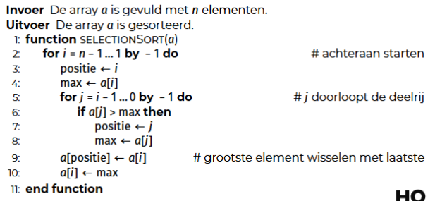

<h1> Zoeken en sorteren </h1>

- [Complexiteit](#complexiteit)
  - [Lineaire tijdscomplexiteit](#lineaire-tijdscomplexiteit)
  - [Kwadratische tijdscomplexiteit](#kwadratische-tijdscomplexiteit)
  - [Exponentiële tijdscomplexiteit](#exponentiële-tijdscomplexiteit)
  - [Logaritmische tijdscomplexiteit](#logaritmische-tijdscomplexiteit)
  - [Constante tijdscomplexiteit](#constante-tijdscomplexiteit)
- [Zoeken in een array](#zoeken-in-een-array)
  - [Sequentieel zoeken (lineair zoeken)](#sequentieel-zoeken-lineair-zoeken)
  - [Binair zoeken](#binair-zoeken)
    - [In code](#in-code)
- [Sorteren](#sorteren)
  - [Sorteren door selectie](#sorteren-door-selectie)
    - [In code](#in-code-1)

# Complexiteit

> Tijdscomplexiteit: Hoe lang het duurt om een algoritme uit te voeren.
> Ruimtecomplexiteit: Hoe veel RAM-geheugen een algoritme nodig heeft.
>
> In deze cursus wordt bij de complexiteit / efficiëntie van een algoritme enkel gekeken naar de tijdscomplexiteit (T)

Bij het bepalen van het type algoritme, gaan we altijd uit van het slechtst mogelijke geval. Daarvoor wordt de big O-notatie gebruikt.

## Lineaire tijdscomplexiteit

T(n) = n

Als de input verdubbelt, verdubbelt de uitvoeringstijd.

## Kwadratische tijdscomplexiteit

T(n) = n<sup>2</sup>

Als input verdubbelt, gaat de uitvoeringstijd maal 4.

## Exponentiële tijdscomplexiteit

T(n) = 2<sup>n</sup>

Als de input met één element verhoogd wordt, verdubbelt de uitvoeringstijd

## Logaritmische tijdscomplexiteit

T(n) = log(n)

Als de input verdubbelt, komt er een constante waarde bij de uitvoeringstijd.

## Constante tijdscomplexiteit

T(n) = c

Als input wijzigt, verandert de uitvoeringstijd niet.

# Zoeken in een array

We gaan er hier vanuit dat de array random accessable is.

## Sequentieel zoeken (lineair zoeken)

**Tijdscomplexiteit -> T(n) = (O)n**

= alle elementen één voor één onderzoeken

Eenvoudig te implementeren, zowel in gesorteerde als niet-gesorteerde lijsten.

Je moet enkel kunnen checken of elementen gelijk zijn aan elkaar of niet.

## Binair zoeken

**Tijdscomplexiteit -> T(n) = O(log<sub>2</sub>(n))**

-> Zoekt eerst het middelste item. Splitst dan op in twee gelijke helften tot er maar één element meer over is.

Array moet al gesorteerd zijn.

Item kleiner dan middelste? -> Zoek in de rechterhelft <br>
Item groter dan middelste? -> Zoek in linkerhelft

Implementatie kan recursief of iteratief.

Je moet kunnen checken of elementen gelijk zijn aan en elkaar en je moet kunnen berekenen welk element groter / kleiner is.

<strong> Variabelen </strong>

- n = lengte array
- l = linkerpositie (init: 0)
- r = rechterpositie (init: n - 1)

Linker- en rechterindices worden gebruikt omdat dit memory efficient is (in tegenstelling tot subarrays kopiëren)

Het midden m bereken je met de formule: (l + r) / 2 <br>
<i>Dit betekent dat het midden bij even lengtes altijd op het laagste element gelegd wordt. (vb. n = 7 -> m = 3)</i>

Het algoritme moet het eerste voorkomen van het element in de lijst weergeven, daarom mag je m niet returnen als m het element al bevat. Dit kan foute resultaten geven als het element meerdere keren voorkomt. Je stopt het algoritme enkel als l = r

### In code

```python
def zoek_binair_iteratief(zoekItem, rij):
    l = 0
    r = len(rij) - 1

    while l != r:
        m = (l + r) // 2
        if rij[m] < zoekItem:
            l = m + 1
        else:
            r = m

    return l if rij[l] == zoekItem else -1

def recursief_binair_zoeken_driver(zoekItem, rij):
    return zoekRecursief(zoekItem, rij, 0, len(rij) - 1)

def zoek_binair_recursief(zoekItem, rij, l, r):
    if l == r: #basisgeval, er is maar 1 element
        return l if rij[l] == zoekItem else -1

    m = l + r // 2
    if rij[m] < zoekItem:
        zoekRecursief(zoekItem, rij, m + 1, r) # zoek rechts
    else:
        zoekRecursief(zoekItem, rij, l, m) # zoek links

```

# Sorteren

Sorteren is een belangrijke voorwaarde voor veel andere algoritmes (waaronder binair zoeken).

## Sorteren door selectie

Je zoekt het grootste element en plaatst het achteraan (wisselen met het laatste element). Je doet dit opnieuw met dezelfde rij maar negeert de al gesorteerde elementen. Dit doe je tot je alle elementen hebt gesorteerd.

<figure>

<figcaption> Je loopt van n - 1 tot en met 1 (want als er maar 1 element is, dan is het al gesorteerd). Elke keer neem je de laatste positie. Je zet die positie ook als waarde voor de max. Dan zoek je de max van alle elementen voor dat element. Als je een groter element vindt dan de huidige max, wordt dat de nieuwe max en wordt de index van dat element de nieuwe positie. Als je op het einde komt, verwissel je het element op positie met het element op de laatste positie (i)</figcaption>
</figure>

### In code

```python
def selection_sort(a):
    pass
```
