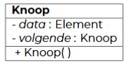
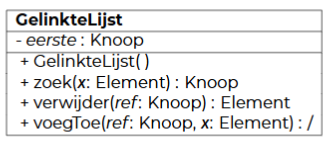

<h1> Gelinkte lijsten </h1>

- [Gelinkte Lijst](#gelinkte-lijst)
  - [Implementatie](#implementatie)
    - [Basisbewerkingen](#basisbewerkingen)
    - [Ankercomponenten](#ankercomponenten)
    - [Dubbelgelinkte lijsten](#dubbelgelinkte-lijsten)
- [Stack](#stack)
  - [Implementatie](#implementatie-1)
  - [Toepassingen](#toepassingen)

# Gelinkte Lijst

Arrays moeten verplaatst worden als ze te groot worden. Ook moeten de elementen allemaal één plaatsje opschuiven als je niet op het einde toevoegt. Beide bewerkingen hebben een T(n) = O(n).

LinkedList is beter geschikt als er veel moet ingevoegd worden. De tijdscomplexiteit is constant (T(n) = O(1)). Het enige dat je moet doen is twee pointers vervangen.

Je slaat telkens een element op, dat element heeft ook een referentie naar het volgende element.

Nadeel: elementen nemen meer ruimte in, lijst doorlopen is wat trager (omdat je met pointers werkt), er is geen indexering (en dus geen random-access)

Element opzoeken in LinkedList heeft tijdscomplexiteit T(n) = O(n) -> Je moet altijd starten bij het eerste element en alles doorlopen tot je het juiste element vindt.

> Definitie
>
> Een linked list bestaat uit knopen (die hebben een data-veld _data_ en een veld _volgende_) die via een kettingstructuur aan elkaar geschakeld zijn. De laatste knoop bevat null als waarde voor _volgende_.

Er moet altijd een referentie bijgehouden worden naar de eerste knoop van de Linked List.

## Implementatie

### Basisbewerkingen

Belangrijkste zijn:

- zoek()
- verwijder()
- voegToe()

De Node/Knoop klasse wordt meestal geïmplementeerd als inner class van de LinkedList klasse -> LinkedList heeft dus toegang tot de velden van Node



```java
// Bovenstaande UML in Java
private class Knoop {
    private Element data;
    private Knoop volgende;

    public Knoop() {
        this.data = null;
        this.volgende = null;
    }
}
```



```java
// Bovenstaande UML in Java
public class GelinkteLijst {
    private Knoop eerste;

    public GelinkteLijst(){
        this.eerste = null;
    }

    // Retourneert de eerste Knoop die als data Element x bevat of null als geen knoop Element x bevat.
    // T(n) = O(n)
    public Knoop zoek(Element x) {
        Knoop ref = eerste;
        while (ref != null and !ref.data.equals(x)) {
            ref = ref.volgende;
        }
        return ref;
    }

    // Knoop ref is de VOORAFGAANDE knoop aan het te verwijderen data-veld. De functie retourneert het data-veld van de verwijderde knoop.
    // KAN NIET TOEGEPAST WORDEN OP DE EERSTE KNOOP.
    public Element verwijder(Knoop ref) {
        Element x = ref.volgende.data;
        ref.volgende = ref.volgende.volgende; // De referentie moet van de verwijderde knoop overgezet worden naar de voorgaande knoop.
        return x;
    }

    // Voegt een nieuwe knoop met data-veld x toe na knoop ref.
    // ref = voorgaande knoop
    // KAN NIET TOEGEPAST WORDEN OP DE EERSTE KNOOP OF EEN LEGE LIJST
    public void voegToe(Knoop ref, Element x) {
        Knoop nieuweKnoop = new Knoop();
        nieuweKnoop.data = x;
        nieuweKnoop.volgende = ref.volgende;
        ref.volgende = nieuweKnoop;
    }
}
```

### Ankercomponenten

De functies verwijder() en voegToe zijn enkel bruikbaar voor algemene gevallen. Ze zijn niet bruikbaar bij de eerste knopen of lege lijsten omdat je dan geen vorige knoop hebt.

Oplossing: ankercomponent (= extra knoop met leeg data-veld)

In een gewone LinkedList krijg je een ankercomponent aan het begin.

### Dubbelgelinkte lijsten

Een LinkedList doorlopen duurt langer als het element zich achteraan bevindt. Een dubbelgelinkte lijst houdt ook een referentie naar de laatste knoop bij. De knopen houden naast de volgende knoop ook de vorige bij.

Er komt een ankercomponent op het einde. Als je nu wil checken of de lijst leeg is, moet je `if (eerste.volgende == laatste || laatste.vorige == eerste)` checken.

# Stack

= LIFO-structuur (Last-In-First-Out)

De basisbewerkingen voor een stack zijn:

- Stack()
- isEmpty()
- push(): nieuw element bovenaan toevoegen
- pop(): bovenste element verwijderen en returnen
- peek(): bovenste element returnen, zonder verwijderen

Wordt in de praktijk geïmplementeerd als een soort GelinkteLijst. De Stack houdt steeds een top bij. Elk element in de Stack krijgt een verwijzing naar het onderliggende element.

## Implementatie

De Knoop wordt als inwendige klasse van Stack geïmplementeerd, zodat de Stack klasse toegang heeft tot de velden van Knoop. Knoop is identiek aan de Knoop bij LinkedList.


```java
// Bovenstaande UML in Java
public Stack {
    Knoop t; // Top van de Stack

    public Stack(){
        this.t = null;
    }

    // Controleert of de stack leeg is. True = leeg, False = niet leeg
    public boolean isEmpty(){
        return t == null;
    }

    // Er wordt een nieuwe Knoop met data-veld x aangemaakt. Deze knoop komt op de Stack te liggen.
    public void push(Element x) {
        Knoop nieuweKnoop = new Knoop();
        nieuweKnoop.data = x;
        nieuweKnoop.volgende = t; // De huidige bovenste knoop wordt de knoop onder de nieuwe knoop.
        this.t = nieuweKnoop; // De nieuwe knoop wordt nu bijgehouden als de top
    }

    // De top wordt verwijderd en het data-veld wordt geretourneerd.
    public Element pop() {
        Element x = t.data;
        t = t.volgende; // De onderliggende knoop wordt de nieuwe top.
        return x;
    }

    // Het data-veld van de top wordt geretourneerd.
    public Element peek() {
        return t.data;
    }
}
```

## Toepassingen

**Controleren van haakjes** <br>
Bij openen van haken, plaats je deze op de stapel. Als je een sluitend haakje vindt, controleer je of de top van de stapel overeenkomt (via pop()) met het sluitende haakje.

[Uitwerking in Python](../python_theorie/controle_haakjes.py)

**Infix en postfix**

In postfix kijk je steeds terug naar de twee operanden voor het bewerkingsteken.

| Infix             | Postfix         |
| ----------------- | --------------- |
| `3 x 4`           | `3 4 x`         |
| `1 + 2`           | `1 2 +`         |
| `2 x 3 + 5 / 7`   | `2 3 x 5 7 / +` |
| `2 x (3 + 5) / 7` | `2 3 5 + x 7 /` |

Uitwerking laatste bewerking:

```
    2 3 5 + x 7 /
    2 8 x 7 /
    16 7 /
    2.285714285714...
```

Postfix kan direct vertaald worden naar compiler, infix (notatie die je normaal altijd in wiskunde gebruikt) niet.

Met een stack kan postfix makkelijk uitgerekend worden (T(n) = O(n)):

- Operanden plaats je op de stack.
- Bij een operator pop je de twee laatste operanden van de stack, voer je de bewerking uit en push je het resultaat terug op de stack.
- Herhaal tot de volledige uitdrukking verwerkt is.

Met een stack kan je infix ook naar postfix converteren. (T(n) = O(n))
