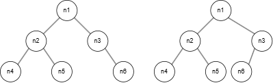
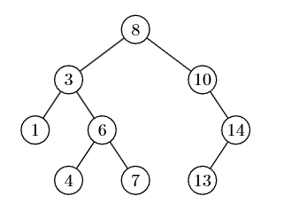
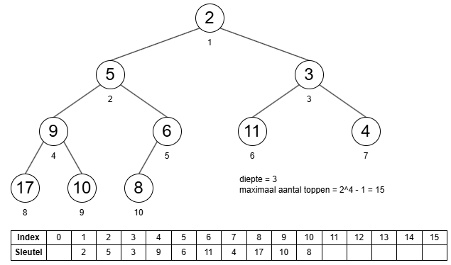
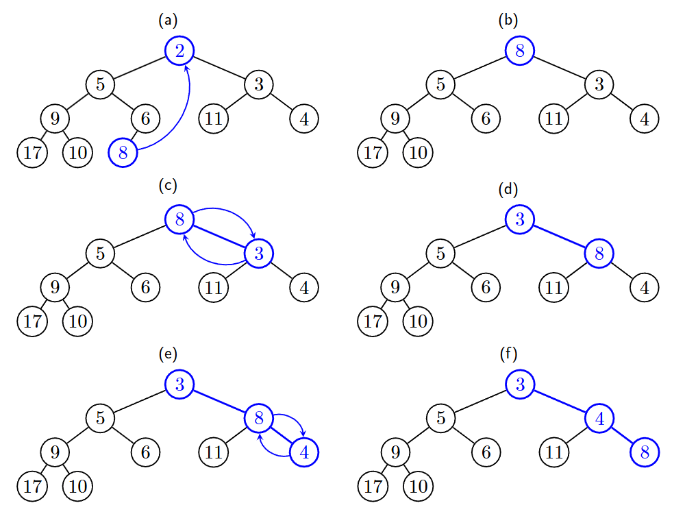

<h1> Bomen </h1>

- [Terminologie](#terminologie)
- [Voorstellingen van bomen](#voorstellingen-van-bomen)
  - [Array-van-kinderen](#array-van-kinderen)
  - [Eerste-kind-volgende-broer](#eerste-kind-volgende-broer)
- [Recursie op bomen](#recursie-op-bomen)
  - [Alle toppen bezoeken](#alle-toppen-bezoeken)
  - [Berekeningen op bomen](#berekeningen-op-bomen)
- [Binaire bomen](#binaire-bomen)
  - [Voorstelling](#voorstelling)
- [Binaire zoekbomen](#binaire-zoekbomen)
  - [Opzoeken van een sleutel](#opzoeken-van-een-sleutel)
    - [Kleinste en grootste element vinden](#kleinste-en-grootste-element-vinden)
  - [Sleutels toevoegen](#sleutels-toevoegen)
  - [Sleutels verwijderen](#sleutels-verwijderen)
  - [Tijdscomplexiteit](#tijdscomplexiteit)
- [Binaire hopen](#binaire-hopen)
  - [Prioriteitswachtrij](#prioriteitswachtrij)
  - [Binaire hoop implementeren als array](#binaire-hoop-implementeren-als-array)
  - [Kleinste element opzoeken](#kleinste-element-opzoeken)
  - [Nieuw element toevoegen](#nieuw-element-toevoegen)
  - [Verwijderen van het element met de kleinste sleutel](#verwijderen-van-het-element-met-de-kleinste-sleutel)
  - [Tijdscomplexiteit](#tijdscomplexiteit-1)

# Terminologie

| Term        | Symbool | Uitleg                            |
| ----------- | ------- | --------------------------------- |
| Boom        | T       |
| Top         | n       | = Node                            |
| Wortel      | t       | Top zonder ouder                  |
| Blad        |         | Top zonder kinderen               |
| Interne top |         | Elke top die geen blad is         |
| Graad       |         | Hoeveel child nodes een top heeft |
| Diepte      |         | Afstand tot de wortel             |
| Hoogte      |         | Afstand tot het verste blad       |

Diepte van een boom = maximale diepte van zijn toppen <br>
Graad van een boom = maximale graad van de toppen

Diepte en hoogte van boom zijn steeds gelijk aan elkaar.

De verschillende 'takken' van een tree zijn disjuncte verzamelingen (grootte van een branch >= 0 dus een enkele top is ook een boom).

# Voorstellingen van bomen

## Array-van-kinderen

Elke top heeft een array, waarvan de grootte de graad van de boom is (zodat alle kinderen zeker een plaats hebben). Daarin worden referenties naar de kinderen bijgehouden.

Nadeel = Er worden veel meer referenties vrijgehouden in het geheugen dan dat er gebruikt worden.

Gebruikte referenties = aantal toppen - 1 (-> want 1 voor elke top behalve de root)<br>
Gereserveerde referenties: aantal toppen \* graad van de boom.

Voor grote bomen kunnen we concluderen dat de nuttige referenties de verhouding `aantal toppen / graad` aanneemt.

## Eerste-kind-volgende-broer

Elke top houdt zijn eerste kind en de volgende broer bij.

Nadeel: Je verliest het overzicht van de boom + aanspreken van bijvoorbeeld een derde kind wordt ingewikkelder <br>
Voordeel: Je hebt veel minder referenties nodig.

Gebruikte referenties = aantal toppen - 1 <br>
Gereserveerde referenties = 2 \* aantal toppen

Voor grote bomen kunnen we concluderen dat de nuttige referenties de verhouding `1 / 2` aanneemt.

# Recursie op bomen

## Alle toppen bezoeken

Twee opties (beide zijn recursief):

- Preorde: Je bezoekt eerst de wortel, daarna de deelbomen.
- Postorde: Je bezoekt eerst de deelbomen, daarna de wortel.

Het basisgeval voor de recursie is wanneer de (deel)boom maar één top heeft (top = blad).

```python
# PREORDE
def preorde(root, visit_functie):
    '''Start de recursie bij de root'''
    preorde_recursief(root, visit_functie)

def preorde_recursief(top, visit_functie)
    visit_functie(top)
    for child in top.get_children():
        preorde_recursief(child, visit_functie)

# POSTORDE
def postorde(root, visit_functie):
    '''Start de recursie bij de root'''
    preorde_recursief(root, visit_functie)

def postorde_recursief(top, visit_functie)
    for child in top.get_children():
        postorde_recursief(child, visit_functie)
    visit_functie(top)
```

Bij preorde ga je per deelboom van boven naar beneden bezoeken.

Bij postorde bezoek je eerst de bladeren en daarna werk je naar boven toe, tot je bij een nieuwe deelboom weer eerst de bladeren bezoekt.

<figure>

</figure>

## Berekeningen op bomen

Bewerkingen op bomen gebeuren meestal recursief (kan zowel in pre- als postorde).

vb. Berekenen van aantal toppen

```python
def bereken_aantal_toppen(boom):
    return aantal_recursief(boom.geef_wortel())

def aantal_recursief(top):
    n = 1 # De top zelf wordt geteld.
    for child in top.get_children():
        n += aantal_recursief(child) # Je voegt het berekende totaal van de deelboom toe aan het totaal van deze boom.
    return n # = aantal_recursief van de deelbomen + 1
```

# Binaire bomen

Binaire bomen zijn bomen die bestaan uit een wortel en twee deelbomen (linker- en rechterdeelboom -> T<sub>l</sub> en T<sub>r</sub>) **OF** leeg zijn.

_LET OP: "Gewone" gewortelde bomen kunnen in tegenstelling tot binaire bomen niet leeg zijn._

<figure>

<figcaption>In de tekening van een binaire boom, is of de node links of rechts getekend wordt van belang. Deze twee binaire bomen zijn niet gelijk aan elkaar.
In boom 1 heeft heeft n3 als linkerdeelboom een lege boom en als rechterdeelboom {n6}. In boom 2 heeft n3 als linkerdeelboom {n6} en rechterdeelboom een lege boom.</figcaption>
</figure>

In een binaire boom bepaal je makkelijk het maximaal aantal toppen voor een gegeven diepte (d) => 2^d

Het minimale aantal toppen die een binaire boom nodig heeft om een gegeven diepte te krijgen is d + 1.

Het maximale aantal topen in de gehele boom is 2<sup>d+1</sup> - 1

## Voorstelling

Elke top bestaat uit de wortel en twee referenties (1 voor linkerboom, 1 voor rechterboom). Referenties zijn altijd naar de wortel.
Lege bomen worden voorgesteld door null-referenties.

**Afspraak: Bij pre- of postorde doorlopen van een binaire boom, doorzoek je eerst de linkerdeelboom.**

Bij binaire bomen kan je ook de wortel tussen de twee deelbomen doorlopen (= inorde).

```
Preorde
    1. Bezoek wortel
    2. Doorloop linkerboom recursief (indien niet leeg)
    3. Doorloop rechterboom recursief (indien niet leeg)

Postorde
    1. Doorloop linkerboom recursief (indien niet leeg)
    2. Doorloop rechterboom recursief (indien niet leeg)
    3. Bezoek wortel

Inorde
    1. Doorloop linkerboom recursief (indien niet leeg)
    2. Bezoek wortel
    3. Doorloop rechterboom recursief (indien niet leeg)
```

# Binaire zoekbomen

Speciale binaire boom waarmee je makkelijk kan:

- gegevens toevoegen
- gegevens verwijderen
- controleren of een gegeven element aanwezig is.

Voorwaarde: De labels moeten vergeleken kunnen worden. <br>
Labels in binaire zoekboom = **sleutels**

Binaire zoekboomeigenschap:

- alle toppen van de linkerdeelboom met top x hebben een kleiner label als linkerdeelboom en een groter label als rechterdeelboom



Als je de binary search tree inorde doorloopt, krijg je de waarden van klein naar groot gesorteerd terug.

## Opzoeken van een sleutel

=> Recursief

We zoeken een waarde in de boom op de volgende manier:

1. Boom is leeg -> return 'niet gevonden'
2. Boom is niet leeg -> vergelijk waarde met sleutel van wortel.
   - Waarde is kleiner dan sleutel: zoek in linkerdeelboom
   - Waarde is groter: zoek in rechterdeelboom
   - Waarde is gelijk: waarde gevonden, geef wortel terug.

### Kleinste en grootste element vinden

Om het kleinste element te vinden:

- Kijk naar de linkerdeelboom
  - Leeg? -> Dit is het kleinste element, geef terug.
  - Niet leeg? -> Zoek verder in de linkerdeelboom.

Je kan hetzelfde doen met de rechterdeelboom om het grootste element te vinden.

## Sleutels toevoegen

=> Recursief

x = toe te voegen waarde.

- Boom is leeg
  - Vervang de boom door een nieuwe boom met x als top en lege linker- en rechterdeelbomen
- Boom is niet leeg:
  - Vergelijk x met de wortel.
    - x < wortel: probeer x links toe te voegen
    - x > wortel: probeer x rechts toe te voegen
    - x = wortel: x behoort al tot de boom

## Sleutels verwijderen

We verwijderen waarde X.

- [Zoek X op.](#opzoeken-van-een-sleutel)
- Drie mogelijke situaties:
  - **X zit in blad**
    - Verwijder het blad.
  - **X heeft één kind**
    - Vervang X door zijn kind.
  - **X heeft twee kinderen**
    - Vervang X door de kleinste waarde uit zijn rechterdeelboom = kleinste waarde die groter is dan X (deze waarde kan nooit twee kinderen hebben, dus is makkelijk te verwijderen)

## Tijdscomplexiteit

Tijdscomplexiteit hangt af van de balans in de boom.

Complete balans = elke top heeft twee kinderen <br>
Totaal ongebalanceerd = elke diepte heeft één top

n = aantal toppen in de boom.

| Balans                | Complexiteit          |
| --------------------- | --------------------- |
| Compleet gebalanceerd | O(log<sub>2</sub>(n)) |
| Totaal ongebalanceerd | O(n)                  |

De diepte van een boom is meestal ook O(log<sub>2</sub>n)

# Binaire hopen

Is een variant van binaire bomen waarmee je o.a. een prioriteitswachtrij kan implementeren.

Complete binaire boom => [binaire boom](#binaire-bomen) die (behalve de diepste laag) maximaal gevuld is. De diepste laag moet van links naar rechts opgevuld zijn.

Binaire hoop => Een complete binaire boom, waarvan de sleutel van elke top maximaal gelijk is aan de kleinste sleutel van zijn kinderen. (= parent is altijd kleiner of gelijk aan kleinste child)

## Prioriteitswachtrij

= uitbreiding van een FIFO queue.

Elk element heeft een sleutel en een waarde. De sleutel is de prioriteit (kleiner = meer voorrang)

In een priority queue kan je minimaal:

- het element met de kleinste sleutel opzoeken.
- het element met de kleinste sleutel verwijderen.
- een nieuw element toevoegen aan de wachtrij.

Je kan enkel makkelijk het element met de kleinste sleutel bereiken -> invoegen is flexibel, verwijderen niet.

## Binaire hoop implementeren als array

Binaire hopen zijn complete binaire bomen en hun vorm staat dus vast. We kunnen elke top een index geven en deze in een array opslaan. Zo moet niet elke top een referentie naar zijn kinderen bijhouden.

De nummering van de toppen gebeurt van boven naar onder en van links naar rechts.

<figure>

<figcaption>Bovenaan: binaire hoop <br>Onderaan: binaire hoop als array geïmplementeerd</figcaption>
</figure>

Positie 0 in de array wordt niet gebruikt.

Om de kinderen te vinden in de array, gebruik je de index van de top.

```
i = index_van_top

  left_child = 2 * i
  right_child = 2 * i + 1
  parent = floor(i/2)
```

## Kleinste element opzoeken

Door de ordeningseigenschap van binaire hopen, is de kleinste sleutel steeds de wortel.

=> Constante tijdscomplexiteit.

## Nieuw element toevoegen

1. Maak het element
2. Voeg het element toe op de eerste beschikbare plaats (dus rechts van het laatst toegevoegde element of één niveau dieper als de diepte vol is)
3. Als het nieuwe element kleiner is dan zijn ouder (schendt ordeningseigenschap van de binaire hoop) => verwissel van element en ouder van plaats
   - Herhaal deze stap tot het element niet meer kleiner is dan zijn ouder. (= omhoog bubbelen)

Maximale aantal wissels = diepte van de boom.

## Verwijderen van het element met de kleinste sleutel

1. Verwissel de wortel met het meest rechtse blad op de grootste diepte.
2. Verwijder het meest rechtse blad (= het kleinste element dat net verwisseld werd)
3. Als de wortel groter is dan zijn kleinste kind -> verwissel de wortel met zijn kleinste kind.
   - Blijf dit element verwisselen met zijn kleinste kind tot de binaire hoop hersteld is. (= omlaag bubbelen)



## Tijdscomplexiteit

Voor een binaire hoop met _n_ toppen, duurt het toevoegen en verwijderen O(log<sub>2</sub>(n)).

Het ophalen van het kleinste element is constant => O(1)
