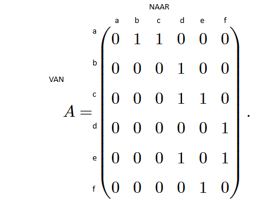

<h1> Graafalgoritmes </h1>

- [Terminologie](#terminologie)
- [Datastructuren](#datastructuren)
  - [Adjacentiematrix](#adjacentiematrix)
    - [Tijdscomplexiteit](#tijdscomplexiteit)
  - [Adjacentielijst](#adjacentielijst)
    - [Tijdscomplexiteit](#tijdscomplexiteit-1)
- [Zoeken in grafen](#zoeken-in-grafen)
- [Kortste Pad Algoritmen](#kortste-pad-algoritmen)
- [Minimale Kost Opspannende Bomen](#minimale-kost-opspannende-bomen)
- [Het Handelsreizigersprobleem](#het-handelsreizigersprobleem)

# Terminologie

| Term               | Symbool | Uitleg                           |
| ------------------ | ------- | -------------------------------- |
| Verzameling knopen | V       |
| Verzameling bogen  | E       |
| Graaf              | G       | Meestal genoteerd als G = (V, E) |

Een boog e tussen knoop v en knoop w schrijven we als `e = (v,w)`

- Adjacent -> Twee knopen zijn met elkaar verbonden
- Incident -> Een boog hoort bij een (koppel) kno(o)p(en) / Een knoop hoort bij een boog.
- Buren -> Alle adjacente knopen
- Graad -> Aantal buren van een knoop
- Orde -> Aantal knopen in een graaf (= #(V)), vaak genoteerd als _n_
- Grootte -> Aantal bogen in een graaf (= #(E)), vaak genoteerd als _m_
- Pad -> Opsomming van knopen zodat er een boog tussen de twee knopen ontstaat (lengte = aantal bogen). Een pad van een knoop naar zichzelf heeft lengte 0.
- Enkelvoudige cykel -> pad dat begint en eindigt in dezelfde knoop, waarin alle bezochte knopen verschillend zijn en geen enkele boog meer dan een keer wordt overlopen (= lus). In een gerichte graaf worden beide richtingen als aparte bogen beschouwd.

In het Nederlands is top een synoniem voor knoop.

- **Ongerichte** graaf: De boogparen zijn niet geordend (hebben geen specifieke richting)
- **Gerichte** graaf: De boogparen hebben een richting. Elke boog heeft een **kop** en een **staart** (noteer de bogen steeds van staart naar kop).

_Voorbeeld in de cursus: Graaf van vriendschappen op Facebook is ongericht (vriendschap gaat twee kanten op). Graaf van volgers op Twitter is gericht._

Maximale aantal bogen in een gerichte graaf = n2

De buren van een knoop in een gerichte graaf, zijn de knopen die je vanuit de originele knoop kan bereiken.

Een graaf is een **gewogen** graaf als er extra informatie met de bogen geassocieerd wordt.

# Datastructuren

## Adjacentiematrix

Twee mogelijke waarden:

- 1 = boog aanwezig
- 0 = geen boog

Een adjacentiematrix is voor een ongerichte graaf steeds symmetrisch (=> boog is aanwezig in beide richtingen).

<figure>
    
    <figcaption>Een voorbeeld van een adjacentiematrix van een ongerichte graaf.   <em>Er is een boog van a naar b, niet van b naar a.</em></figcaption>
</figure>

Bij een gewogen graaf, kan je het gewicht opslaan per boog i.p.v. een 1 of 0. Er moet dan wel een speciale waarde voorzien worden voor wanneer de knopen niet adjacent zijn.

Neemt O(n2) geheugen in (n = aantal knopen in graaf).  
_Bij ijle grafen (= aantal bogen is klein t.o.v. maximaal aantal bogen) is veel ruimte verspild._

Als de knopen niet genummerd zijn, wordt meestal een woordenboek gebruikt waarin elk label naar een geheel getal omgevormd wordt (vb. in een hashmap).

### Tijdscomplexiteit

Kijken of twee knopen adjacent zijn => O(1)  
_=> Element ophalen uit tweedimensionale array_

Alle buren van een knoop vinden => O(n)  
_=> Je moet de rij voor de knoop overlopen._

## Adjacentielijst

Je gebruikt een array. Elke knoop komt overeen met een index. Op deze index plaats je een lijst van buren.

Voordeel: Verspilt geen geheugen. Gebruikte geheugen is `O(aantal knopen + aantal bogen)`

Meestal worden grafen in programmeertalen in adjacentielijsten opgeslagen. Dit is meestal in de vorm van een Map-structuur. Hierin staan de knopen als labels en een lijst van buren als waarde.

### Tijdscomplexiteit

Kijken of twee knopen adjacent zijn => (trager dan bij adjacentiematrix)  
_Je overloopt de lijst van buren tot je een match hebt._

Alle buren van een knoop vinden => O(n)   (zelfde als bij matrix)

# Zoeken in grafen

**VERDER VANAF PAGINA 136**

# Kortste Pad Algoritmen

# Minimale Kost Opspannende Bomen

# Het Handelsreizigersprobleem
