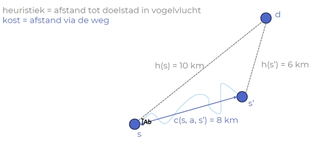

<h1>Zoekalgoritmes</h1>

- [Inleiding](#inleiding)
  - [Zoekproblemen](#zoekproblemen)
  - [Zoekproblemen oplossen](#zoekproblemen-oplossen)
- [Algemene zoekalgoritmen](#algemene-zoekalgoritmen)
  - [Boomgebaseerd zoeken](#boomgebaseerd-zoeken)
  - [Criteria voor zoekalgoritmen](#criteria-voor-zoekalgoritmen)
  - [Graafgebaseerd zoeken](#graafgebaseerd-zoeken)
- [Blinde Zoekmethoden](#blinde-zoekmethoden)
  - [Breedte Eerst Zoeken](#breedte-eerst-zoeken)
  - [Diepte Eerst Zoeken](#diepte-eerst-zoeken)
  - [Diepte-gelimiteerd zoeken](#diepte-gelimiteerd-zoeken)
    - [Iteratief verdiepen](#iteratief-verdiepen)
  - [Uniforme kost zoeken](#uniforme-kost-zoeken)
- [Geïnformeerde Zoekmethoden](#geïnformeerde-zoekmethoden)
  - [Heuristieken](#heuristieken)
  - [Gulzig Beste Eerst](#gulzig-beste-eerst)
  - [A\* Zoekalgoritme](#a-zoekalgoritme)
- [Heuristieken ontwerpen](#heuristieken-ontwerpen)
  - [Eerste manier: Gebruik van vereenvoudigde problemen](#eerste-manier-gebruik-van-vereenvoudigde-problemen)
  - [Tweede manier: Patroondatabanken](#tweede-manier-patroondatabanken)
  - [Heuristieken combineren](#heuristieken-combineren)
- [Samengevat](#samengevat)

# Inleiding

-> We moeten iets zoeken maar de graaf van de data is veel te groot om op te kunnen bouwen.

Veronderstelling om te kunnen modelleren als een zoekprobleem:

- De omgeving bevat één persoon
- De omgeving moet compleet observeerbaar zijn
- De omgeving is deterministisch (geen randomness)
- Statische omgeving: Als er geen actie uitgevoerd wordt, verandert er niets
- Discrete toestanden (dus O -> 1, niet 0 -alle cijfers tussen 0 en 1-> 1)

## Zoekproblemen

Zoekproblemen bestaan uit:

- **Toestandsruimte** (S): alle mogelijke toestanden
- Verzameling van **acties** (A)
- **Transitiemodel** (T): definieert het effect van het uitvoeren van een actie

Het zoeken vertrekt steeds uit een toestand s0. Het uitvoeren van een actie heeft meestal een **kost** (c)

**Opvolger** = toestand s' na het uitvoeren van een actie op toestand s

**Doeltest** = geeft voor elke toestand aan of het doel bereikt is. Een toestand waarin het doel bereikt is, heet een **doeltoestand**.

**Toestandsruimtegraaf** (= state space graph) is een graaf waarin de knopen toestanden zijn en de opvolgers met elkaar verbonden worden met bogen. Het gewicht van de boog is de kost van de actie. Elke toestand komt maar één keer voor. Meestal te groot om volledig bij te houden in een computer.

De cursus geeft enkele voorbeelden:

- 8-puzzel
- 8-koninginnenprobleem (schaakbord)
- route- en rondreisproblemen
- [handelsreizigerprobleem](H5%20-%20Graafalgoritmes.md#het-handelsreizigersprobleem)

## Zoekproblemen oplossen

Oplossing is een sequentie van acties om de doeltoestand te bereiken. De kost van een oplossing is de som van de kost van al zijn acties.

Optimale oplossing => oplossing met minimale kost onder mogelijke oplossingen.

# Algemene zoekalgoritmen

## Boomgebaseerd zoeken

-> Houdt een lijst (in de vorm van een zoekboom) bij van mogelijke deeloplossingen (= plannen) die verder uitgewerkt moeten worden (= open lijst)

Bij de start is het enige plan de initiële toestand s0.

Basiswerkwijze:

- Kies een plan uit de lijst.
- Verwijder het plan uit de lijst.
- Check of het plan aan de doeltest voldoet.
  - Nee: Voeg alle opvolgers van het plan toe aan de lijst (= expanderen) en herhaal.
  - Ja: Stop algoritme.

Als de lijst leeg is, werd er geen oplossing gevonden.

```
INVOER: Zoekprobleem P.
UITVOER: Sequentie van acties die het probleem oplossen of een error.

function TreeSearch(P)
    f <- nieuwe lege lijst
    f.add(plan gebaseerd op initiële toestand van P)
    while f ≠ ∅ do
        c <- f.kiesEnVerwijderPlan              # kiest het volgende plan, c = huidig plan
        if P.doeltest(c.getToestand) = true then
            return getActieSequentie(c)         # oplossing gevonden
        else
            for (s, a) ∈ c.getToestand.getOpvolgers do         # expanderen, s = toestand van opvolger, a = actie om opvolger te krijgen
                f.add(nieuw plan gebaseerd op (s, a) en c)
            end for
        end if
    end while
    return error: geen oplossing gevonden
end function
```

Een object van klasse Plan bestaat uit vier velden:

- huidige toestand
- laatst gekozen actie (a) -> leeg voor initiële toestand
- voorganger / parent van dit plan
- totale kost van het plan (g) -> kan je ook berekenen door de voorgangers te volgen, maar deze berekening zou lineair zijn en dus veel tijd aan het algoritme toevoegen.

## Criteria voor zoekalgoritmen

- Compleet zoekalgoritme -> vindt voor elk zoekprobleem een oplossing
- Optimaal zoekalgoritme -> vindt voor elk zoekprobleem steeds de optimale oplossing

_Als er geen oplossing voor het zoekprobleem bestaat, vinden ze natuurlijk geen oplossing._

- Tijdscomplexiteit: snelheid is evenredig met aantal gegenereerde toppen
- Ruimtecomplexiteit: uitgedrukt in aantal toestanden die gelijktijdig worden bijgehouden

Terminologie tijds- en ruimtecomplexiteit:

| Term              | Symbool | Uitleg                                           |
| ----------------- | ------- | ------------------------------------------------ |
| vertakkingsfactor | b       | maximaal aantal opvolgers van een top in de boom |
| doeltop           | d       | meest ondiepe top met een doeltoestand           |
| maximale lengte   | m       | maximaal genomen acties van een pad              |

Aantal toppen in laag m in de zoekboom = O(b<sup>m</sup>)

## Graafgebaseerd zoeken

Probleem met boomgebaseerd zoeken -> onthoudt niet waar het geweest is (kan daardoor in oneindige lus terechtkomen)

Oplossing: Ook een gesloten lijst gebruiken, deze houdt toestanden bij (geen plannen) die al geëxpandeerd zijn

Graafgebaseerd zoeken -> elke toestand wordt maximaal 1 keer geëxpandeerd

```
INVOER: Zoekprobleem P
UITVOER: Sequentie van acties of error

function GraphSearch(P)
    f <- nieuwe lege lijst
    closed <- ∅                                             # lijst geëxpandeerde toestanden
    f.add(plan voor initiële toestand van P)
    while f != ∅ do
        c <- f.kiesEnVerwijderPlan
        if P.doeltest(c.getToestand) = true then
            return getActieSequentie(c)
        else
            if c.getToestand ∉ closed then                  # c werd niet eerder geëxpandeerd
                close <- closed ∪ c.getToestand
                for (s, a) ∈ c.getToestand.getOpvolgers do  #expanderen
                    f.add(plan gebaseerd op (s, a) en c)
                end for
            end if
        end if
    end while
    return error: geen oplossing gevonden
end function
```

# Blinde Zoekmethoden

Beschikken enkel over informatie uit de definitie van het zoekprobleem.

## Breedte Eerst Zoeken

Bouwt de zoekboom laag per laag op

Open lijst = FIFO

=> Compleet algoritme, niet-optimaal (want soms kunnen meerdere kleine kosten beter zijn dan één grote kost)

_Als de kost van elke actie hetzelfde is, is breedte eerst wel optimaal._

Tijdscomplexiteit en ruimtecomplexiteit zijn exponentieel = O(b<sup>d+1</sup>) <br>
_(b = vertakkingsfactor, d = meest ondiepe doelknoop_)

Groot voordeel van breedte eerst zoeken: Wint heel veel tijd als veel toestanden meerdere malen voorkomen.

## Diepte Eerst Zoeken

Gaat zo snel mogelijk zo diep mogelijk in de boom.

Zelfde manier als breedte eerst, maar dan met LIFO voor de open lijst.

=> Niet-compleet (kan vroegtijdig in een lus raken) en niet-optimaal (vindt telkens de meest linkse oplossing).

Tijdscomplexiteit ook slecht en exponentieel = O(b<sup>m</sup>) <br>
_(m = maximale lengte van een pad)_

Genereert eerst het linkerdeel van de boom. Als de doeltoestand volledig rechts zit, wordt alles dus gegenereerd (= worst case)

Groot voordeel: Gebruikt veel minder geheugen dan breedte eerst zoeken (ruimtecomplexiteit = O(bm))

## Diepte-gelimiteerd zoeken

=> Niet gebaseerd op het boomgebaseerd zoekalgoritme.

Diepte-eerst zoeken dat wordt afgebroken bij een bepaalde diepte.

Heeft een speciale returnwaarde "hit boundary" -> geen oplossing gevonden, maar limiet werd bereikt dus een oplossing kan misschien gevonden worden bij hogere limieten.

```
INVOER: Zoekprobleem P, maximale diepte d.
Uitvoer: Sequentie van acties, hit boundary of error

function DepthLimitedSearch(P, d)
    c <- plan gebaseerd op initiële toestand van P
    return DlsRecursive(c, P, d)
end function

function DlsRecursive(c, P, d)
    if P.doeltest(c.getToestand) = true then
        return getActieSequentie(c)                 # oplossing werd gevonden, return deze
    end if

    if d = 0 then
        return "hit boundary"                   # d = 0 betekent dat dieptelimiet bereikt werd
    end if
    boundaryHit <- false                            # houdt boundary hits in recursieve oproepen bij

    for (s, a) ∈ c.getToestand.getOpvolgers do      # expanderen
        child <- nieuw plan (voor (s, a) en c)
        oplossing <- DlsRecursive(child, P, d - 1)  # recursieve oproep met lager dieptelimiet
        if oplossing = 'hit boundary' then
            boundaryHit <- true
        else
            if oplossing ≠ "error: geen oplossing gevonden" then
                return oplossing                    # oplossing gevonden, return
            end if
        end if
    end for

    if boundaryHit = true then
        return "hit boundary"
    else
        return "error: geen oplossing gevonden"     # geen oplossing + geen boundary hit
    end if
end function
```

### Iteratief verdiepen

Je gaat diepte-gelimiteerd zoeken, maar verhoogt de toegelaten diepte telkens met één.

Lijkt alsof het veel werk opnieuw doet -> eerste lagen worden meerdere malen opgebouwd. Maar deze bevatten relatief weinig toppen vergeleken met de diepere lagen.

```
INVOER: Zoekprobleem P
UITVOER: Sequentie van acties of error

function IterativeDeepening(P)
    d <- 0
    oplossing <- DepthLimitedSearch(P, d)
    while sol = "hit boundary" do               # oplossing mogelijk met hoger limiet
        d <- d + 1                              # verhoog limiet met 1
        oplossing <- DepthLimitedSearch(P, d)
    end while
    return oplossing                            # = oplossing of error
end function
```

Iteratief verdiepen is een compleet zoekalgoritme, niet-optimaal (behalve als alle acties dezelfde kost hebben).

## Uniforme kost zoeken

=> Lost het probleem van breedte-eerst zoeken op (nl. het is niet-optimaal)

Gaat hetzelfde te werk, maar de open lijst is een priority queue. Hoe kleiner de totale kost van een plan, hoe groter de prioriteit om te expanderen.

# Geïnformeerde Zoekmethoden

Blinde zoekmethoden expanderen vaak onlogische plannen -> oplossing hiervoor is **heuristiek** (= aanwijzing dat we in de juiste richting zoeken)

## Heuristieken

Je gebruikt domeinkennis om het zoeken efficiënter te laten verlopen.

= getalwaarde die aangeeft hoe ver je nog van je doel bent (vb. afstand in vogelvlucht)

De heuristiek is altijd een positieve waarde. Belangrijk dat deze snel te berekenen is (wordt telkens in het zoekalgoritme uitgevoerd).

Soorten heuristieken:

- **Toelaatbare** heuristiek => de heuristiek is steeds minder dan de kost van de optimale oplossing. (Nooit een overschatting) - Een toelaatbare heuristiek naar de doeltoestand is altijd 0.
- **Consistente** heuristiek: De heuristiek moet kleiner zijn dan de werkelijke kost + de heuristiek van de nieuwe toestand.

Een consistente heuristiek is altijd toelaatbaar (omgekeerd niet, consistentie is strenger).

<figure>
    
    <figcaption>De heuristiek in s = 10km, de heuristiek in s'is 6km. De werkelijke kost tussen s en s' is 8km. <br> 
    10km < (8+6=) 14km
    </figcaption>
</figure>

## Gulzig Beste Eerst

Gelijkaardig aan [uniforme kost zoeken](#uniforme-kost-zoeken).

De open lijst is een priority queue waarin de toppen met de laagste heuristiek (h) de hoogste prioriteit krijgen.

Niet-optimaal -> volgt de weg met de beste heuristieken en houdt geen rekening met de werkelijke kost.

Niet-compleet -> als de heuristische waarde van de vorige knoop de laagste is, kom je in een oneindige lus terecht

Tijd- en ruimtecomplexiteit: O(b<sup>m</sup>)
<br> _Dit is het slechtste geval, hoe beter de heuristie, hoe lager de werkelijke tijdscomplexiteit_

## A\* Zoekalgoritme

Probleem bij gulzig beste eerst -> enkel rekening gehouden met de heuristiek, niet de afgelegde weg.

A\* lost dit op.

Open lijst = prioriteitswachtrij. De hoogste prioriteit is de top waarbij de f-waarde minimaal is.

`f-waarde = totale kost van plan + heuristiek`

**Boomgebaseerde** A\* is optimaal bij toelaatbare heuristieken. <br>
**Graafgebaseerde** A\* is optimaal bij consistente heuristieken.

Probleem van A\* = tijd- en ruimtecomplexiteit zijn exponentieel (heeft daarom soms geheugen tekort)

# Heuristieken ontwerpen

Heuristiek heeft een enorme invloed op tijd- en ruimtecomplexiteit dus een goed ontwerp is belangrijk.

## Eerste manier: Gebruik van vereenvoudigde problemen

Bereken de heuristiek door het probleem op te lossen met minder restricties.

vb. Je kiest vogelvlucht i.p.v. omrijden bij barrières.

Belangrijkste is dat de heuristiek makkelijk berekend wordt (i.e. zonder uitvoeren van een ander zoekalgoritme).

## Tweede manier: Patroondatabanken

Je houdt voor elk deelprobleem de oplossing bij in een databank.

vb. I.p.v. alle getallen in de 8-puzzel juist te krijgen, bekijk je eerst vier getallen.

Je bouwt dan de databank op via achterwaarts breedte-eerst zoeken. Elke toestand die je dan genereert, sla je op in de databank met het aantal stappen dat je verwijderd bent van de doeltoestand.

## Heuristieken combineren

Als je twee of meer heuristieken berekent, moet je het maximum van de heuristieken nemen. Als ze allemaal toelaatbaar zijn, dan is de maximumheuristiek ook toelaatbaar.

# Samengevat

Blinde zoekmethoden

| Naam                 | Compleet | Optimaal          | Tijd   | Ruimte | Boom/Graaf    | Soort open lijst                      |
| -------------------- | -------- | ----------------- | ------ | ------ | ------------- | ------------------------------------- |
| Breedte Eerst Zoeken | ja       | nee, minst diepe  | exp(d) | exp(d) | meestal graaf | wachtrij                              |
| Diepte Eerste Zoeken | nee      | nee, meest linkse | exp(m) | b\*m   | meestal boom  | stack                                 |
| Iteratief verdiepen  | ja       | nee, minst diepe  | exp(d) | b\*m   | meestal boom  | stack                                 |
| Uniforme kost zoeken | ja       | ja                | exp(d) | exp(d) | beide         | priority queue (o.b.v. kost van plan) |

Geïnformeerde zoekmethoden

| Naam                       | Compleet                    | Optimaal                    | Tijd | Ruimte | Opmerking                 | Soort open lijst                   |
| -------------------------- | --------------------------- | --------------------------- | ---- | ------ | ------------------------- | ---------------------------------- |
| Gulzig beste eerst         | nee                         | nee                         | exp  | exp    | geen rekening met padkost | priority queue (o.b.v. heuristiek) |
| A\* zoeken (boomgebaseerd) | ja (toelaatbare heuristiek) | ja (toelaatbare heuristiek) | exp  | exp    |                           | priority queue (o.b.v. f-waarde)   |
| A\* zoeken (graafgebaserd) | ja (consistente heuristiek) | ja (consistente heuristiek) | exp  | exp    |                           | priority queue (o.b.v. f-waarde)   |

Bij geïnformeerde zoekmethoden, gaat de werkelijke complexiteit naar beneden bij een goedgekozen heuristiek.
