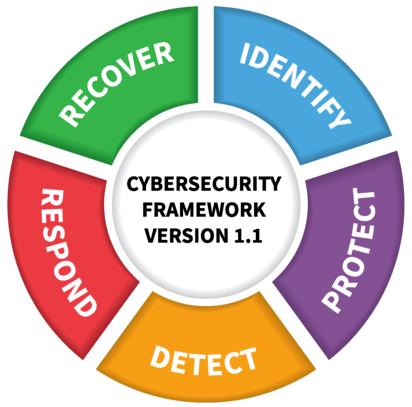

<h1> Een wereld van experten en criminelen </h1>

- [Cyberwetten](#cyberwetten)
  - [NIS en NIS2](#nis-en-nis2)
  - [NIST Framework](#nist-framework)
  - [ISO/IEC cybersecurity model](#isoiec-cybersecurity-model)
- [Aanvallers](#aanvallers)
- [Verdedigers](#verdedigers)
- [Security vs. privacy](#security-vs-privacy)
    - [Verdergaan bij 59:03 (les van hoofdstuk 2)](#verdergaan-bij-5903-les-van-hoofdstuk-2)

# Cyberwetten

Cybersecurity in de wetgeving:

- België: wetgeving rond ethisch hacken
- Europa: NIS en NIS2 directives (Network & Information System)
- VS: NIST framework
- Wereldwijd: ISO/IEC cybersecurity mode

## NIS en NIS2

NIS: Deze wet bepaalt dat bepaalde kritieke bedrijven in Europa (vb. leveranciers militaire middelen, havens, etc.) moeten voldoen aan bepaalde cybersecuritymaatregelen.

NIS werd ingevoerd in 2016, maar was vaag, niet streng genoeg en de invoering ging moeizaam.

NIS2 bood meer verduidelijking, was strenger en is zo opgesteld dat de wetgeving future-proof is. De technologieën worden breder beschreven zodat nieuwe technologieën ook direct onder deze wet vallen. Het breidde ook het aantal organisaties uit dat aan de wet moet voldoen. Werd ingevoerd in oktober 2024.

## NIST Framework

= National Institute of Standards and Technologies

Dit is een raamwerk om de belangrijkste soorten verantwoordelijkheden, functietitels en benodigde personeelsvaardigheden te identificeren. Dit is dus geen wettelijke verplichting. In Amerika gaan ze ervan uit dat de grote bedrijven zichzelf zullen reguleren.

Gezien het om tips gaat, kan het door iedereen in de wereld gebruikt worden.

- Identify: Nadenken over de soorten software je gebruikt / welke zwaktes er kunnen zijn.
- Protect: Zwaktes onderzoeken en kijken wat je kan doen om de zwaktes op te lossen of het gevaar ervan te minimaliseren.
- Detecteren: Informatie krijgen over wat er gedaan wordt door aanvallers. (100% veilig kan namelijk nooit, dus moet je de aanvallen die wel gedaan worden, kunnen oplossen voor de toekomst).
- Respond: Ervoor zorgen dat problemen in de cybersecurity snel worden opgelost.
- Recover: Systeem herstellen (meestal over langere tijd). vb: Data herstellen, gelekte data aanpassen (paswoorden, etc.). Hieronder valt o.a. de GDPR-mail naar klanten over gelekte data.

## ISO/IEC cybersecurity model

Niet verplicht, maar door veel landen gebruikt als model voor cybersecurity.

ISO 270000 is een verzameling van checklists voor cybersecurity.

# Aanvallers

Er zijn drie verschillende soorten hackers, op basis van de ethiek die erachter zit:

- **White hat**: Proberen systemen veiliger te maken door in te breken en zwakke punten te ontdekken.
- **Gray hat**: Hackers die tussen white en black hats zitten. Doen dingen die niet altijd oké zijn, maar kunnen nog ethisch verantwoordbaar zijn.
- **Black hat**: Onethische hackers, meestal uit egoïstische motivaties

Nog enkele specifieke soorten:

- **Scriptkiddies**: Meestal tieners of hobbyisten die (meestal voor de grap) "hacken" door scripts te runnen. Meestal weinig of geen IT-vaardigheid. Schade meestal beperkt.
- **Vulnerability brokers**: Zijn gray hats die exploits proberen te ontdekken en die verkopen voor geld of een beloning (meestal aan de bedrijven zelf, en soms als ze niet betalen aan andere hackgroepen).
- **Hacktivists**: Gray hats die hacken om verschillende politieke en sociale ideeën te promoten of er tegen te protesteren. (Is wel illegaal, maar kan ook ethisch zijn.)
- **Cybercriminelen**: Black hats die jaarlijks verantwoordelijk zijn voor het stelen van miljarden dollars.
- **State sponsored hackers**: White of black (afhankelijk van standpunt) hackers die overheidsgeheimen stelen, inlichtingen verzamelen, netwerken saboteren, etc. Doelwitten zijn meestal buitenlandse regeringen, terroristische groeperingen en bedrijven.

# Verdedigers

= Blue team

Dit zijn de cybersecurityspecialisten. Veel organisaties werken hierin samen, het delen van informatie over zwaktes is een sterkte voor de verdediging tegen cyberaanvallen.

Er zijn een aantal samenwerkingen:

- **Vulnerability Databases**: Publiek toegankelijke databanken met bekende zwaktes in software. (vb. CVE van Mitre)
- **Early Warning Systems** (vb. honeypots) -> Fake servers opzetten en kijken welke (nieuwe) technieken de hackers gebruiken.
- **Share cyberthreat intelligence** -> vaak tussen de publieke en private sector (vb. conferenties, hackathons, etc.).
- **ISM-normen** (vb. ISO 27000)

Organisaties zoals de FCCU (= Federal Computer Crime Unit) en Centre for Cyber Security Belgium strijden tegen computermisdaad in België. Wereldwijd zijn o.a. Europol, ENISA (Europese Unie) en Interpol actief.

# Security vs. privacy

Sommige overheden zetten druk op technologiebedrijven om de communicatie tussen burgers in te kijken (vb. via backdoors / encryptiesleutels). Burgers verwachten privacy. Het grote vraagstuk is waar de grens moet liggen, aangezien de privacy ook voor slechte doeleinden gebruikt kan worden.

### Verdergaan bij 59:03 (les van hoofdstuk 2)
