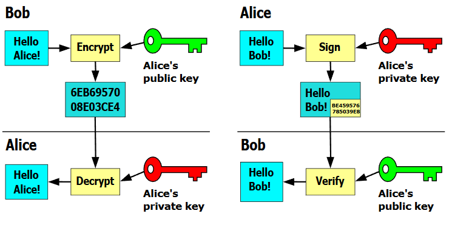

<h1> Confidentiality </h1>

- [Cryptografie](#cryptografie)
  - [Belangrijke termen](#belangrijke-termen)
    - [Encrypteren](#encrypteren)
    - [Decrypteren](#decrypteren)
    - [(Pseudo)randomness](#pseudorandomness)
  - [Symmetrische vs Assymetrische algoritmen](#symmetrische-vs-assymetrische-algoritmen)
    - [Private-key versleuteling (symmetrisch)](#private-key-versleuteling-symmetrisch)
    - [Public-key versleuteling (assymetrisch)](#public-key-versleuteling-assymetrisch)
      - [Diffie-Hellman](#diffie-hellman)
- [Cryptanalyse](#cryptanalyse)
- [Interessante links](#interessante-links)

# Cryptografie

Cryptografie is een tak van de cryptologie (= wetenschap van het maken en breken van geheime codes).

Cryptografie = manier om gegevens op te slaan en te verzenden, zodat alleen de ontvanger deze kan lezen. (Al enkele duizenden jaren oud.)

## Belangrijke termen

### Encrypteren

= Een algoritme (= cipher) gebruiken om ons bericht onleesbaar te maken.

Belangrijke termen:

- plaintext = tekst voor het encrypteren
- ciphertext = tekst na het encrypteren
- key = geheime sleutel waarmee de ciphertext gemaakt wordt.

### Decrypteren

= Geëncrypteerde tekst terug leesbaar maken.

Dit gebeurt meestal met een combinatie van enkele technieken:

- Transpositie (omzetting) - volgorde van karakters veranderen
- Substitutie (vervanging) - vervangen van karakters door andere karakters (vb. Caesar Cipher)
- One-time pad - random sleutel wordt toegevoegd aan plaintext

> Voorbeeld van een one-time pad
>
> Plaintext = Hello  
> Sleutel = David   > _Het eerste karakter van de versleutelde tekst is (H + D) mod 127. Het tweede karakter is (e + a) mod 127, etc._

### (Pseudo)randomness

Om een one-time pad goed te doen werken, heb je volledige randomness nodig, wat niet eenvoudig is. Computers zijn heel nauwkeurig en deterministich, daardoor zijn ze eigenlijk maar pseudorandom. Ze genereren "willekeurige" getallen via een seed.

-> Randomness wordt vaak gebaseerd op natuurlijke fenomenen (zoals atmosferische ruis) die moeilijk te voorspellen zijn.

## Symmetrische vs Assymetrische algoritmen

Symmetrisch = zelfde sleutel gebruiken voor encrypteren en decrypteren, zender en ontvanger kennen deze voor de communicatie (nadeel: Hoe wissel je deze sleutel veilig uit?)
_Ook wel private key encryption_

Assymetrisch = verschillende sleutels voor encryptie en decryptie. Eén is publiek, één is privé. Sleutel hoeft niet uitgewisseld te worden. (nadeel: Complexer en trager dan symmetrisch)  
_Ook wel publieke-sleutel-cryptografie (public key encryption)_

|           | Symmetrisch                                                               | Assymetrisch                                                                   |
| --------- | ------------------------------------------------------------------------- | ------------------------------------------------------------------------------ |
| Voordelen | - Snel   - Minder resources nodig   - Voor korte en lange berichten | - Veiliger   - Goed voor encryptie en validatie                             |
| Nadelen   | - Sleutel moet gedeeld worden                                             | - Veel resources nodig   - Enkel bruikbaar voor (relatief) kleine berichten |

Meestal gebruik je een combinatie van enkele manieren:

1. Je zet een tunnel op via assymetrische encryptie.
2. Je genereert private keys via Diffie-Hellman.
3. Je gebruikt de symmetrische sessie om een snellere tunnel op te zetten (via de private keys)

Tunnel = berichten in enkele of beide richting encrypteren.

<figure>

<figcaption>Voorbeeld van public key encryption.</figcaption>
</figure>

### Private-key versleuteling (symmetrisch)

| Afkorting | Volle naam                              | Huidige staat | Opmerking                                                                                    |
| --------- | --------------------------------------- | ------------- | -------------------------------------------------------------------------------------------- |
| DES       | Data Encryption Standard                | Niet veilig   | Eenvoudig                                                                                    |
| 3DES      | Triple DES                              | Niet veilig   | Drie keer DES uitvoeren met verschillende sleutels                                           |
| IDEA      | International Data Encryption Algorithm | Veilig        | Wordt gebruikt in PGP                                                                        |
| AES       | Advanced Encryption Standard            | Veilig        | Meest aangeraden (performantie en implementeerbaarheid). Gebruikt door Amerikaanse overheid. |

### Public-key versleuteling (assymetrisch)

| Afkorting | Volle naam                        | Huidige staat | Opmerking                                                                                  |
| --------- | --------------------------------- | ------------- | ------------------------------------------------------------------------------------------ |
| RSA       | Rivest Shamir Adleman             | Veilig        | Gebruikt in browsers. Product van 2 heel grote priemgetallen.                              |
| ECC       | Elliptic Curve Cryptography       | Veilig        | Alternatief voor RSA -> wordt populairder door kortere sleutels.                           |
| /         | [Diffie-Hellman](#diffie-hellman) | Veilig        | Vaak gebruikt om symmetrische sleutel uit te wisselen (vb. in SSL, TLS, SSH, IPSec)        |
| /         | El Gamal                          | Veilig        | Vroeger gebruikt in PGP i.p.v. RSA. Amerikaanse overheidsstandaard digitale handtekeningen |

#### Diffie-Hellman

Via dit algoritme kunnen symmetrische sleutels op een assymetrische manier uitgewisseld worden. Zo hoeft de private key nooit gedeeld te worden.

Wordt vaak vergeleken met verf:

1. Beide partijen hebben een gemeenschappelijk kleur (public key) en een privékleur (private key).
2. Beide kleuren worden gemengd zodat de originele kleuren niet te achterhalen zijn. (In het algoritme wordt dit met een modulobewerking gedaan.)
3. De gemengde kleur wordt uitgewisseld.
4. Elke partij voegt zijn eigen private key toe aan het mengsel. Hierdoor ontstaat een nieuwe kleur die bij beide partijen hetzelfde moet zijn.
5. De nieuwe kleur wordt als gedeelde sleutel gebruikt.

# Cryptanalyse

= Uitzoeken welke cryptografische methodes iemand gebruikt heeft / cryptografie kraken.

# Interessante links

- [Overzicht van aangeraden cryptografische methodes](https://cheatsheetseries.owasp.org/cheatsheets/Cryptographic_Storage_Cheat_Sheet.html#algorithms)
- [Diffie-Hellman uitgelegd (YouTube)](https://www.youtube.com/watch?v=YEBfamv-_do)
