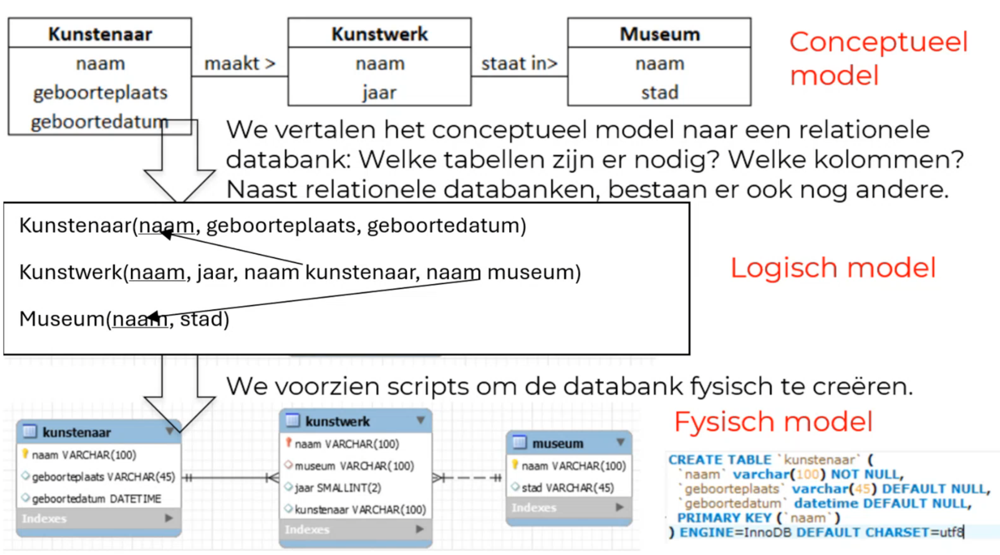

<h1> Databanken gekaderd </h1>

- [Van bestand naar databank](#van-bestand-naar-databank)
- [(R)DBMS](#rdbms)
  - [Gebruikers van de databank](#gebruikers-van-de-databank)
- [Delen van een databanksysteem](#delen-van-een-databanksysteem)
  - [3-lagen architectuur](#3-lagen-architectuur)
- [Belangrijke begrippen](#belangrijke-begrippen)
  - [Gegevensonafhankelijkheid](#gegevensonafhankelijkheid)
  - [(On)gestructureerde gegevens](#ongestructureerde-gegevens)
  - [Integriteitsregels](#integriteitsregels)

> Dit hoofdstuk dient grotendeels als achtergrondinformatie.   Definities dienen gekend te zijn, maar worden niet letterlijk gevraagd.

# Van bestand naar databank

Data managen in bvb. een Excel-bestand is een klassieke manier om data te managen bij beginnende projecten. Er zijn echter grote problemen aangezien iedereen dezelfde conventies moet volgen en het ordenen van de bestanden heel snel fout loopt.

Gegevens managen via bestanden heeft de volgende bijkomende nadelen:

- Verspreiding en isolatie van gegevens: Verschillende data worden in verschillende bestanden opgeslagen, het is moeilijk om relaties tussen data te onderzoeken of data te combineren.
- Redundante data: Veel gegevens (zoals naam, voornaam, adres, etc.) zullen in meerdere bestanden terecht komen. Als gegevens geüpdatet worden, kunnen bestanden makkelijk vergeten worden.
- Data-afhankelijkheid: De code van applicaties die toegang krijgen tot de datum, is afhankelijk van de vorm van het bestand. Als je een extra kolom toevoegt, zal je programma fout zijn en moet alle code herwerkt worden.
- Incompabiliteit: Verschillende afdelingen werken met verschillende bestanden die niet samen kunnen werken.
- Fixed Queries: Het is moeilijk om binnen de bestanden verschillende soorten queries uit te voeren. De vragen die je kan beantwoorden met je data zijn veel beperkter.

Databanken proberen deze problemen op te lossen. Ze worden gedefinieerd als:

> Een **gedeelde** verzameling van **logisch met elkaar verbonden** gegevens en hun **beschrijving**, ontworpen om aan de **informatienoden** van een organisatie te voldoen.
>
> Ze hebben de volgende eigenschappen:
>
> - digitaal opgeslagen
> - voor een specifiek bedrijfsproces
> - voor een specifieke groep (niet alle data is voor elke gebruiker zichtbaar)

# (R)DBMS

= (Relational) Database Management System

-> Verzameling computerprogramma's om databanken te definiëren, creëren, wijzigen, beheren en gebruiken.

Een RDBMS werkt met relationele databanken = het meest frequent gebruikte systeem (werkt met SQL)  
Een relationele databank werkt met tabellen, rijen en kolommen.

De bekendste RDBMS'en zijn:

- Oracle: Vaak gebruikt in grote bedrijven
- Microsoft SQL server: In verschillende versies leverbaar
- MySQL: Open source, wordt ondersteund door Oracle
- PostgreSQL: Alternatief voor MySQL, ook open source

Niet-relationele DB's noemen we soms ook NoSQL DB'en (vb. MongoDB)  
In dit vak worden enkel de relationele databanken besproken.

## Gebruikers van de databank

Verschillende delen van een organisatie verbinden via hun specifieke applicaties met de DBMS om data van de centrale databank te raadplegen.

De verschillende gebruikers zijn onder andere:

- Data Administrator (DA) = centraal verantwoordelijke voor de data van een bedrijf
- DB ontwerper = iemand die het conceptuele model naar een logisch en intern model vertaalt
- DB Administrator (DBA) = implementeert en monitort de DB
- Software Developer = schrijft de apps die met de databank gaan interageren
- Eindgebruikers = voeren acties op de databank uit via de applicaties (al dan niet bewust van de databank)

# Delen van een databanksysteem

Het databanksysteem bestaat uit de databank zelf en het DBMS.

Het databankmodel / databankschema beschrijft hoe de structuur van de db in elkaar zit. Dit wordt opgesteld tijdens het databankontwerp. Blijft redelijk stabiel, wordt opgeslagen in de cataloog.

De cataloog bevat de metadata over de data.

De toestand van de databank = de effectieve data in de databank. Wijzigt voortdurend.

Een datamodel is de weergaven van gegevens met hun kenmerken en relaties. In de cursus drie types:

- Conceptueel datamodel: Opbouw van de databank op een hoog niveau op basis van de vraag van iemand in de business.
- Logisch datamodel: Vertaling van het conceptueel datamodel naar tabellen
- Fysisch datamodel: Code die de databank vormgeven

## 3-lagen architectuur

- Externe laag: Is een deelverzameling van het logisch model, bevat views (deel van de data dat relevant is voor bepaalde gebruikers).
- Middelste laag: Het conceptuele / logische model
- Interne laag: Het fysieke datamodel dat de data fysisch organiseert en opslaat. (komt grotendeels overeen met de fysieke laag)

# Belangrijke begrippen

## Gegevensonafhankelijkheid

Fysieke gegevensonafhankelijkheid: wijzigingen in de fysieke implementatie van de db mogen geen invloed hebben op het logisch model of de applicatie.

Logische gegevensonafhankelijkheid: Als het logisch model verandert, vraagt dit minimale aanpassingen in de applicaties.

## (On)gestructureerde gegevens

Gestructureerde gegevens kunnen in een logisch datamodel voorgesteld worden. Je kan integriteitregels opstellen. (vb. personeelsgegevens)

Ongestructureerde gegevens: Kunnen niet zinvol geïnterpreteerd worden door een db. (vb. blogberichten)

Semi-gestructureerde gegevens: Gegevens met een structuur die zeer onregelmatig of wisselend zijn (vb. productspecificaties Bol.com)

## Integriteitsregels

Worden opgeslagen in de cataloog.

Ze leggen vast hoe gegevens worden opgeslagen (vb. customerID moet een geheel getal zijn) en wanneer gegevens correct zijn (vb. prijs moet altijd boven nul zijn).

De integriteitsregels dwingen de correctheid van de data af.
