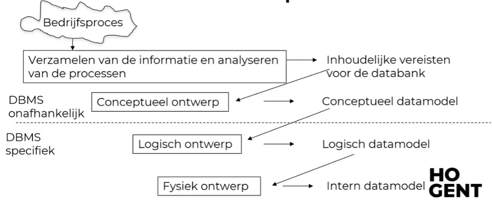
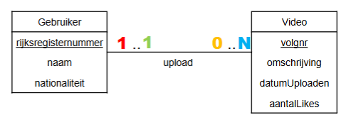

<h1> Conceptueel Model </h1>

# Fases in DB ontwerp

## Fase 1 - Verzamelen en analyseren van de functionele / inhoudelijke vereisten

Je moet in communicatie treden met de opdrachtgever en toekomstige gebruikers.

Je vertrekt altijd vanuit bedrijfsprocessen.  Voorbeelden van bedrijfsprocessen: opstellen van facturen, werkroosters managen, voorraadbeheer, etc.

**Doel** = Benodigde data begrijpen en bepalen wat er in de databank moet opgenomen worden.

_Deze stap is databasemodel- en dbms-onafhankelijk._

## Fase 2 - Conceptueel ontwerp

Grafische weergave van je idee over wat in de DB moet komen. Ontstaat uit de gesprekken in fase 1.
  Je bent hier nog niet bezig met tabellen maken!

ERD is een voorbeeld van een conceptueel ontwerp.

**Doel** = Een communicatiemiddel om duidelijk te maken wat er in de databank komt. Het moet verstaanbaar zijn voor zowel IT'ers als niet-IT'ers.

_Deze stap is databasemodel- en dbms-onafhankelijk._

## Fase 3 - Logisch ontwerp

Hier wordt nagedacht over welk type databank (vb. relationeel, NoSQL) je gaat gebruiken. Het product zelf ligt meestal nog niet vast.

Het kan zijn dat er informatie verloren gaat bij de vertaling van het conceptueel naar het logisch ontwerp. Deze informatie moet je opnemen in een apart document.

_Deze stap is dbms-onafhankelijk._

## Fase 4 - Fysiek ontwerp

De implementatie van het logisch ontwerp. Hier maak je tabellen en werk je met een specifieke DBMS. Je schrijft hier code om datarestricties op te leggen.

# Entity Relationship Diagram

Geïntroduceerd door Peter Chen (1976)

Heeft drie bouwstenen:

- Entiteittypes -> Gelijkaardig aan een klasse in programmeren
- [Attribuuttypes](#attribuuttypes)
- [Relatietypes](#relatietypes) -> Definieert de relatie tussen één of meerdere entiteittypes

Een **entiteit** is een instantie van een entiteittype. (vb. Pablo Picasso is een entiteit van entiteittype Schilder)

Een entiteittype moet altijd **identificeerbaar** zijn en een inhoud hebben. Je kan dus geen entiteittype creëren zonder een attribuut.

## Relatietypes

De **graad van een relatietype** wordt bepaald door het aantal verschillende entiteittypes die deelnemen aan het relatietype:

- 1 entiteittype: Unaire relatie
- 2 entiteittypes: Binaire relatie

Een relatietype kan **rollen** definiëren. Dat is bij binaire relaties meestal de naam van elk entiteittype. Bij unaire relaties krijgen ze meestal een aparte naam.

_vb. Een entiteit van entiteittype Persoon kan een unaire relatie hebben met een andere Persoon. Dan kan de relatie bijvoorbeeld zijn "verwant met" en de rollen "kind" en "ouder"_

Relatietypes kunnen ook attributen hebben, die noemen we relatie-attributen. Deze zijn belangrijk als de kenmerken bij de relatie horen (vb. wanneer en voor welke prijs iets gekocht is), maar niet bij een van de entiteittypes (vb. de koper of het gekochte goed)

### Cardinaliteiten

Geven aan hoeveel entiteiten minimaal en maximaal aan de relatie deelnemen.

Ze moeten vaak afgetoetst worden bij de opdrachtgever -> Enkel modelleren wat je weet, geen veronderstellingen.

De minimumcardinaliteit kan 1 of N zijn.  
De maximumcardinaliteit kan 0 (= sommige entiteiten nemen niet deel, de relatie is optioneel) of 1 zijn.

Bij twijfel of de minimumcardinaliteit 0 of 1 is, kies je best voor 0. 1 is een zeer strenge restrictie binnen de database.

<figure> 
    
    <figcaption> 
    
<strong>1..1</strong> - Elke video is geüpload door minimaal één en maximaal één gebruiker.   <strong>0..N</strong> - Een gebruiker kan geen of meerdere video's uploaden.

    </figcaption>
</figure>

## Attribuuttypes

**Enkelvoudige vs. samengestelde attribuuttypes**:

- Samengesteld: Kunnen nog verder opgesplitst worden (vb. adres -> straat, nummer, postcode, woonplaats)
- Enkelvoudig: Kan niet verder opgesplitst worden.

In een conceptueel model: Steeds op niveau van enkelvoudige attribuuttypes

**Enkelwaardige vs. meerwaardige attribuuttypes**:

- Enkelwaardig: Attribuut kan maar één waarde hebben (vb. iedereen heeft één geboortedatum)
- Meerwaardig: Attribuut kan meerdere waarden bevatten (vb. iemand kan meerdere hobby's hebben)

Beide kunnen voorkomen in ERD. Meerwaardige attributen worden in dit vak vermeden.

**Afgeleide attribuuttypes** zijn berekende waarden zoals "leeftijd", deze mogen niet in de database voorkomen.

Een **kandidaatsleutelattribuut** is een attribuut dat een identiteit kan identificeren door een uniek(e combinatie van) attribu(u)t(en). Dit moet op een irreducibele manier gebeuren (= we kunnen geen delen weglaten zonder de identificatie onmogelijk te maken).

**IN HET ERD MOET JE ALLE MOGELIJKE KANDIDAATSSLEUTELS AANDUIDEN**

Als de kandidaatsleutel uit meerdere attributen bestaat, duiden we ze in het ERD met een u-constraint aan.  
Als ze uit een attribuut bestaan <u>onderlijnen</u> we het.

Let op met ID's. Probeer vooral identificatienummers te gebruiken die ook in de echte wereld bestaan (vb. nummerplaat, ISBN-nummer, studentnummer, etc.). Je loopt namelijk het risico dezelfde records meerdere keren toe te voegen onder andere identificatienummers.

# Zwak entiteitstype

Dit zijn entiteitstypes die **bestaansafhankelijk** zijn van een ander entiteitstype (eg. minimumcardinaliteit = 1) en op zichzelf niet uniek kan geïdentificeerd worden.

De identificatie gebeurt dan a.d.h.v. enkele attributen + de relatie met een specifieke entiteit.

vb. Een episode kan niet als uniek geïdentificeerd worden a.d.h.v. seizoen en nummer (er bestaan meerdere series), maar wel aan seizoen en nummer in combinatie met de serie.

Zwakke entiteitstypes hebben m.a.w. geen eigen kandidaatsleutelattribuut.

## Historiek

Je kan makkelijk historische gegevens bijhouden door een zwak entiteitstype toe te voegen. Je plaatst het tussen de twee entiteitstypes waarvoor een historiek bijgehouden moet worden. De sleutel bestaat dan uit bijvoorbeeld de datum en de twee relaties.

## Ternaire relaties

In dit vak komen geen ternaire relaties aan bod. We kunnen ze wel als binaire relaties voorstellen door: de drie entiteitstypes te verbinden met een zwak entiteitstype. De sleutel voor het zwak identiteitstype zal dan bestaan uit iets unieks (zoals een tijdstip) + de drie relaties.
