<h1> Relationeel model </h1>

- [Bouwstenen](#bouwstenen)
  - [Sleutels](#sleutels)
- [Mapping](#mapping)
  - [Entiteittypes mappen](#entiteittypes-mappen)
  - [Relatietypes mappen](#relatietypes-mappen)
    - [Één-op-één-relaties (1:1)](#één-op-één-relaties-11)
    - [Één-op-veel-relaties (1:N)](#één-op-veel-relaties-1n)
    - [Veel-op-veel-relaties (M:N)](#veel-op-veel-relaties-mn)
  - [Zwakke entiteiten mappen](#zwakke-entiteiten-mappen)
  - [Meerwaardige attributen mappen](#meerwaardige-attributen-mappen)
  - [Specialisaties mappen](#specialisaties-mappen)

In deze cursus wordt ervan uitgegaan dat we een relationele database opstellen. Het logisch model is hier dus altijd een relationeel model.

# Bouwstenen

ERD moet vertaald worden naar relaties (tabellen met kolommen).

Daarbij komen enkele belangrijke termen te kijken:

- Tupel: unieke, geordende lijst met waarden van kenmerken. Beschrijft een object.
- Attribuut: benoemd kenmerk van een tupel. Is atomair en éénwaardig. Er mogen geen samengestelde attributen zijn.
- Domein: Verzameling van alle mogelijke waarden voor een attribuut.
- Relatie: Verzameling van tupels die gelijkaardige objecten beschrijven.

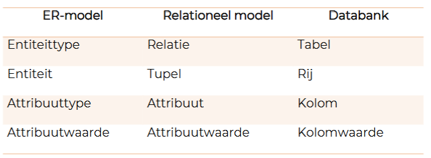

Relaties uit het ERD worden omgezet naar primaire sleutels (PK - primary key) en vreemde sleutels (FK - foreign key) in het relationeel model.

## Sleutels

Een sleutel zorgt ervoor dat een tupel altijd uniek is.

Er zijn verschillende soorten:

- kandidaatsleutels: minimale verzameling van attributen in een tupel waarmee elke tupel uniek geïdentificeerd kan worden.
- primaire sleutels: één kandidaatsleutel die uitgekozen wordt, mag nooit null zijn.
- alternatieve sleutels: alle kandidaatsleutels die geen primaire sleutel zijn.
- vreemde sleutels: attribuut dat verwijst naar een primaire sleutel in een andere relatie (tabel).

Als een sleutel Null-waarden bevat, verliest het zijn status als kandidaatsleutel (want het is niet langer uniek).

# Mapping

= ERD omzetten naar tabellen

Samengevat:

1. Entiteittype -> tupelverzameling / tabel
2. Enkelvoudige attribuuttypes -> overnemen
3. Samengestelde attribuuttypes opsplitsen, daarna overnemen
4. Meerwaardige attributen in een nieuwe verzameling plaatsen.
5. Primaire sleutel bepalen.
6. Relatie uit het ERD -> vreemde sleutels bepalen
7. Integriteitsregels van vreemde sleutels bepalen

## Entiteittypes mappen

- Eenvoudige attribuuttypes -> kolom
- Samengesteld attribuuttypes opsplitsen en in kolommen zetten.
- Kies een van de kandidaatsleutels als primary

Noteren als:
ENTITEIT(<u>uniekeCode</u>, voornaam, familienaam, straat, huisnummer, postcode, woonplaats, emailadres, geboortedatum)

## Relatietypes mappen

Manier hangt af van de maximumcardinaliteit.

### Één-op-één-relaties (1:1)

Als één kant een minimumcardinaliteit van 1 heeft: Vreemde sleutel daar toevoegen (heeft geen null-waarden.)

- Sleutel is verplicht.
- Sleutel is uniek.

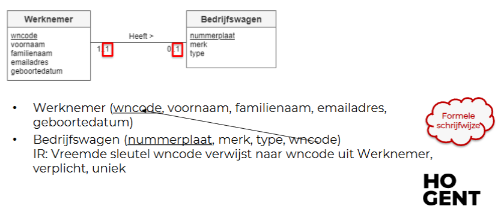

Minimumcardinaliteit 0 aan beide zijden: Vreemde sleutel toevoegen aan de kant waar je de minste lege rijen verwacht.

- Sleutel is optioneel.
- Sleutel is uniek.

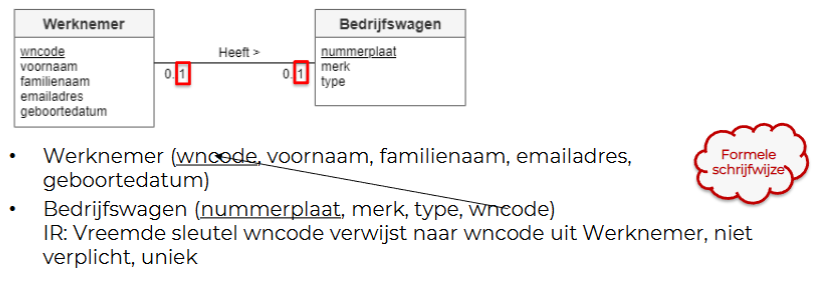

### Één-op-veel-relaties (1:N)

Voeg een kolom toe bij de kant met maximumcardinaliteit N.

- Sleutel is optioneel als de andere kant 0..1 is, verplicht als de andere kant 1..1 is.
- Sleutel is niet uniek.

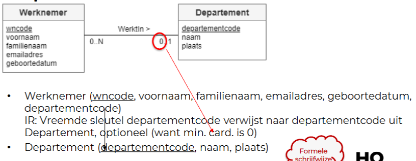

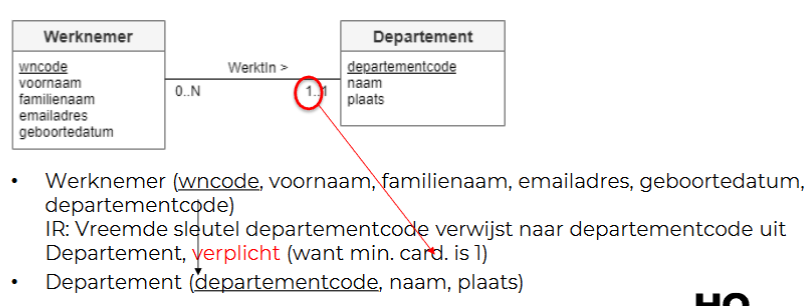

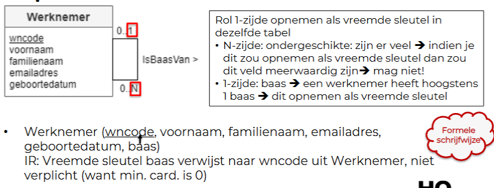

### Veel-op-veel-relaties (M:N)

Gebruikmaken van een tussentabel waarin de sleutels van beide entiteittypes voorkomen. Eventuele relatie-attributen kunnen als extra kolommen toegevoegd worden.

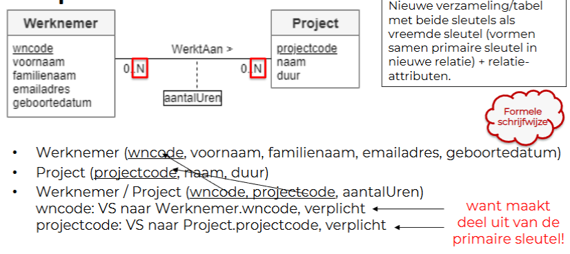

## Zwakke entiteiten mappen

De volledige primaire sleutel van de entiteit waarvan de zwakke entiteit afhankelijk is, wordt in de tabel van de zwakke entiteit toegevoegd.

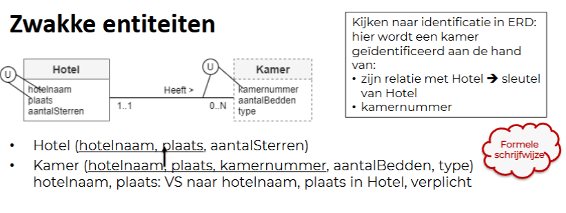

## Meerwaardige attributen mappen

Het meerwaardige attribuut moet eerst omgezet worden in een M:N-relatie (je extraheert het attribuut en maakt er een nieuwe entiteittype van).

Daarna map je deze relatie zoals je altijd bij M:N-relaties doet.

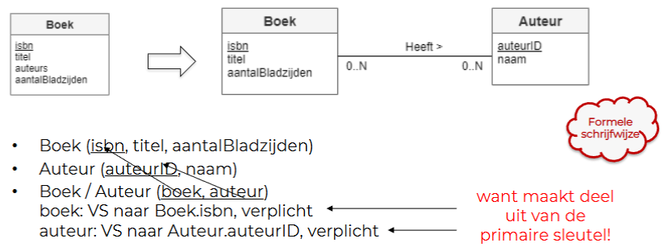

## Specialisaties mappen

**{Mandatory, AND}** -> Alle subtypes en hun attributen toevoegen in de tabel van het supertype. Boolean kolom per subtype. (Nadeel = veel nullwaarden.)

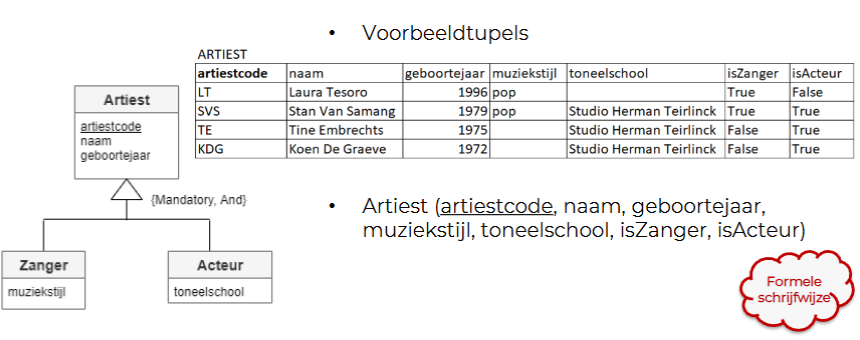

**{Optional, AND}** -> Je maakt een tabel met alle attributen van het supertype. Daarna maak je een extra tabel met dezelfde primaire sleutel als de eerste tabel, daarin voeg je alle attributen + boolean kolommen voor de subtypes toe.

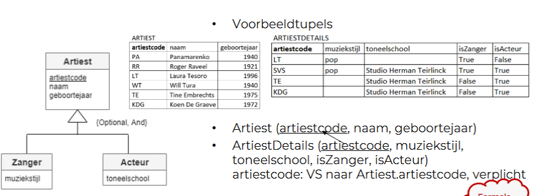

**{Mandatory, OR}** -> Maak een tabel per subtype.

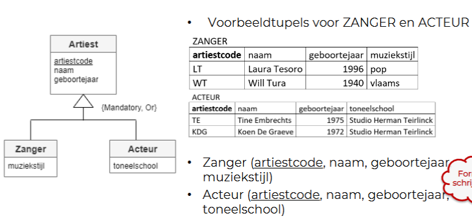

**{Optional, OR}** -> Tabel met alle attributen van het supertype. Per subtype maak je een aparte tabel met de attributen van het subtype, hierin neem je de primaire sleutel van het supertype op.

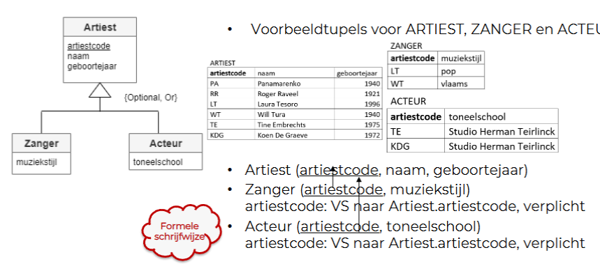
