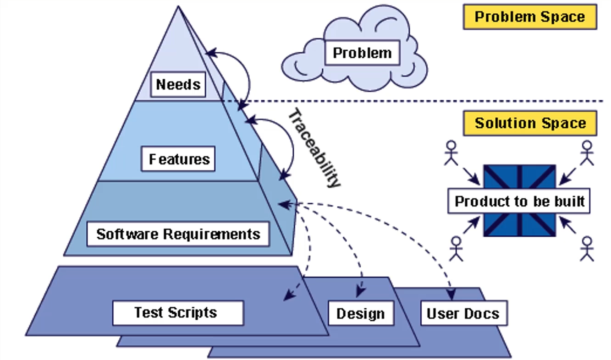

# Functionele Requirements

## Doelstellingen

- Nut kennen van een use case diagram
- Algemene eigenschappen van een use case diagram kunnen benoemen en uitleggen.
- Opstellen van een use case diagram op basis van een context.
- Nut kennen van een use case
- Algemene eigenschappen van een use case kunnen benoemen en uitleggen
- Opstellen van een use case op basis van een context

## Functionele Requirements

= Vastelling en eenduidige definitie van de functionaliteiten

## Use Cases

Use cases beschrijven de visie op het systeem. Ze leggen de scope, situering en stakeholders van het te implementeren systeem vast. Ze beschrijven de user goals die bereikt moeten zijn op het einde van de use case en leggen alle verhalen vast.

Use cases kunnen op verschillende niveaus beschreven worden. <br>
In de lessen -> **Elementaire Businessniveau (Elementary Business Process = EBP)**

EBP is een **user goal -> proces door 1 persoon** <br>
Duur = meestal 2 tot 20 minuten

### Relaties

#### Include-relatie

Use Case A voert ALTIJD use case B uit tijdens normaal verloop

A --- include --> B

#### Extend-relatie

Use case A voert use case B uit tijdens een alternatief verloop (dus niet altijd)

A <-- extend --- B

### Tips use cases uitwerken

- Aantal stappen in normaal verloop: tussen 3 en 15
- Spendeer maximaal een halve dag met de eindgebruiker
- Beter om te werken in kleine groepen
- Zorg dat de actor neutraal genoeg is (dus niet "Jantje" maar "Boekhouder")
- Meer use cases is niet beter! (KISS)

## Use Cases opstellen

Een use case bevat:

- Een primary actor
- Stakeholders
- Precondities: Voorwaarden die bereikt moeten zijn om de UC te starten. (Controle van de precondities hoeft in de UC niet meer.)
- Postcondities: Wat er bereikt is bij het succesvol uitvoeren van de UC. (Altijd vanuit het standpunt van het systeem geschreven.)
- Normaal verloop (= Main succes story)
- [Alternatief verloop](#use-cases---uitbreidingen)
- [Domeinspecifieke regels](#domeinspecifieke-regels): Regels voor o.a. validatie
- Op te klaren punten (optioneel): Hier vermeld je zaken die nog onduidelijk kunnen zijn voor de klant.

De **actiestappen** die in de UC worden opgenomen zijn altijd één van de volgende:

- Een interactie tussen de primary actor en het systeem
- Een validatie
- Een interne wijziging

<figure>
<figcaption>De mogelijke actiestappen komen overeen met de 4 delen van een transactie. (I. Jacobson)</figcaption> </figure>

### Actiestappen opstellen

Richtlijnen:

1. Gebruik eenvoudige zinnen (SVO)
2. Geef de actor telkens duidelijk aan.
3. Beschrijf vanuit een bird's eye view (= vogelperspectief) -> Dus geen imperatieven, maar "De klant doet x" / "Het systeem valideert y".
4. Toon de vooruitgang in het proces (= wees niet te gedetailleerd, voeg kleine zaken samen tot één actiestap). Dus niet: "Klant geeft naam in.", "Klant geeft leeftijd in." MAAR: "Klant geeft gegevens in."
5. Toon de bedoeling van de actor, niet de beweging (= beschrijf WAT er gebeurt, niet HOE). Dus niet: "Klankt klikt op OK" MAAR: "Klant bevestigt keuze."
6. Zorg dat de set actiestappen aanvaardbaar is: Ze zijn opgesplitst en behoren allemaal tot een van de vier delen van een transactie.
7. Controleer niet, maar valideer. If-statements worden vermeden. <br> _vb. "Stap 2: Systeem valideert paswoord. Stap 3: Systeem toont de toegelaten acties voor de gebruiker." (We gaan ervan uit dat de validatie oké was. Indien niet -> alternatief verloop)_
8. User laat systeem A systeem B aansturen: Beschrijf geen interacties met de GUI, ook niet als de user via de GUI meerdere systemen aanroept. In plaats daarvan: "User laat het systeem achtergrondinfo ophalen bij systeem B"
9. Gebruik geen calls als de UC een andere UC oproept. Schrijf niet: "De gebruiker bevestigt en gaat naar <a>Betalen winkelmand</a>" "De gebruiker bevestigt en <a>betaalt winkelmand</a>". De andere use case moet nog steeds onderlijnd worden (kon niet in Markdown, daarom links gebruikt).

### Use Cases - uitbreidingen

- Alternatieve verlopen vragen veel kennis van de business rules, zijn in tegenstelling tot het normale verloop niet altijd door iedereen goed gekend.
- Kunnen aanleiding geven tot nieuwe use cases.

Bij het opstellen van alternatieve verlopen / uitbreidingen is het belangrijk om bij elke stap van het normale verloop te kijken naar wat er mis kan gaan.

Noteer de alternatieve verlopen vanuit wat het systeem ontdekt heeft, niet wat er gebeurd is. <br>
_vb. NIET: "Klant vergeet PIN in te geven" MAAR: "Tijdslimiet overschreden bij ingave PIN"_

Elke alternatief verloop moet een titel krijgen.

Een alternatief verloop eindigt door:

- Terug te keren naar het normaal verloop (zelfde of andere stap).
- Een andere UC op te roepen.
- Stopzetten van de UC.

#### Noteren in UC:

De uitbreidingen komen onder het normaal verloop. Elke uitbreiding krijgt een titel (vb. 4a. Ongeldige pincode). Binnen het alternatief verloop tel je terug op in actiestappen.

```
...
3. De klant voert de pincode in.
4. Het systeem valideert de pincode.
5. De klant geeft een bedrag in.
6. ...

Uitbreidingen
    4a. Ongeldige pincode
        4a1. Systeem verhoogt foutieve pogingen met 1.
        4a2. Het systeem toont een gepaste melding.
        4a3. Keer terug naar stap 2 van het normale verloop.

    4b. Fout wachtwoord te dikwijls ingegeven
        4b1. Systeem verwittigt gebruiker.
        Use case eindigt zonder bereiken postcondities.
```

### Domeinspecifieke regels

Hier komen alle technische regels te staan. <br>

```
DR_NIEUW_LID
    Een nieuw lid is minstens 18 jaar oud.
    Wachtwoord is 8-16 tekens lang en bevat geen spaties
```

### Van probleem naar oplossing



Een opdrachtgever heeft een probleem en beschrijft behoeften.

Elke behoefte moet steeds gekoppeld zijn aan enkele features en elke feature heeft een aantal software requirements. Op die manier moet elke software requirement en elke behoefte kunnen gekoppeld worden (= traceability).