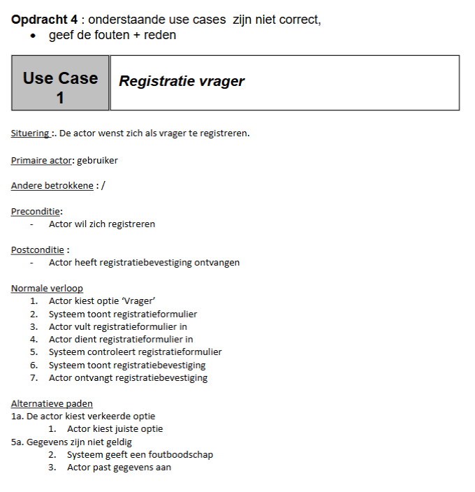
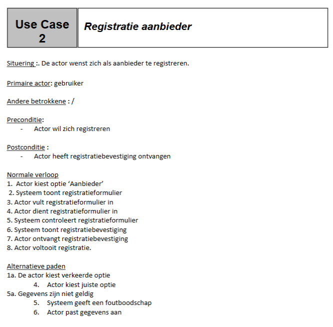
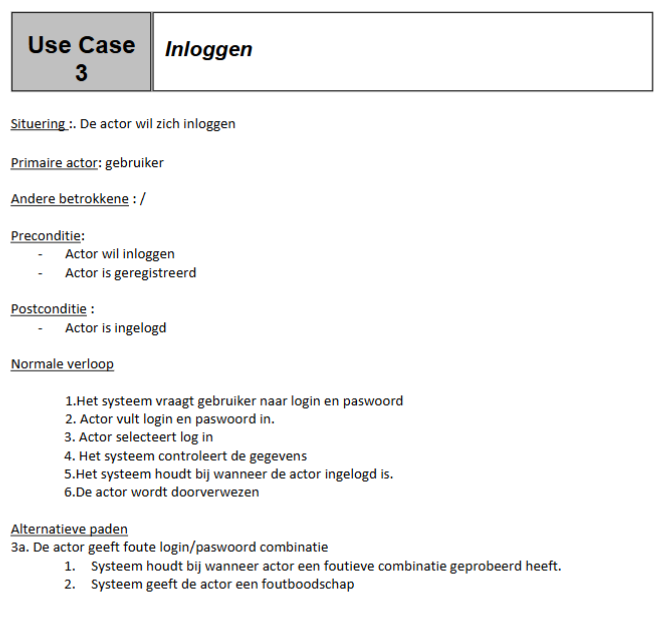

<h1> H2 - Oefening 4 - Zoek de fout </h1>

# Opgave 1

## Uitwerking

Situering: Deze tekst moet in de eerste stap van het normale verloop komen. Dit is geen goede naam voor een use case
(eenvoudig)

Andere betrokkene -> moet "stakeholder zijn"

De postconditie wordt hier beschreven vanuit de primaire actor, dit moet vanuit het systeem beschreven worden.

Normale verloop:

- Stap 1: Wordt beschreven als een interactie met de GUI.
- Stap 4: Overbodige stap, moet samen met stap 3.
- Stap 7: Overbodige stap, dit is dezelfde stap als stap 6.

Alternatieve verlopen:

- Verkeerde nummering: Elk alternatief verloop moet vanuit 1 starten.
- 1a1: Dit beschrijft geen aanvaardbare actiestap. Er is ook geen einde van de use case of terugkeer naar het normaal verloop.
- 5a3: Hier moet een verwijzing naar een stap uit het normaal verloop komen.

# Opgave 2

## Uitwerking

Gelijkaardig aan opgave 1.

# Opgave 3

## Uitwerking

Postconditie moet verwoord worden vanuit systeem.

"Actor" is te vaag.

Normale verloop:

- Stap 1: Moet later, eerste stap moet "Gebruiker wenst in te loggen" zijn.
- Stap 3: Gebaseerd op GUI.
- Stap 6: Vaag.
