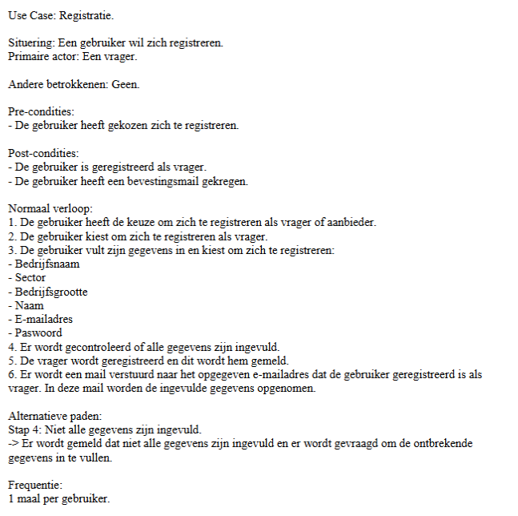
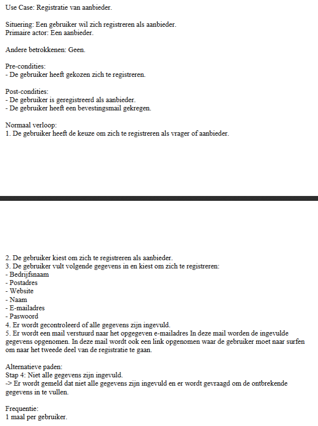
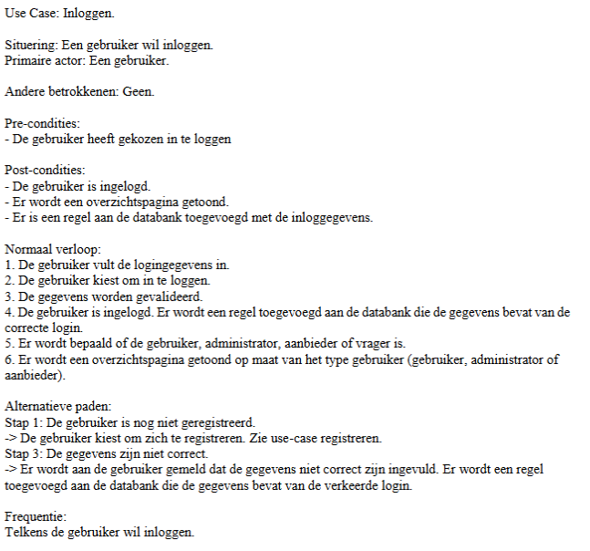

<h1> H2 - Oefening 5 - Zoek de fout (bis) </h1>

# UC1

## Uitwerking

Primaire actor niet correct: De pa is op dit moment nog geen vrager, maar gebruiker.

Postcondities: Verwoord vanuit de actor i.p.v. het systeem.

Normaal verloop:

- Stap 1: Situatiebeschrijving. Dit moet weggelaten worden.
- Stap 5: Dit zijn twee handelingen -> opsplitsen.
- Stap 6: Te veel gebaseerd op GUI/implementatie. Beter: "Het systeem bevestigt de registratie aan de gebruiker."

Alternatief pad wordt verkeerd benoemd. Er volgen geen actiestappen in het alternatief verloop.

# UC2

## Uitwerking

Primaire actor en postcondities: idem aan UC1.

Normaal verloop: zelfde fouten als in UC1.

# UC3

## Uitwerking

Post-conditie 2 is een GUI-onderdeel.

Normaal verloop:

- Stap 2 is overbodig.
- Stap 4 is geen actiestap. Beter opsplitsen: Stap 4 "Systeem voegt een regel aan de databank toe.", Stap 5 "Het systeem logt de gebruiker in."
- Stap 5 en 6 zijn te veel op implementatie gericht.

Alternatief verloop:

- Alternatieve paden worden verkeerd benoemd. Het eerste pad doet een oproep naar een andere use case, i.p.v. in businesstaal te verwoorden.
- De paden bevatten geen actiestappen.
