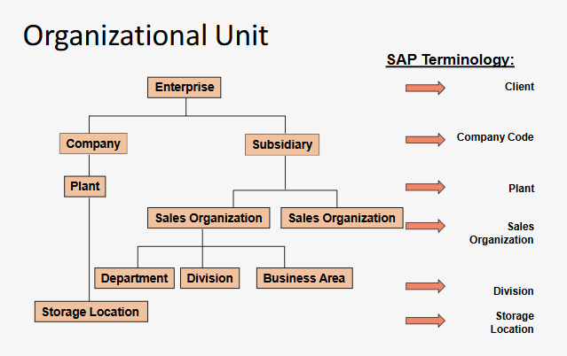

<h1>SAP</h1>

# Inleiding

Architectuur = client/server-architectuur

Gebruikt een three-tier structuur:

- User Interface (GUI of Web)
- Application server
- Database server

## Datatypes

Er zijn drie datatypes:

- Organizational: Vooral data over het bedrijf zelf (stelt de structuur vast)
- Master data: Personen, materialen, klanten, etc.
- Transaction Data: Bestelbon, rekening, etc.

### Organizational Data

Opgebouwd in lagen:

### Master data

Long term data: bevat onder andere de klanten, werknemers, materialen, etc.

De master data kan meestal in meerdere views weergegeven worden (vb. aankoopdata, voorspellingsdata, wettelijke info)

### Transaction data

Kortetermijndata -> gekoppeld aan bepaalde master data.

## Documents

-> Dit zijn templates die ingevuld worden wanneer een bepaalde businesstransactie uitgevoerd wordt.

Voorbeelden: salesdocument, materiaalbon, boekhoudingsformulieren, etc.

# Materials Management (MM)
