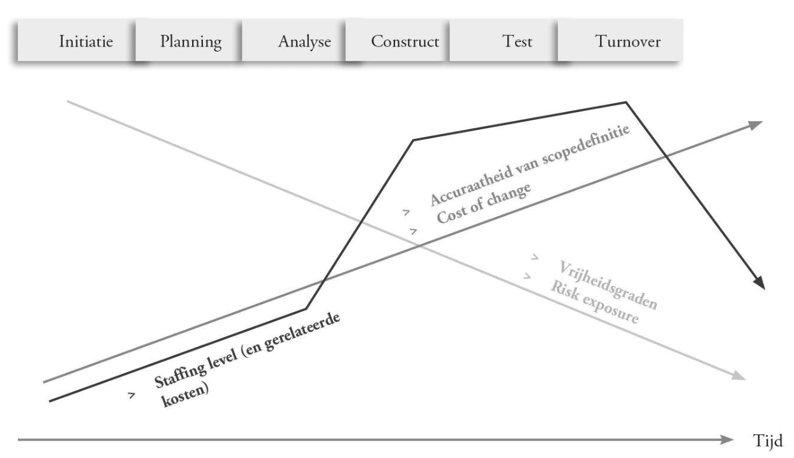

<h1>Van initiatie tot oplevering</h1>

# Rol van deliverable in kader van projectmatig werken

Doel van project = creëren van waarde.   Link tussen scope en doelstellingen moet dus duidelijk zijn.

**Scope creep** -> ongecontroleerde uitbreiding van scope

> Een deliverable is een finaal of tussentijds project dat wordt opgeleverd als resultaat van een projectactiviteit. (Meestal nodig om een fase/project/activiteit af te sluiten.)

Deliverables worden gebruikt om:

- doorlooptijd van project in te schatten.
- het werk te organiseren.
- het opgeleverde werk te evalueren.

Deliverables worden opgesplitst in werkpakketten (WBS).

> Mijlpaal = momentopname op projecttijdlijn dat wordt gebruikt om status van oplevering te monitoren. Vaak niet gelinkt aan individuele taken / deliverables.

# Verschil projectuitvoering - projectmanagement

Projectuitvoering gebeurt door het projectteam -> alle activiteiten die gelinkt zijn aan het opleveren van het product.

Projectmanagement gebeurt door de projectmanager -> organiseren, beheersen en leiden van tijdelijke activiteiten om specifieke doelen te bereiken. Je moet verzekeren dat de gemaakte projectdoelstellingen voltooid worden en de afspraken op de meest efficiënte wijze worden gerealiseerd.

Projectmanagement bewaakt:

- scope
- kost
- tijd
- resources
- kwaliteit
- risico's

Ook bij agile werken is management nodig -> project is meestal meer dan enkel een IT-project + bedrijfsmanagement hecht hier veel waarde aan.

# Fasen van een project

- Initiatie: Globale vaststelling van wat we willen doen. (Voorbereidend onderzoek) -> het kan zijn dat het project niet verder dan deze initiatie gaat.
- Turnover: Fase waar het eindresultaat in productie kan gaan.

Hoe verder het project vordert, hoe minder vrijheden er nog zijn (al veel beslissingen genomen) -> = minder risico.
