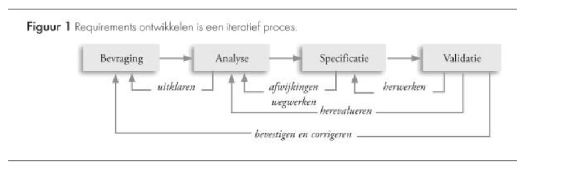
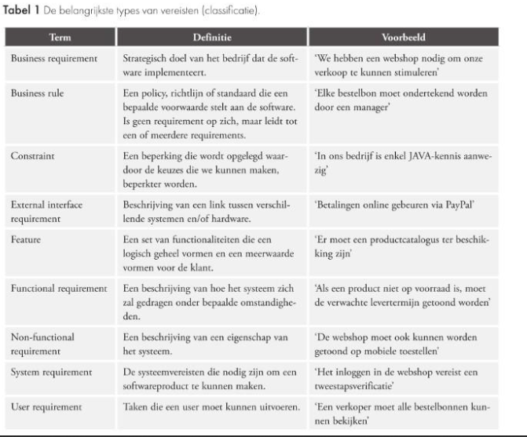

<h1>Wat zijn de noden van onze klanten?</h1>

# Requirements opstellen

Als resultaat krijg je een vereiste.

De deliverables die hieruit voortstromen zijn:

- Scope statement
- User stories
- Software Requirements Specification (SRS)

## Bevragen

Productvisie definiëren en aan de business case koppelen.

Je identificeert de gebruikersgroepen.

Definieer user requirements + hun meerwaarde.

Digitale triggers definiëren -> Gebeurtenis die een actie in gang zetten.

## Analyseren

Hieronder valt:

- De omgeving visueel modelleren
- Haalbaarheid van requirements nagaan
- Requirements prioritiseren
- Technische requirements opstellen

## Specificatie

Communiceer eenduidige wat er concreet vereist wordt.

## Validatie

Formeel akkoord gaan over de vereisten van het project. => dit is de bepaling van de scope van het project.

# Beheersaspecten van een project

[LESSEN BEKIJKEN - ONDUIDELIJK IN SLIDES]

# Inschatting van risico's

Risico = gevaar voor schade of verlies door onzekere gebeurtenis.

Grootte wordt berekend met <code>kans x gevolg</code>

In een risico-analyse:

- Inventariseer je de risico's
- Analyseer je de risico's (kans, gevolg, grootte)
- Formuleer je maatregelen om de risico's eventueel te beperken.

Om te beslissen of je een project moet stoppen, moet je kijken naar het al besteedde en nog te besteden budget vergeleken met de baten aan het einde van het project.

- <code>Al besteed + nog te besteden < baten</code> => succesvol project
- <code>Nog te besteden < baten</code>, maar <code>al besteed + nog te besteden > baten</code> => doorgaan, maar geen succesvol project
- <code>Nog te besteden > baten</code> => project stopzetten.

Niet in sunk-cost fallacy trappen!

# Project management methodes

Er bestaan verschillende methodologieën:

- System Development Methodology = Watervalmethode
- Scrum
- Prince2: Werkt met checklists, richtlijnen, Project Initiation Document
- PMBoK
- P6
